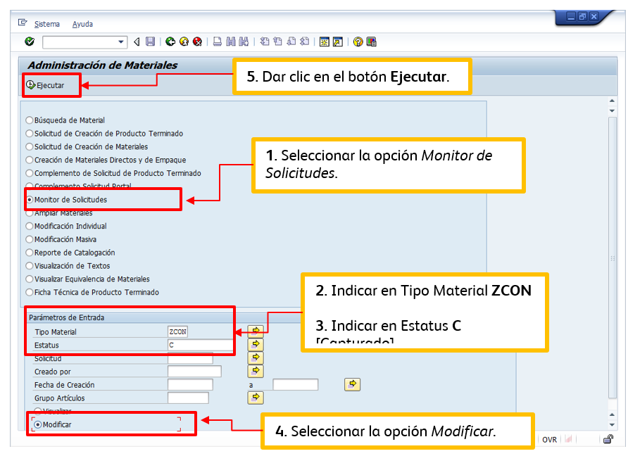

# ALTA MATERIALES CONSUMIBLES (ZCON)
[back](analyst.md)

Descripción SOP:	Alta materiales consumible
Frecuencia del proceso:	Diaria
Programas utilizados:	SAP
Fecha de revisión:	31/01/2025
Fecha de creación:	01/04/2018
Creado por:	Edgar Belmares
Revisado por:	Ronaldo Chavez

## 1. Propósito
- El propósito de este documento es presentar todos los pasos necesarios para la aceptación o rechazado de solicitudes de Alta de Materiales Consumibles (ZCON).

## 2. Alcance
- Aprobación o rechazo de los diferentes tipos de Materiales Consumibles (ZCON) de CM HEINEKEN.

## 3. Responsabilidades
- El Analista de MDM es el responsable de validar que la solicitud cumpla con los estándares y lineamientos que se comentan a continuación, así como de la ejecución en tiempo y forma para proceder con la autorización o rechazo de la misma.

## 4. Descripción del proceso
### 4.1 Solicitud
- Las solicitudes de Alta son elaboradas por personal de Planta y/o Ingeniería en la transacción ZMATERIALES de SAP, en la sección Solicitud de creación de material y una vez que ésta es capturada llega a Expins para su posterior autorización y/o rechazo.

### 4.2 Visualizar solicitud
- En la transacción ZMATERIALES opción Monitor de Solicitudes (ZCON) se pueden visualizar todas las solicitudes que se han generado y que se encuentran pendientes por atender.

### 4.3 Tratamiento de solicitudes
- Ingresar en el cuadro de búsqueda la transacción ZMATERIALES

- Seleccionando la opción Monitor de Solicitudes, capturamos en Tipo Material “ZCON”, en Estatus “C”, seleccionamos la opción Modificar y damos clic en el botón Ejecutar.

- Después de dar clic en el botón Ejecutar se desplegarán todas aquellas solicitudes pendientes de revisar. Los campos a validar son:
  - **Texto breve de material:**
    - El nombre debe ser menor o igual a 40 caracteres.
    - Iniciar con Mayúscula cada palabra seguido de Minúsculas.
    - La descripción debe estar formulada de la siguiente manera: Nombre del Material + Marca + Número de Parte. [Marca y Número de Parte siempre deberán ir en Mayúsculas]
    - La descripción debe ser detallada y entendible a lo que se requiere comprar (Ej. no puede decir solo Pinza, Reactivo, etc.)

  - **Categoría de valoración:**
    - Que el material/descripción del material se encuentre dentro de las Categorías de Valoración disponibles para Materiales Consumibles establecidas por MDM Local y haga match con el o los respectivos Common Material Groups [CMG’s] definidos para cada una, como lo podrás visualizar en la sección de Anexos.

  - **Common Material Group [CMG]:**
    - Que el material/descripción del material se encuentre dentro de los respectivos Common Material Groups definidos para cada Categoría de Valoración, como lo podrás visualizar en la sección de Anexos.

**De no cumplir la solicitud con los lineamientos mencionados con anterioridad, ésta se rechaza por medio del sistema para su corrección**
- **Rechazo**
- Para rechazar una solicitud, es necesario seleccionar aquella que se desea rechazar, por ejemplo, en la imagen de abajo se observa que hay 2 que no cumplen con la categoría de valoración correcta, éstas deben de ser seleccionadas y una vez que estén marcadas de color naranja es necesario presionar el botón Rechazado. Al hacerlo el sistema habilitara el campo Motivos de Rechazo para indicar los motivos por los cuales se están rechazando la solicitud. 

- Se pueden indicar comentarios como por ejemplo: ***Favor de colocar la categoría de valoración correcta, o el nombre del material no cumple con las reglas definidas***, dar “Enter” una vez indicados los comentarios de rechazo y al finalizar es necesario presionar el botón Grabar para que estas regresen al usuario que capturó la solicitud y pueda hacer las modificaciones correspondientes. Cuando esto suceda te darás cuenta que la letra C [Capturado] cambiará por la R [Rechazado] en la columna Status.

- Para aprobar una solicitud, es necesario seleccionarla y presionar el botón Ind. Impuesto (Indicador de Impuesto) en el cual siempre se debe de indicar 0 Tasa IVA y posteriormente se da clic en el botón Aprobado. 

- Una vez que hayas realizado los pasos con cada una de las solicitudes pendientes por aprobar, podrás observar que el estatus C [Capturado] cambia a A [Aprobado] y para finalizar deberás presionar el botón Grabar.

- Al presionar el botón Grabar, las solicitudes, tanto aprobadas como rechazadas desaparecen del listado quedando nuevamente solo aquellas que estén pendientes por tratar.

### 4.4 Aviso a solicitante
- Una vez que se ha aprobado o rechazado la solicitud, el sistema SAP en forma automática envía al solicitante el número de material creado, en caso de que alguno de los usuarios solicitantes llegue a comentar que no ha recibido el número del material aún y cuando la solicitud ya fue aprobada previamente, se les debe de indicar que es necesario levantar un ticket en la 1111 indicando el error para que les puedan dar una solución.