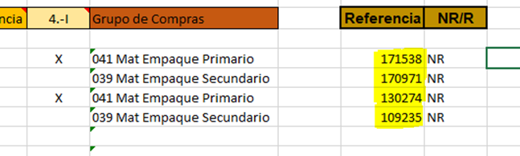

# ALTA MATERIALES DE EMPAQUE (ZREM)
[back](analyst.md)

Descripción SOP:	Alta materiales de Empaque
Frecuencia del proceso:	Por Solicitud, Diaria
Programas utilizados:	Mendix, SAP
Fecha de revisión:	01/08/2024
Fecha de creación:	01/01/2019
Creado por:	Marcos Axeel Ramirez Rocha	
Revisado por:	Yahir Orona

## 1. Propósito
- El propósito de este documento es presentar todos los pasos necesarios para la creación de solicitudes de Alta de Materiales de empaque (ZREM) en la Herramienta Global MENDIX así como el complemento local en SAP.

## 2. Alcance
- Creación de los diferentes tipos de Materiales de empaque (ZREM) de nuestra OpCo CM HEINEKEN.

## 3. Responsabilidades
- El Analista de MDM es el responsable de validar que la solicitud sea realizada por medio de la herramienta de Heiflow, que ésta contenga el archivo en Excel que se muestra en la sección de anexos, así como de la ejecución en tiempo y forma del alta del material de empaque.

## 4. Descripción del proceso
- El Equipo de empacotecnia realiza una solicitud de alta del material que requiere por medio de la herramienta de HeiFlow, en analista MDM valida la solicitud y genera el alta global del material en la herramienta MENDIX y después de esto se procede a realizar el complemento del material en SAP

### 4.1 Solicitud
- Las solicitudes de Alta son elaboradas por personal de empacotecnia por medio de la herramienta de HeiFlow en la sección de MDM / Datos Maestros / Materiales / Nueva Solicitud / Tipo de Servicio: Empaque /Subtipo de Servicio: Alta.
Respecto a los materiales ya creados que requieren modificación o bien borrarlos, estos se solicitan de la misma manera solo se cambia el Subtipo de Servicio de la solicitud dependiendo lo que se necesite a: Borrado, Ampliación,Modificación.
  - Versión actualizada del archivo:  El formato de alta material de empaque debe ser el formato de más reciente versión, este se puede descargar al momento de llenar la solicitud en HeiFlow.
    - 
  - Descripción del Material: Texto de hasta 40 caracteres que designa más detalladamente el material. No debe de ser solo una palabra. Debe venir en inglés y en español [Mayúsculas y Minúsculas]
  - CMG y Data Standards: Validamos que la descripción se haya creado alineada al Data Estándar. Para esta validación necesitamos el “Material Group” o CMG del material y lo validamos en el formato “SD027 CMG versus Goods and services Typology” en donde filtramos con el CMG para obtener cual es el Data Estándar que necesitamos usar para la validación del material. Si la descripción es incorrecta el analista MDM la corrige y alinea a los DS.
  - Mercado, Referencia y NR/R: Deben indicarse en el formato estos 3 campos de manera obligatoria ya que son necesarios para realizar el complemento del material
  - Grupo de PLNF, Material Referencia y Grupo de compras: son datos que se llenan en automático con un Vlookup el cual toma de referencia el CMG del material. Estos datos son necesarios para realizar el complemento del material, si no se pueden ver solo hay que jalar la formula a las casillas en blanco y se llenan solas.
  - Indicador: Sujeto a lote: Este campo viene en blanco por lo que el analista MDM marca con una “X” el material que sea un barril, botella, Hermetapa, lata o Tapa de acuerdo a la columna del material

  - En caso de que alguno de los campos venga en blanco o no cumpla con alguna de las especificaciones antes mencionadas, primeramente, contactaremos al solicitante que creo el ticket del equipo de empacotecnia para resolver las dudas del material y en caso de no poder obtener la información que necesitamos para crear el material la solicitud deberá de ser rechazada por medio de la herramienta, indicando los motivos de rechazo.

### 4.2 Tratamiento de solicitudes
- Después que se realizaron las validaciones al o los materiales de la solicitud, en la hoja de “Tabla Materiales” nos ubicamos en la columna de “Referencia” aquí podemos ver un número GID. Este material ya está creado en nuestra OpCo y cuenta con datos muy similares al material nuevo que se desea crear y por eso este número lo tomamos como referencia para crear el material nuevo.

- Nos dirigimos al Portal global “MENDIX” para proceder con el alta del material nuevo.
  - En la opción de “Materials” seleccionamos la opción de “Dashboard”.
  - Colocamos el GID de referencia que se nos indicó en el formato de alta y presionamos el botón de Search.    
  - Enseguida veremos en la pantalla el material que buscamos, le damos doble clic al material o bien un clic y presionamos el botón verde “Get Full Material Data” esto nos desplegara toda la información del material en modo para Visualizar. 
  - Nos dijimos a la opción de “Request Scope” y seleccionamos en el match nuestra OpCo.
  - Damos clic en la opción “Create With Reference”.

- Podrás validar el seguimiento del alta del material gracias a esta línea. quien crea el material (LDR) en MENDIX es quien inicia el proceso el cual debería durar aproximadamente 24hrs en que Global recibe el material y lo aprueba.

- Se despliegan los datos en forma de edición de nuestro material de referencia y entonces lo que se hace es copiar todos los datos que tenemos de nuestro material nuevo del formato vamos llenando esos campos actualizándolos en MENDIX, muchos datos son similares ya que estamos creando este material con referencia. Hacemos la actualización de los datos en el siguiente orden:
  - Material Description: Damos 2 clics a la descripción actual para que podamos modificarla, copiamos de nuestro formato de alta en Excel la descripción nueva, la pegamos y oprimimos el botón de “Save”, hacemos lo mismo para la descripción en español.

  - General Data: en esta sección copiamos los datos del Excel y los colocamos donde correspondan, se llenan los campos de; Material Group(CMG), Base UoM, Gross Weight Base UoM, Net Weight Base UoM y Unit of Weight. Los demás campos se llenan en automático

  - Alternative UoMs: La mayoría de los materiales de empaque cuenta con unidades de medida alternativas por lo que de igual manera damos clic a la unidad de medida actual para desplegar el modo de edición y copiamos el dato nuevo del formato Excel. El campo de “calculated net weight” se llena en automático. Al terminar presionamos SAVE

  - Segmentation Data: Esta sección solo se llena cuando el material es una lata o botella.
    - Para las botellas es obligatorio que se llene el campo de “Color Table For CMG” y los demás campos deberán ir en blanco.
    - Para una lata es obligatorio llenar los campos de “Primary Pack Volume” y “Can Body diameter” y el campo de “Color Table For CMG” va en blanco.

  - JDE: En esta sección solamente llenaremos el campo de UoM-Primary. Para esto abrimos el Match y seleccionamos la opción que nos aparezca que siempre es una sola de acuerdo a lo que pusimos en la opción de Base UoM de la sección de “General Data”. **Al darle clic a la opción se auto llenan los campos en blanco**

  - Attachments/Process information: Estas secciones son opcionales, general mente no se utiliza a menos que se indique o sea necesario anexar algún formato o comentario

  - Al terminar el llenado de la solicitud presionamos el rayo verde que despliega las acciones a tomar con la solicitud en donde usaremos las opciones de Validate, Duplicate Check y Submit Global Request.
  - Primeramente, validamos que no nos falten datos en la solicitud presionando el botón de  si todo esta bien podremos ver un mensaje como este

  - Si se nos pasó llenar algún campo el sistema te indica cual debes llenar o bien corregir.
  - Después presionamos el botón de “Duplicate Check”   el cual revisa que no existan ya materiales creados en nuestra OpCo con las mismas especificaciones. Si no se duplica aparece un mensaje que indica que no existe ningún duplicado. Si ya existe un material similar, el sistema te arroja la siguiente pantalla de posibles Duplicados.

  - Al llegar a esta pantalla validamos que nuestro material no se duplique. 
    - En caso de que se presente un porcentaje de duplicidad del 100% se procederá a rastrear el origen del material ya existente, esto se puede hacer por medio del archivo excel llamado “2.Solicitud Códigos SAP” situado en la carpeta “Herramientas Empacotecnia”. En este archivo se menciona quién solicitó la creación del material. 
    - En caso de que el material no aparezca en el excel se compartirá la información disponible en Mendix con el equipo de Empacotecnia para determinar cómo es que se diferenciarán los materiales. 
    - El equipo de Empacotecnia se conforma de los siguientes puestos que se pueden encontrar en la estructura organizacional.
      - Packaging Engineer  Leader
      - Packaging Leader
      - Technologies Packaging Leader
      - Packaging Coordinator
  - Se debe tener claro que todo nuevo material o nueva clave que se requiera crear no puede duplicar, ni se puede omitir su creación, aún y cuando se detecte que ya hay otro material parecido o idéntico. 

  - Si no es un duplicado oprimimos el botón    para continuar  con el alta. Una vez que ya validamos y verificamos la duplicidad podemos terminar la solicitud de creación presionando el botón de   lo que mandara la solicitud al LDBA para su validación, si pasa ese filtro el material se va a global para su aprobación y tarda 24 horas en que recibamos una respuesta y con esto se concluye la creación del material en MENDIX.
    - Nos aseguramos de guardar el archivo Excel del alta ya que se usará para los siguientes pasos.

### **Esperar 1 día**

- Cuando la solicitud está aprobada por global recibimos un correo electrónico con el Subject de Completed y el nombre del material. En el correo recibiremos 4 números los cuales necesitaremos identificar.
  - Request ID: Este es el número de tu solicitud, sirve para identificar la solicitud de alta para cualquier duda que tengas y necesites consultar con global.
  - Global ID: Es El número Global del material.
  - HCE: Numero que utiliza el departamento de Empaque.  
  - Local ID:  Es el numero local del material, con el podemos ver los datos del material en SAP.           

- Cuando recibimos el correo de global de que nuestro material esta completo, abrimos nuevamente nuestro archivo Excel de alta de materiales, añadimos una hoja nueva para anexar una tabla la cual podemos copiar de algún archivo de alta anterior que hayamos utilizado.

- Esta tabla nos sirve para organizar las descripciones y asignarles los números que recibimos por correo de cada material respectivamente, así que copiamos y pegamos para llenar esta tabla.

- Abrimos la hoja de ”Tabla Materiales” y añadiremos una columna al principio antes de las descripciones con el nombre “Global ID” en donde colocaremos el Global ID de cada material, damos formato a la columna usando la opción de “Format Painter”.

- Así mismo añadiremos una columna entre la columna de Referencia y NR/R con el nombre de LOCAL ID y damos formato con la misma opción de “Format Painter”.

- Entonces Buscaremos el Local ID de el o los materiales referencia que tengamos ya que necesitaremos este dato más adelante. Por lo que copiamos todos GID los materiales referencia que tenemos en el archivo y para esto usaremos la transacción SE16N en SAP dentro del mandante ECC Ágil Productivo.
  - Ingresamos a SAP dentro del mandante 10) ECC Ágil Productivo
  - Entramos con nuestro usuario y contraseña
  - ingresamos en la transacción SE16N
  - Buscaremos la tabla MARA y eliminamos el número que este en el campo de Ctd.max.aciertos.
  - Desmarcamos todos los campos para con el botón   y solamente seleccionaremos los campos de “Material” y “Fabr./insp.” Los cuales nos traerán el número local y global del material respectivamente.

- Dentro del campo “Fabr./insp”  presionamos la flecha para anexar los Global IDs de referencia que tenemos en el formato Excel. Para pegarlos usamos el botón y después presionamos el botón de ejecutar

- Presionamos nuevamente ejecutar y veremos la siguiente pantalla donde encontramos el Local ID de los materiales que referencia indicados. Los cuales copiaremos y pegamos en la columna de Local ID en el formato Excel de alta de materiales. (no están en orden así que se copia y pega de uno por uno en el Excel).

### 4.3 Cargar en carpeta solicitud código SAP
- Hay una carpeta compartida donde se encuentra un Excel (2.Solicitud Códigos SAP) en el que el analista MDM debe cargar los datos del material, estos datos los usan el departamento de empacotecnia para validar cierta información así como se necesitan para realizar los complementos de Abasto y Asignar Costos al material.
- Ingresamos al siguiente link: \HEIFILESHARE\Materiales de empaque\HERRAMIENTAS EMPACOTECNIA
- Al abrir el excel aparecera un mensaje, hay que oprimir “Update”, al ser un archivo compartido solo una persona puede entrar en modo de edición, en caso de que al abrir el archivo alguien ya esté usándolo aparecerá un mensaje con el nombre de la persona que lo está usando y se te abrirá el archivo en forma de visualización

- Los datos que hay que llenar en esta carpeta son:
  - **Global ID:**  Lo obtenemos del Excel, formato de alta de materiales.
  - **Descripción en inglés y español:** Se obtienen del Excel, Formato de alta de materiales.
  - **Material:** Se determina de acuerdo a la descripción en español
  - **Mercado:** Lo obtenemos del Excel, formato de alta de materiales, indica si el material es Nacional o Extranjero
  - **NR:** Lo obtenemos del Excel, formato de alta de materiales, indica si el material es “R” retornable o “NR” No Retornable.
  - **Código:** Lo obtenemos del Excel, formato de alta de materiales, es el Local ID de nuestro material referencia.
  - **Descripción:** Es la descripción en español del material Referencia, para obtenerla copiamos el Local ID y entramos en SAP a la transacción MM03, colocamos el número local del material, seleccionamos la vista de Datos Básicos y después oprimimos palomita de ahí copiamos la descripción del material y la colocamos en el archivo Excel Código SAP.

  - PLNF: Lo obtenemos del Excel, formato de alta de materiales
  - Usuario quien solicita el alta del material: Lo obtenemos directamente de la solicitud de alta de material de empaque en el portal HeiFlow.

  - Copiamos y pegamos los datos directo del Excel, estos se encuentran en la hoja de “Tabla Materiales”

### 4.4 Complemento de material en SAP 
- Se realiza el complemento del material usando los datos que tenemos del material en la pestaña de “Tabla Materiales” del Excel de Alta de materiales de empaque.
  - **Los datos que usaremos son los de las columnas:**
    - Global ID
    - Mercado
    - GRUPO DE PLNF
    - Material/Referencia
    - Columna “Indicador”

- Ingresamos en SAP con el perfil de MDM Global Analyst en el mandante ECC Ágil Productivo y entramos a la transacción “Zmateriales” 
- Seleccionamos la opción de “Complemento Solicitud Portal” lo cual nos habilita los 3 campos de solicitud portal que se llaman 1- Solicitud Portal, 2- Tipo Material, 3- Centro.

- Solicitud Portal: En este campo se colocan los Global ID´s de los materiales que tengamos en nuestro formato Excel de alta de materiales, oprimimos la flecha y después los pegamos con el botón de pegar, después se le da ejecutar.

- **Tipo Material:**  siempre colocaremos “ZREM” en este campo.
- **Centro:** De preferencia hay que llenar este campo antes de llenar los demás ya que en ocasiones se bloquea.  Oprimimos la flecha    y lo que haremos es colocar las 7 sociedades para que el complemento quede reflejado en todas las sociedades.

- Una vez llenos los datos presionamos Ejecutar  nuevamente y entraremos a capturar los campos del complemento con la información que tenemos de nuestro archivo Excel del alta.
  - **Los campos que SAP nos requiere capturar son 4:**
    - Nac/Exp: Se coloca 001 si el material es nacional (MX) o 002 si el material es extranjero (US)
    - Material Referencia para materiales de igual embalaje: colocamos 000000000000170759 o 000000000000170762 de acuerdo a lo que indique nuestro archivo Excel.
    - Grupo de planificación de necesidades: se colocan los 4 números de acuerdo a nuestro archivo Excel
    - Indicador: Sujeto a lote: Colocamos una “X” en el campo si se trata de un Barril, Botella, Hermetapa, Lata o Tapa.

- Copiamos y llenamos los campos en SAP de acuerdo a los datos de cada material, podemos validar que dato le pertenece con la descripción del mismo. Al terminar el llenado presionamos el botón de Guardar y SAP nos arroja un mensaje indicando que el complemento se realizó con Éxito.
- ***Así terminamos con el complemento de los materiales en SAP por lo que es necesario ingresar al archivo compartido “2. Solicitud Codigos SAP” y colocar el “OK” en la columna de Datos M.***

### 4.5 Enviar aviso al solicitante
- Para finalizar la solicitud se realizan 2 pasos, primeramente cerramos el Ticket que recibimos en nuestro portal de HeiFlow y después mandamos un Correo electrónico con los datos del material.

## Nota 
- *NOTA: una vez que el material esta complementado por las 3 áreas (MDM, Abasto y Costos) se debe asignar el dato de “Materiales” en la transacción MM02 esto se hace solo para los materiales a los que se les asigne el FLAG de clase de inspección; Barril, Botella, Hermetapa, Lata y tapa.*
- **Se hace de la siguiente manera:**
  - Abrimos SAP en la transacción MM02, colocamos el local ID del material, seleccionamos la vista de CLASIFICACION y después seleccionamos la opción de categoría de clase 022 con la opción de    
  - Se asigna la categoría de clase “022” Lote, con la clase “Materiales”.

