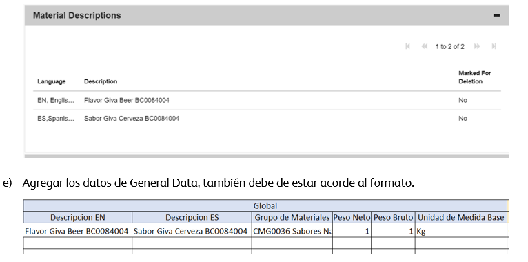

# ALTA MATERIA PRIMA DIRECTA (ZROD)
[back](analyst.md)

Descripción SOP:	Alta de Materiales ZROD
Frecuencia del proceso:	Esporádico 
Programas utilizados:	SAP ECC, MDM Workflow
Fecha de revisión:	25/07/2024
Fecha de creación:	01/12/2020
Creado por:	Sonia Verónica González
Revisado por:	Yahir Orona

## 1. Propósito
- El propósito de este documento es presentar todos los pasos necesarios para operar las solicitudes de creación de los materiales ZROD (Materia Prima Directa). 

## 2. Alcance
- Creación de códigos SKUs para cada material ZROD requerido.

## 3. Responsabilidades
- El Analista de MDM es el responsable de lo siguiente:
  - Validar que las solicitudes cumplan con los requisitos necesarios para realizar la creación del material tanto global como local.
  - Cumplir con la solicitud de acuerdo a los niveles de servicio establecidos.
  - Informar y dar seguimiento con el funcional de materiales de ZROD (Jose Eduardo Ramirez).

## 4. Descripción del proceso
### 4.1 Visualización de la solicitud 
- La solicitud llega por parte del usuario Jose Eduardo Ramirez en el modulo de Materiales con el tipo de servicio Materia Prima Directa, adjuntando el archivo de alta ZROD(Adjunto al final del archivo). El archivo debe de tener los campos de Global y complementos llenos para poder proceder con el alta en el flujo MDM Workflow.

- Una vez que tengamos la solicitud procedemos a validar los datos indicados en el archivo, el analista MDM realiza el alta en el portal de Mendix.
- 
*Revisar que el peso neto sea igual al peso bruto*
  - **Folio**: Asignado por el Analista MDM LDR para el control y seguimiento interno del manejo de los materiales.
  - **Material Referencia:** Material que puede ser usado para comparar con el que se va a solicitar
  - **Descripción EN/Descripción ES:** Texto que detalla el material a dar de alta (Puede tener modificaciones acorde al DS)
  - **Grupo de Materiales:** debe indicarse un CMG/Grupo de Artículos 
  - **Unidad de Peso:** debe indicarse la unidad de peso en que se gestionará el servicio.
  - **Peso Neto:**se debe indicar el Peso neto del material
  - **Peso Bruto:**se debe indicar el peso bruto del material
  - **Unidad de Medida Base:** debe indicarse la unidad de medida base en que se gestionará           el servicio.
  - **Nacional/Exportación:** debe de llenarse siempre como 03 NA
  - **Categoría de Valoración:** se llena con el dato predeterminado de 1300 Materiales Indirectos
  - **Grupo de Planificador de necesidades:** se llena con el dato predeterminado 1034 Materia Prima Cocimientos
  - **Request ID/Local ID/ Global ID:** una vez confirmada la solicitud el Analista MDM LDR debe de compartir estos datos.

- Antes de comenzar con el llenado en Mendix se debe de ajustar si es necesario la descripción del material para que este acorde a los estándares globales el material a dar de alta, en este caso se ajustó acorde al DS.

### 4.2 Generación en la solicitud en Mendix
- Una vez que tengamos todos los datos y ajustes en la descripción, procedemos a crear el material. Entrar a la liga http://infored/ , hacer clic en Servicios Generales para después escoger el apartado de Heiport.
- Seleccionar el apartado de Work, y escoger MDM Workflow.

- Una vez adentro del portal, debemos de hacer clic en Material >> Create en donde escogeremos la opción de YROH Raw Materials

- Se desplegará el formulario y se deberá ir llenando acorde al formato. Agregar la descripción del material por idioma(una por una) haciendo clic en el botón New.

- Como último paso, antes de enviar la solicitud, se hace una validación de todos los campos capturados, adicional de una validación de posibles registros duplicados. Si la solicitud se encuentra completa, daremos clic en “Submit Global Request”, de lo contrario habrá que revisar si nos hace falta algún dato o verificar la duplicidad del material que nos haya arrojado.

### 4.3 Aprobación
- Una vez que la solicitud haya pasado al Analista MDM LBDA, este debe de validar que cuente nuevamente con todos los estándares y requerimientos necesarios para la aprobación del material.(Validate>>Duplicate Check>> Submit Global Request)

- Una vez que el GDA aprueba la solicitud, nos llegará el correo de aprobación y posteriormente una ultima notificación con el global y local ID para el sistema en SAP(PRM400) 

