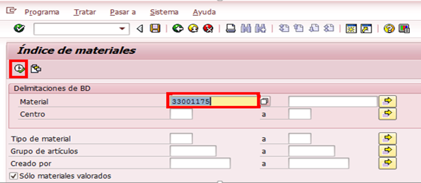
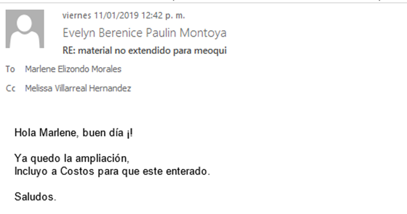
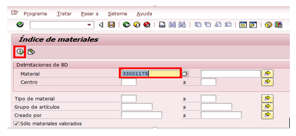
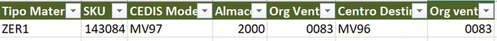
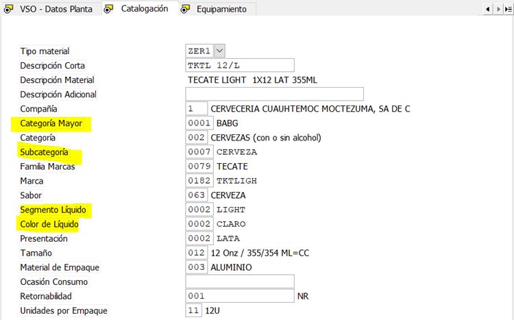
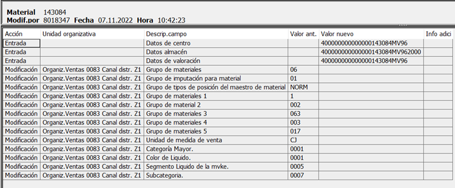

# AMPLIACIÓN PRODUCTO A PLANTA
[back](analyst.md)

Descripción SOP: Ampliación de producto a planta
Frecuencia del proceso:	Diaria
Programas utilizados:	SAP – ECC
Fecha de revisión:	25/07/2024
Fecha de creación:	01/11/2019
Creado por:	Evelyn Paulín	
Revisado por:	Yahir Orona

## 1. Propósito
- El propósito de este documento es presentar todos los pasos necesarios para hacer la ampliación de cualquier producto a un centro.

## 2. Alcance
- Al ejercer la ampliación de un material, apoyamos para que este pueda ser utilizado por el almacén de la planta, llevar a cabo algún traspaso, y que así mismo sea considerado de forma natural en temas de pedidos, tramos etc.

## 3. Responsabilidades
- El Analista de MDM es el responsable de llevar a cabo la ampliación con la previa solicitud.

## 4. Descripción del proceso #1
- Ampliación de Material

### 4.1 Solicitud
- Dicho requerimiento puede ser solicitado por el equipo de Materiales, Abasto y Empacotecnia
  
### 4.2 Ejecución del proceso
- Entramos a la transacción MM60, para poder revisar que efectivamente el material aun no este habilitado en el centro señalado y así mismo considerar algún centro como base. En este caso en la columna material agregamos el sku y damos clic en ejecutar.

- Te arrojara en que centros actualmente está ampliado dicho  material, lo cual te puede servir de referencia.

- Posteriormente ir a la transacción ZMATERIALES y seleccionar la opción de Ampliar Materiales.

- ***En el apartado Origen de Ampliación  capturaremos los siguientes datos.***
  - **Tipo de Material.-**  agregaremos si es un ZER1, ZER2, ZREM, ZALB, etc.
    - En este ejemplo haremos un ZALB	
  - **Numero de Material.**- Copiaremos el sku que deseamos ampliar.
  - **Centro.-**Agregaremos el centro en donde actualmente se encuentra ampliado, es decir el que vamos a tomar de referencia. 
  - **Almacen.-** capturaremos el almacén 1000. Considerando este ejemplo.
  - **Organización de Ventas.-** Capturaremos la 0083.
    - En la parte destino de Ampliación agregaremos lo siguiente.
    - Centro.- El destino en donde lo queremos ampliar.
    - Organización de Ventas.- Capturar 0083

***Puedes validar nuevamente en la MM60 y ya te deberá aparecer el centro que acabas de ampliar.***
- Notificar al usuario que ya fue ejecutado el movimiento y así mismo incluir al equipo de Costos.
- 

## 5. Descripción del proceso Innowera

### 5.1 Solicitud
- Dicho requerimiento puede ser solicitado por el equipo de Logistica

### 5.2 Ejecución del proceso
- Entramos a la transacción MM60, para poder revisar que efectivamente el material aun no este habilitado en el centro señalado y así mismo considerar algún centro como base. En este caso en la columna material agregamos el sku y damos clic en ejecutar.

- Te arrojara en que centros actualmente está ampliado dicho material, lo cual te puede servir de referencia.
- Posteriormente en nuestra carpeta de plantillas de Innowera hay que seleccionar la plantilla de 1- Ampliar

- En el apartado Origen de Ampliación capturaremos los siguientes datos. Nota: Validar que todos los campos estén correctamente en su lugar y asegurar que no falte ningún dato.

- **Tipo de Material.-**  agregaremos si es un ZER1, ZER2, ZREM, ZALB, etc.
  - En este ejemplo haremos un ZER1	
  - **Numero de Material/SKU.-** Copiaremos el sku que deseamos ampliar.
  - **CEDIS MODELO.-**  Agregaremos el centro en donde actualmente se encuentra ampliado, es decir el que vamos a tomar de referencia. Nota: Validar en la trx MM03 que el centro destino modelo no cuente con la condición de Sujeto a lote:
  - **Almacén.-** capturaremos el almacén 2000. Considerando este ejemplo.
  - **Organización de Ventas.-** Capturaremos la 0083.
  - **Centro.-** El destino en donde lo queremos ampliar. 
  - **Organización de Ventas.-** Capturar 0083
- Dar click en el botón de Correr:

- Validar en la trx MM03 y MM04 que los siguientes datos no se hayan borrado: (MM03)

- Puedes validar nuevamente en la MM60 y ya te deberá aparecer el centro que acabas de ampliar.
- Notificar al usuario que ya fue ejecutado el movimiento y así mismo incluir al equipo de Costos.
