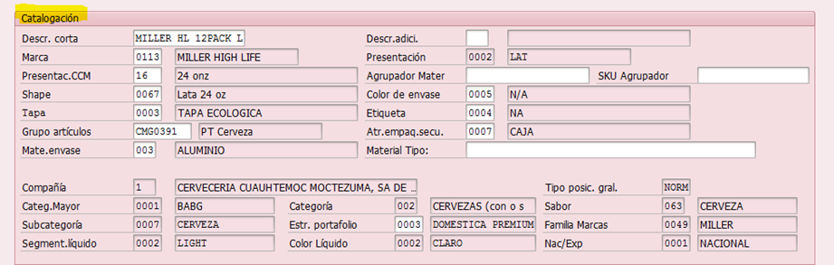

# ALTA SKU NACIONAL
[back](analyst.md)

Descripción SOP:	Alta de SKU nacional
Frecuencia del proceso:	Variante en base a Iniciativas de las Marcas (Diaria, Semanal etc)
Programas utilizados:	SAP - ECC
Fecha de revisión:	25/07/2024
Fecha de creación:	01/09/2020
Creado por:	Evelyn Paulín	
Revisado por:	Yahir Orona

## 1. Propósito
- El propósito de este documento es presentar todos los pasos necesarios para llevar acabo el alta de un Sku Nacional.

## 2. Alcance
- Dar trámite a la creación de un sku Nacional en base a la información proporcionada por las diversas áreas (NPI, Empacotecnia, Calidad, Almacen e Innovación) cumpliendo con  las características obligatorias señaladas en sistema SAP- ECC, para que este a su vez pueda ser utilizado en la planeación, producción, venta y distribución. 

## 3. Responsabilidades
- El Analista de MDM es el responsable de capturar en SAP ECC la información detallada en el formato de Alta de Sku Nacional, el cual nos lo comparte el equipo de NPI ya totalmente completo por las diferentes áreas involucradas (Calidad, Almacenes, Empacotecnia e Innovación).

## 4. Descripción del proceso
- Alta de Sku Nacional.

### 4.1 Solicitud
- Dicho requerimiento es solicitado por el equipo de NPI  Supply Chain anexando el formato actualizado de Alta de Sku Nacional.

### 4.2 Tratamiento de solicitudes
- Entramos a la transacción ZMATERIALES, damos enter.
- Seleccionamos la opción Solicitud de Creación de Producto Terminado y ejecutamos.

- En base al Excel de alta de sku revisaremos la primera parte si es Ret o No Retornable y seleccionaremos este punto en el SAP Ecc.

- Pasaremos a la parte de Catalogación capturando los siguientes datos conforme al Excel de alta de sku Nacional. 

- Ahora bien deslizaremos la barra desplazadora e iremos a la parte de Dimensiones.
- Capturaremos los siguientes datos del formato Excel los cuales también están en el apartado Dimensiones.

- En el formato Excel pasaremos al parte de Código de Barras EAN, para capturar los siguientes datos sombreados en amarillo en SAP ECC

- Nuevamente moveremos hacia abajo la barra desplazadora para ahora capturar los datos de Tamaño Caja y Tamaño Tarima Producto que a su vez están identificados con el mismo nombre en el formato Excel.

- Por último deslizaremos la barra a la parte final denominada Logistica de Producto, en donde seleccionaremos la o las planta productoras señalada en el formato Excel 

- En la parte de Plantas Distribuidoras señaladas en el SAP ECC, vamos a seleccionar todas las plantas, ojo solo te deja seleccionar  del MC01 Al MC09.
- Notaras que te regresa a la parte inicial de la máscara solo hay que volver a posicionarnos en la barra desplazadora para moverla nuevamente hasta el apartado de plantas distribuidoras para seleccionar el centro MC11
- Una vez hayamos dado clic en el centro MC11, volveremos a darle clic en  tal como se muestra en la siguiente imagen.

- Nuevamente te regresara a la parte inicial de la máscara por lo que repetiremos el paso en donde nos posicionamos en la barra desplazadora y la moveremos nuevamente hasta este apartado (Plantas distribuidoras) para seleccionar el ultimo centro MC49.
- Por último moveremos la barra desplazadora hacia arriba para ver el apartado dimensiones y agregaremos el campo denominado tamaño marcado en amarillo, daremos clic en donde estas las 2 hojitas nos mostrara la siguiente ventana

- Ahí seleccionaremos el campo correspondiente a la descripción del sku, que viene en la parte inicial del formato de alta de sku.

- Quedará de la siguiente manera.

- Por ultimo daremos enter
- Notaremos que se terminan de pre llenar datos en la parte de Catalogación.

- Guardamos y nos arroja núm de solicitud de SAP.