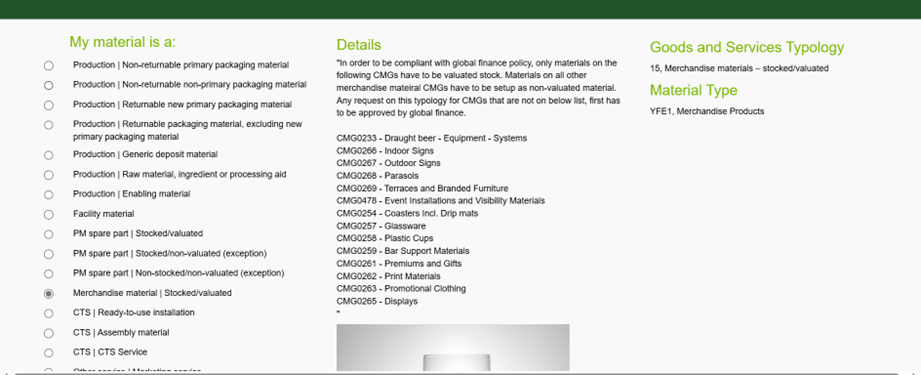

# ALTA MATERIALES MERCH (ZAW3)
[back](analyst.md)

Descripción SOP:	Alta de SKU Multicategorias
Frecuencia del proceso:	Por solicitud
Programas utilizados:	SAP
Fecha de revisión:	01/02/2025
Fecha de creación:	01/02/2025
Creado por:	Ronaldo Chavez		
Revisado por:	Ronaldo Chavez

## 1. Propósito
- El propósito de este documento es dar de alta materiales de merchandising, en especial los ZAW

## 2. Alcance
- Se apoya al equipo de Merchandising para crear el material ZAW3

## 3. Responsabilidades
- El Analista de MDM es el responsable de generar el alta y hacer las validaciones correspondientes cada que el usuario lo solicite.

## 4. Descripción del proceso
- Asegurar la correcta información a modificar en el alta

### 4.1 Solicitud
- La solicitud se sube a Heiflow utilizando el siguiente formato, donde se debe capturar el nombre o la descripción acorde a Collibra (Máximo 40 caracteres) así como el CMG, Canal, etc…

- Una vez revisado que la solicitud esta correcta, procedemos a entrar a Mendix para llenar la solicitud a global, seleccionamos la opción de Merchandise materials y le damos a crear.

- Ya dentro de la pestaña de creación, empezamos a llenar los datos con la información de la solicitud
- Se deben llenar todos los campos marcados con una estrella roja acorde a la solicitud (De faltar algún dato se debe rechazar la solicitud) Una vez terminada la solicitud, hay que esperar la respuesta de global (Usualmente de un día hábil) donde nos proporciona el sku global, local y número HCE

- Una vez teniendo esa información, pasamos a SAP a la transacción ZMATERIALES donde complementaremos la solicitud donde llenamos con el sku global, el tipo de material ZAW3 y las plantas productoras.

- Los datos para complementar se encuentran en el formato, centro, almacen y Grupo de compras ágil. Una vez terminado el complemento, procedemos a ampliarlo a los centros solicitados por el solicitante.

- Llenamos los datos que pide el movimiento y le damos ejecutar. 

### 4.2 Tratamiento de solicitudes
- Una vez teniendo esa información, pasamos a SAP a la transacción ZMATERIALES donde complementaremos la solicitud donde llenamos con el sku global, el tipo de material ZAW3 y las plantas productoras.

- Los datos para complementar se encuentran en el formato, centro, almacen y Grupo de compras ágil. Una vez terminado el complemento, procedemos a ampliarlo a los centros solicitados por el solicitante.

- Llenamos los datos que pide el movimiento y le damos ejecutar. 
