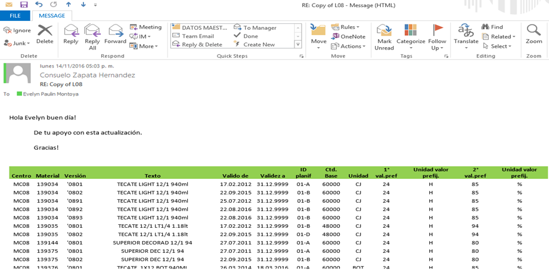

# AJUSTE DE EFICIENCIA Y VELOCIDAD
[back](bom.md)

Descripción SOP:	Ajuste de Eficiencia y de Velocidad
Frecuencia del proceso:	Diaria
Programas utilizados:	SAP
Fecha de revisión:	29/01/2025
Fecha de creación:	01/06/2024
Creado por:	Yahir Orona	
Revisado por:	Ronaldo Chavez

## 1. Propósito
- Ajustar la eficiencia y velocidad acorde a las necesidades de las diferentes plantas  afectando los materiales solicitados.

## 2. Alcance
- Eficiencia y velocidad de cada planta

## 3. Responsabilidades
- El Analista MDM BOM es el responsable de validar que la eficiencia y(o) velocidad se encuentren acorde a lo que requieren las plantas.

## 4. Descripción del proceso
### 4.1 Solicitud
- Para actualizar una eficiencia en alguna Receta es validarlo con la posición de Jefe de Tecologias Envasado en OS (Jesus Antonio Zazueta Muñoz). Para un movimiento de Velocidad es con Daniel avalos Sanchez, el es Jefe de Ingenieria OS 

### 4.2 Tratamiento de solicitudes
*Copiar información del correo en un Excel y agregarle filtros a la columna de encabezado.*

- Entrar al SAP ECC / Transacción C223
- Agregar los siguientes datos.
  - **Centro:** capturar la planta que nos está solicitando el ajuste (MC00, MC02, MC04, MC06, MC08 y MC10)
  - **Material SKU:** capturar el código de producto.

- Despues de dar enter, nos mostrara la siguiente pantalla

- Mover las columnas de tal forma que sean visibles los siguientes datos. (Alt, Grupo Recetas, Contador, Línea, Almacen para Tomas e ID planfi

- En base al archivo Excel, filtraremos por código de producto y ajustaremos su eficiencia en Sap, ejemplo.
  - Archivo Excel;  producto 139034  el cual tiene 5 versiones y la eficiencia que requiere es de 85 %

- SAP: Seleccionar la primer fila que en este caso corresponde a la versión 0801, (2) dar clic en el botón receta

- Para continuar nos arroja el siguiente recuadro, en donde daremos clic en el botón Calendario, si no aparece el calendario dar clic en el icono de palomita verde

- Nos muestra la siguiente pantalla en donde ejecutaremos los siguientes pasos.
  - Identificar la operación 1010
  - Mover la barra de desplazamiento, para visualizar la columna 2° val.pref
  - Vemos que trae un 85 %, borrar y ajustar en base a lo que solicitan en el correo.
  - Dar enter y seleccionar el botón Guardar.

- Al ejecutar el cambio nos debe mostrar el siguiente mensaje.

- Confirmar vía correo que los ajustes fueron realizados.
