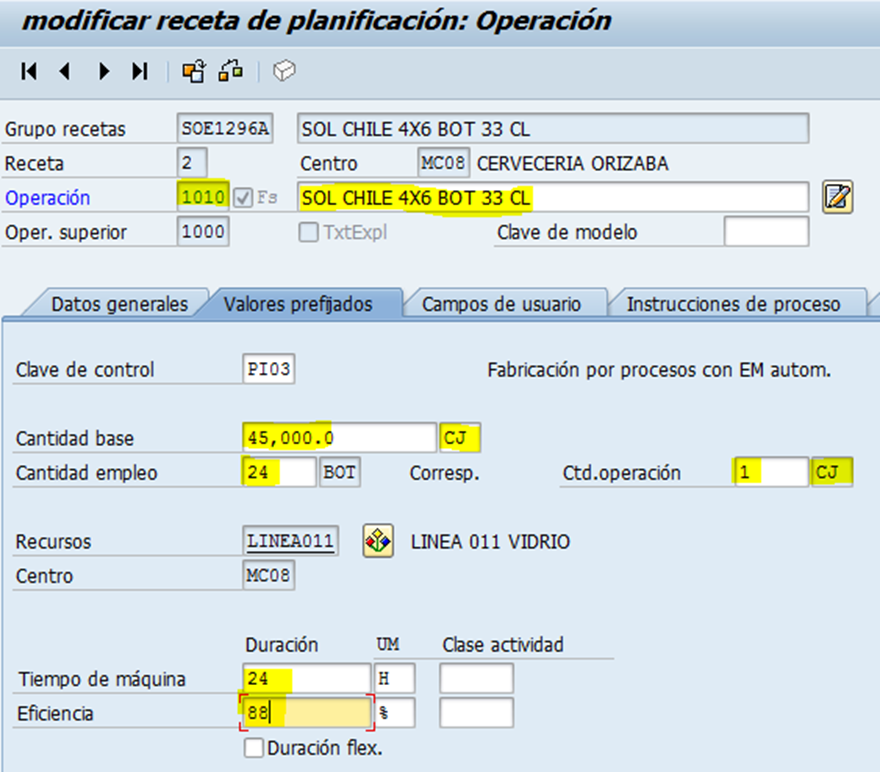
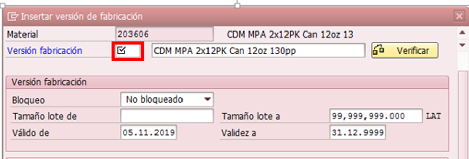

# ALTA DE RECETA
[back](bom.md)

Descripción SOP:	Creación de receta
Frecuencia del proceso:	Frecuente
Programas utilizados:	SAP
Fecha de revisión:	29/01/2025
Fecha de creación:	01/01/2019
Creado por:	Evelyn Paulín	
Revisado por:	Ronaldo Chavez

## 1. Propósito
- El propósito de este documento es presentar todos los pasos necesarios para la creación de una receta de producto terminado.

## 2. Alcance
- La correcta Planeación, Programación y Producción del producto Terminado en la Planta y Línea correspondiente.

## 3. Responsabilidades
- El Analista de MDM es el responsable de crear las recetas que cumpla con los estándares y lineamientos que se comentan a continuación, así como su correcta planeación en tiempo y forma previo a su producción y distribución.

## 4. Descripción del proceso
Creación y/o Habitación de Receta de Producto Terminado

### 4.1 Solicitud
- El alta de recetas puede ser solicitada por las siguientes áreas, cada una por la siguiente finalidad
  - **NPI – Emapacotecnia;** La entrada de Nuevos Productos al mercado.
  - **DM Supply Chain y Logistica de Producto;** por temas de ahorro y fletes
  - **Control de Materiales;** apoyando en temas de agotamiento

### 4.2 Tratamiento de solicitudes
- Entrar a la transacción C201 – Crear Receta de Planificación.
- Capturar los siguientes datos.
  - **Grupo de Recetas;** está conformado en base a la siguiente estructura.
  - **3 letras que especifiquen la marca + los últimos 4 dígitos del código de producto SAP + la letra A**
    - Ejemplo;  PLANTA MC00  SKU 203606 “CDM MPA 2x12PK Can 12oz 130pp”
  - **El grupo de Recetas quedaría de la siguiente manera. CDM3606A**
  - **Material;** agregar el código de producto nuevo.
    - Ejemplo 202696
  - **Centro;** agregar la planta productora.
    - Ejemplo MC00
  - **Perfil;** siempre agregar PI01.

- En la pestaña Cabecera de receta capturar los siguiente
  - *Estatus 4*
  - *Utilización 1*
- Dar enter, en donde te arrojara la siguiente imagen.

- Capturar los siguientes datos según la columna..
  - **Oper, Fase:** 1000, 1010 y 1020
  - **Indicador Fase;** seleccionar la operación 1010 y 1020
  - **Operación Superior:** Capturar en la Operación Fase 1010 y 1020 el número 1000
  - **Receptor:** Capturar en la Operación Fase 1010 y 1020 el número 01
  - **Recurso:** Capturar la línea en donde será programado, en este caso como es re-work se asigna la palabra MULTILIN en las tres Operación fase (1000,1010 y 1020) (Para validar en que línea se va a producir podemos tomar de ejemplo el archivo Líneas de Producción – Presentación y Marcas el cual se encuentra en la carpeta 30 - Master Data Documentation)
  - **Clave de Control:** En la Operación fase 1000 y 1010 se asigna la clave PI03, en cuanto a la operación  1020 se queda tal cual con el PI01.
  - **Denominación:** En la operación 1010 y 1020 el nombre del sku  y en la operación fase 1020 asignar la palabra SETUP

- Dar enter, para la sig pantalla

- Notaras que la operación 1010 y 1020 quedo marcado en color rojo.

- Dar doble clic en la operación 1010, en donde se habilitara la pestaña Valores Prefijados, revisaremos que en la parte de encabezado este correcta el Gpo de Recetas y la Descripción que indicamos al inicio del proceso.

- Si el paso anterior esta correcto proceder en capturar los datos restantes.
  - **Cantidad Base** = Cantidad de Cajas que se produce en 24 hrs.
    (La cantidad base se extrae de un producto base el cual debe ser misma presentación, misma planta, misma línea. Ejemplo para el producto 202696 - Sol P. Rico 4x6 bot 330 ml. voy a utilizar el base 201292 – Sol Chile 4x6 bot el cual se produce en OZB. Linea011, tomaré como referencia la versión 1102 pues es la que tiene mayor prioridad (01-A)

  - **Cantidad de Empleo** = Cantidad de lata que contiene dicho producto en este caso si vemos la descripción 2x 12 pk, se entiende que son 24 Lat.
  - **Tiempo de Maquina** = se extrae del producto base
  - **Eficiencia** = se extrae del producto base
  - **Cantidad de Operación;** se ajusta la abreviatura Lat por Cj, dando doble clic sobre campo.

- Una vez capturados los puntos anteriores dar enter  y pasar a la pestaña de Recursos Secundarios.

- Se habilitara la siguiente imagen en donde capturaremos lo siguientes datos en base a cada columna.

  - **Posición recurso sec** = 1000
  - **Recursos** = GRUPOL01  (Va en mayúsculas y los últimos tres campos hacen referencia a la línea en donde lo estas programando)
  - **Clave de Control** = PD01
  - **Descripción** = se escribe “GRUPO LINEA 1” ojo es en base a línea que estas programando dicho sku en este caso es la 1.
- Una vez capturados los datos anteriores dar enter. 
- Quedará de la siguiente manera.

- Dar clic en F3 o clic en la flechita verde  
- Regresaras a la pantalla de inicio
- Desmarcar posición 1010.
- Seleccionar y dar doble clic a la posición 1020, e ir la pestaña de Datos Generales, en el apartado Familia que lo encuentras desplazando la barra hacia abajo, preparación buscar el campo de Grupo y ahí capturaremos el sku producto terminado y daremos enter
- Te deberá aparecer la descripción del SKU

- Si marca algún error como el siguiente.

- Hay que habilitar primero el sku, se abrirá un nuevo modo en Sap – ECC   en la transacción OP43 
- Nos arrojara la siguiente pantalla en donde daremos clic en Entradas Nuevas 

- Agregaremos el Centro – el Sku – Una breve Descripción del sku.
  - Ver la siguiente imagen

- Dar clic en Guardar
- Arrojará la siguiente imagen

- Regresaremos a la receta, volveremos a dar enter Familia preparación y ya nos dejara ver la descripción que le dimos al sku

- Ir a la pestaña de Relación de Ordenación.

- Se habilitara la siguiente imagen, en donde en la columna Fase capturaremos el número 1010 y daremos enter.

- Daremos clic en F3 o flechita verde  
- Nos regresara a la pestaña de inicio

- Seleccionamos la pestaña de materiales
- Nos arrojara la siguiente imagen en donde capturaremos los siguientes datos.
  - Version de Fabricación: se compone 4 dígitos, los primeros 2 hacen referencia a la línea y los últimos 2 a la lista de material.
  En este caso como es un sku completamente nuevo, recordemos que la línea es la 1 y la lista de material es la 1, quedaría de la siguiente forma   “0101”

  - **Lista Material Alternat** =  al número de lista de material que deseas ligar en dicha receta. 
  En este caso es la 01
  - **Utilizac.lista mat.** = siempre debe llevar “1”

  - **Línea de Producción** = a la línea en donde se producirá dicho sku en este caso como es re-work se deja como “Multilin”
  - **ID Planif** = a la prioridad que va tener dicho sku, ejemplo 01-A, 01-B, 01-C  dependiendo las líneas en donde está programado dicho sku por planta.
    En este caso como es re-work no lleva ID Planif.
  - **Almacén para tomas** = se compone de 4 dígitos, los primeros dos son el número “11” y los otros dos son el equivalente a la línea en done programaste el sku, en este caso puntual la linea1, quedando 1101
  - **Almacen receptor** = siempre es 2000
- Debe quedar de la siguiente forma:

- Dar clic en la tachita azul  
- Te mostrara la lista de materiales, daremos clic en marcar todo
- Dar clic en el botón guardar.
- Te abrirá una pestaña, donde daremos clic en "Si"
- Abrir un nuevo modo capturando  la transacción C223
- En Centro agregaremos la planta en donde creamos la receta, en este caso MC00 y en Material capturaremos el sku, en este caso el 203606

- Daremos enter.
- Te arrojara la siguiente linea, la selecionaremos y daremos clic al botón de balanza

- Te mostrara el siguiente mensaje, solo daremos clic en la flechita verde.

- Te regresara a la imagen principal y daremos clic en el botón guardar.
- Con ello queda activa la receta.
- Notificar al solicitante que la receta ya fue creada.

