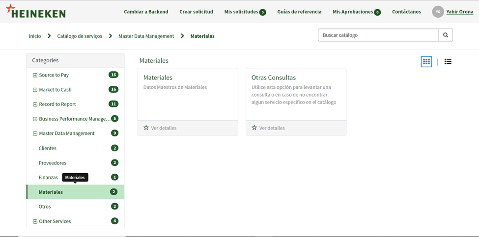
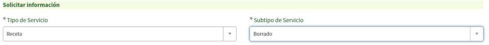
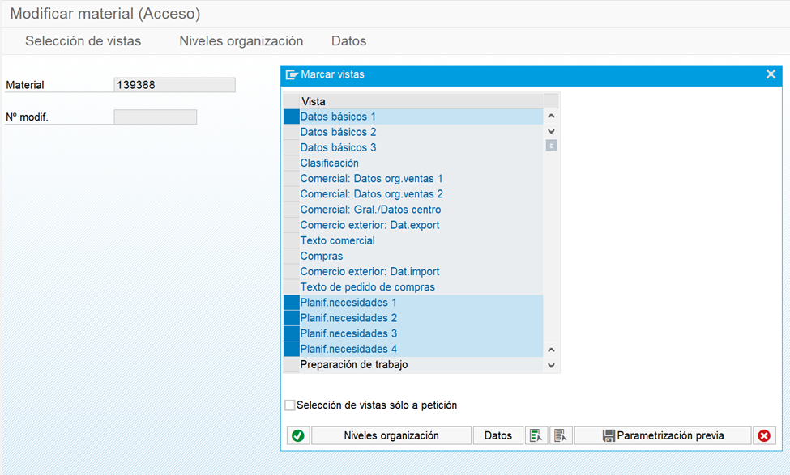
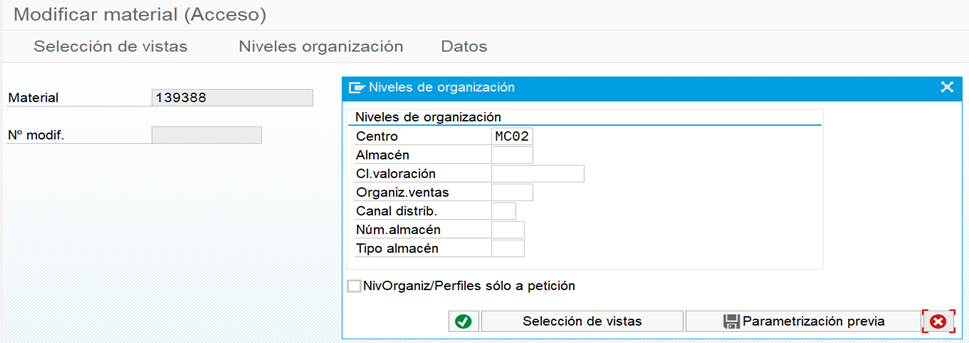
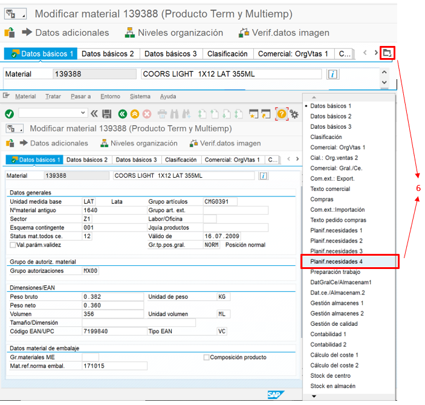
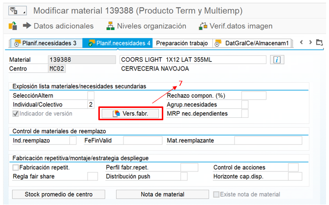
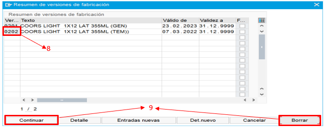

# ELIMINAR RECETAS
[back](bom.md)

Descripción SOP:	Eliminación de Recetas
Frecuencia del proceso:	Diaria
Programas utilizados:	SAP
Fecha de revisión:	29/01/2025
Fecha de creación:	08/08/2024
Creado por:	Yahir Orona	
Revisado por:	Ronaldo Chavez

## 1. Propósito
- La eliminación de recetas cuyo propósito ya fue cumplido o son erróneas.

## 2. Alcance
- Recetas de SKU para diferentes centros.

## 3. Responsabilidades
- El Analista MDM BOM es el responsable de validar que las recetas sean eliminadas adecuadamente de acuerdo a las necesidades del solicitante.

## 4. Descripción del proceso
### 4.1 Solicitud
- La solicitud puede venir por el portal de HeiFlow o por medio de correo, sin embargo, llega principalmente por correo electrónico al Analista MDM BOM.
- Si llega a HeiFlow se utiliza el apartado Master Data Management -> Materiales -> Tipo de Servicio: Receta -> Subtipo de Servicio: Borrado

### 4.2 Tratamiento de solicitudes
- Abrir SAP y dirigirse a la transacción MM02
- Escribir el material
- Seleccionar “Datos Básicos 1, Planif. Necesidades 1, 2, 3 y 4”
- Una ves capturado el material y seleccionado las vistas requeridas damos click en ejecutar (Palomita verde)

- Capturamos el centro y volvemos a dar ejecutar

- Seleccionamos la pestaña que nos abre las variantes y seleccionamos “Planif. Necesidades 4”

- Nos mostrara la pantalla siguiente donde daremos click en versión de fabricación

- A continuación, aparecerá la siguiente pantalla donde tenemos que seleccionar la receta que deseamos borrar.
- Luego daremos borrar y continuar

- Por último, daremos click en guardar
- Como ultima validación podemos ir a la transacción C223 y verificar que efectivamente no esté la receta.		