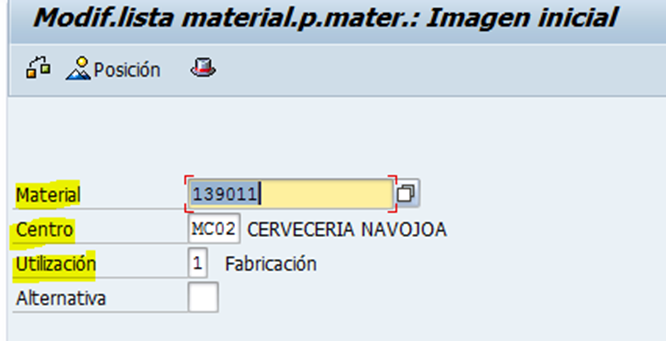
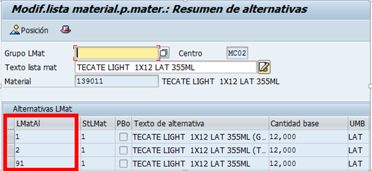
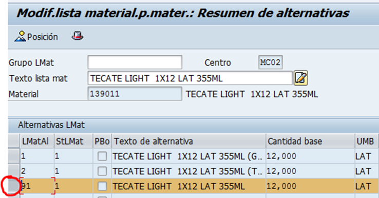
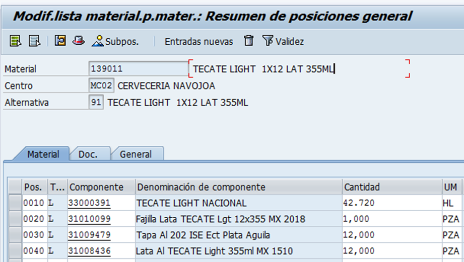
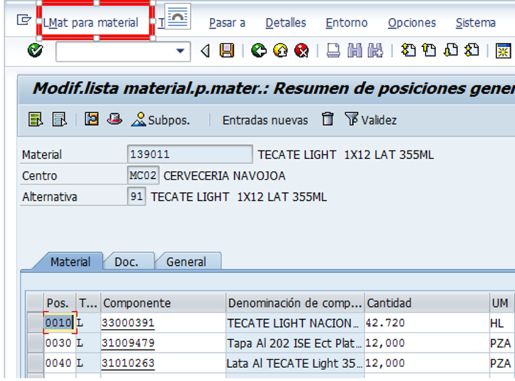
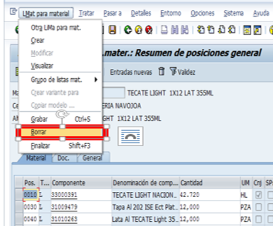

# BAJA MATERIALES ZCON
[back](bom.md)

Descripción SOP:	Eliminar lista de material
Frecuencia del proceso:	Frecuente
Programas utilizados:	SAP
Fecha de revisión:	29/01/2025
Fecha de creación:	01/02/2019
Creado por:	Evelyn Paulín	
Revisado por:	Ronaldo Chavez

## 1. Propósito
- El propósito de este documento es presentar todos los pasos necesarios para la eliminación de una lista completa de material para producto terminado.

## 2. Alcance
- Eliminar de forma correcta y bajo los lineamientos de seguridad para no generar impacto en temas de producción.

## 3. Responsabilidades
- El Analista de MDM es el responsable de eliminar las listas de material que cumpla con los estándares y lineamientos para no generar impacto alguno en temas de producción.

## 4. Descripción del proceso
- Eliminar Listas de Material de Producto Terminado.

### 4.1 Solicitud
- Para eliminar una lista de material se debe tener una previa solicitud por parte de la planta, o bien que el analista MDM considere que ya no se utilizara más.

### 4.2 Tratamiento de solicitudes
- Entrar a la transacción CS02 – Modificar lista de materiales
- Capturar los datos señalados.
  - **Material** = sku producto terminado
  - **Centro** = Agregar la Planta Productora (MC00, MC02, MC04, MC06, MC08, MC10 y MC48)
  - **Utilización** = siempre debe llevar el “1”

- Dar enter
- En la primera columna te mostrara el número de alternativas que tiene habilitado dicho producto en la planta que anteriormente señalaste. 
  - Revisando este ejemplo para el producto 139011 en planta MC02 tiene 3 listas: 1, 2 y la 91 

- Seleccionar la alternativa que deseas ajustar posicionándote en el cuadro que esta antes del número de la alternativa.
- En este caso seleccionare la 91, anexo ejemplo
- En automático se marcara con el siguiente color.

- Dar doble clic dentro de la fila que ya tienes marcada. Debe mostrarlo de la siguiente forma.

- Seleccionar la opción “LMat para material”  

- Te arroja el siguiente listado, en donde daremos clic en Borrar

- Te aparecerá el siguiente mensaje en donde daremos clic a la opción Sí.
- Notificar al solicitante el movimiento 