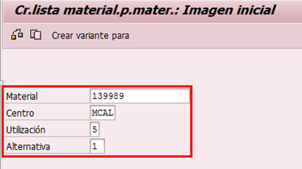
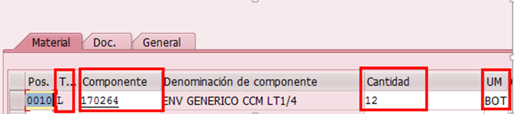
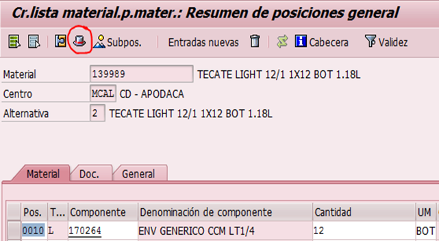
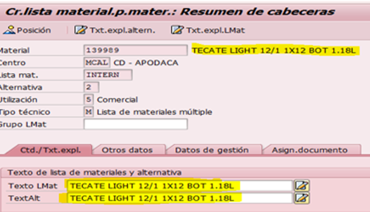
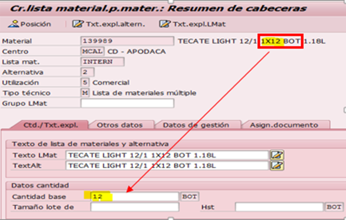
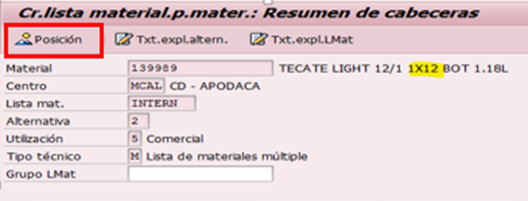
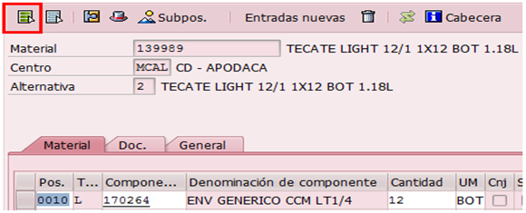

# CREACIÓN DE LISTA BOM5
[back](bom.md)

Descripción SOP:	Creación de lista BOM5
Frecuencia del proceso:	Media
Programas utilizados:	SAP / ECC
Fecha de revisión:	25/07/2024
Fecha de creación:	01/10/2019
Creado por:	Evelyn Paulín	
Revisado por:	Yahir Orona

## 1. Propósito
- El propósito de este documento es presentar todos los pasos necesarios para la creación de una lista de retorno de envase (BOM5)

## 2. Alcance
- La planeación y utilización de un producto de retronó a cualquier centro destino para que este a su vez pueda ser ingresado a cualquier almacén, en donde pueda ser programado e inventariado a través de la herramienta correspondiente (SAP)

## 3. Responsabilidades
- El Analista de MDM es el responsable de crear la lista de retorno que cumpla con los estándares y lineamientos tales como Sku -Producto Terminado, la Planta Productora, Centro Suministro y/o Centro de Distribución, todo ello definido por las siguientes áreas; Empacotecnia, la Planta, Logistica Inversa y Datos Maestros (Supply Chain)

## 4. Descripción del proceso
- Creación de Lista BOM5 (retorno de envase) para un Producto Terminado

### 4.1 Solicitud
- Describe, paso a paso, la primera parte de proceso. Si es necesario, incluye imágenes (impresiones de pantalla) que ayuden al entendimiento de la actividad.

Para crear una lista de retorno se debe tener una previa solicitud por las siguientes áreas
- Logistica Inversa / Empacotecnia
- Coordinadores de Ctl de Producción y Materiales de cada planta; Ya que al programar el plan de producción  se pueden percatar que el producto terminado no está ligando como tal el descuento de un envase.
- Dato Maestro Supply Chain; Nuevo Producto, Nuevo Envase, Tramite de Product Allocation etc.
- Centros de Distribución, al no poder dar ingreso al almacén o ejercer algún traspaso a otro centro destino.

### 4.2 Tratamiento de solicitudes
- Entrar a la transacción CS01 – Crear lista de materiales
- Capturar los datos señalados.
  - **Material** = sku producto terminado (en donde le ligaremos dicho envase)
  - **Centro** = Planta Productora, Centro de Suministro o Centro de Distribución
  - **Utilización** = siempre debe llevar el “5”
  - **Alternativa** = 1

- Dar enter
- Se habilitara la siguiente imagen en donde se captura los siguientes 4 campos.

  - **TpP**: Agregar la letra “L” 
  - **Componente**: Agregar el número de envase que debe ligar el producto terminado, este lo puedes consultar en la tx MM03 /Datos Básicos 2
  - **Cantidad**:  va en referencia a la presentación del producto terminado,  es decir si es    1x12 = 12 Bot      4x6 =24 Bot      1x24= 24 Bot
  - **UM**: Bot
- Una vez capturados los 4 datos anteriores dar enter.
- Dar clic en el icono de cabecera.

- Te mostrara la siguiente imagen en donde vamos a capturar la Descripción del producto Terminado en  los siguientes 2 apartados Texto LMat y TextAlt

- En Cantidad base asignaremos el número de botellas según la presentación       
Ver la siguiente imagen.

- Dar clic en el botón de Posición.

- Dar clic en marcar todo

- Notificar al usuario que ha concluido el proceso.