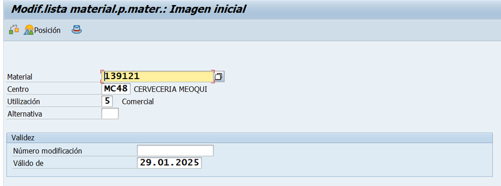
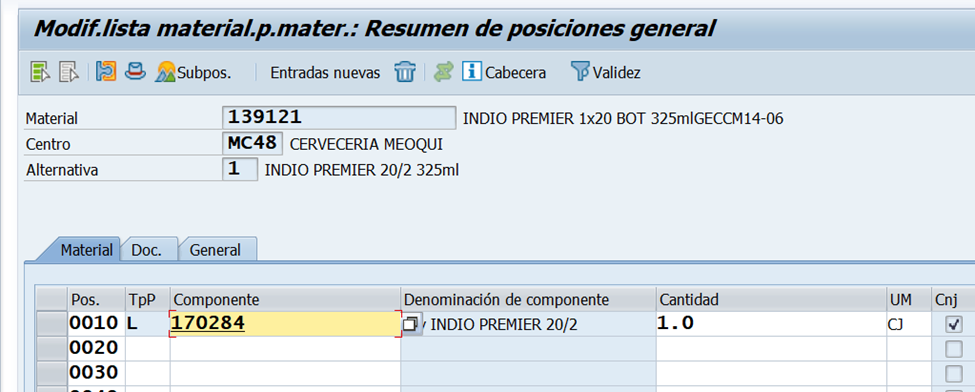

# CAMBIO COMPONENTE MATERIAL BOM5
[back](bom.md)

Descripción SOP:	Cambio componente material BOM5
Frecuencia del proceso:	Media
Programas utilizados:	SAP / ECC
Fecha de revisión:	29/01/2025
Fecha de creación:	29/01/2025
Creado por:	Ronaldo Chavez	
Revisado por:	Ronaldo Chavez

## 1. Propósito
- El propósito de este documento es presentar todos los pasos necesarios para la modificación del componente en un material (BOM5)

## 2. Alcance
- La planeación y utilización de un producto de retronó a cualquier centro destino para que este a su vez pueda ser ingresado a cualquier almacén, en donde pueda ser programado e inventariado a través de la herramienta correspondiente (SAP)

## 3. Responsabilidades
- El Analista de MDM es el responsable de crear la lista de retorno que cumpla con los estándares y lineamientos tales como Sku -Producto Terminado, la Planta Productora, Centro Suministro y/o Centro de Distribución, todo ello definido por las siguientes áreas; Empacotecnia, la Planta, Logistica Inversa y Datos Maestros (Supply Chain)

## 4. Descripción del proceso
- Modificación de componente de Lista BOM5 (retorno de envase) para un Producto Terminado

### 4.1 Solicitud
- Describe, paso a paso, la primera parte de proceso. Si es necesario, incluye imágenes (impresiones de pantalla) que ayuden al entendimiento de la actividad.
    ***Para modificar el componente de un material BOM5 se debe tener una previa solicitud por las siguientes áreas***
    - Logistica Inversa / Empacotecnia
    - Coordinadores de Ctl de Producción y Materiales de cada planta; Ya que al programar el plan de producción se pueden percatar que el producto terminado no está ligando como tal el descuento de un envase.
    - Dato Maestro Supply Chain; Nuevo Producto, Nuevo Envase, Tramite de Product Allocation etc.
    - Centros de Distribución, al no poder dar ingreso al almacén o ejercer algún traspaso a otro centro destino.

### 4.2 Tratamiento de solicitudes
- Entrar a la transacción CS02 – Modificar lista de materiales
- Capturar los datos señalados.
  - Material el cual se vaya a modificar
  - Centro del material a modificar
  - Utilización poner 5, que corresponde al BOM5
  - Alternativa: 1

- Posicionarnos en la columna de “Componente”
- Realizar el cambio del componente de acorde a la solicitud.

- Clic en guardar

