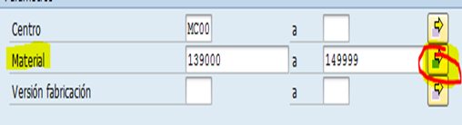
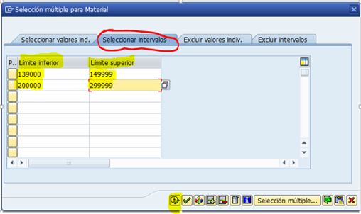
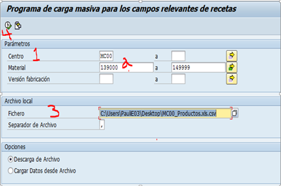
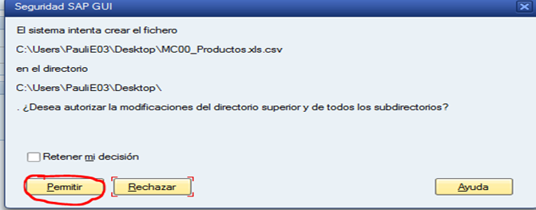
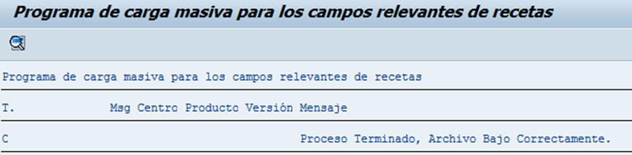

# EXTRACCION DE RECETAS DE FORMA MASIVA
[back](bom.md)

Descripción SOP:	Extracción recetas - masiva
Frecuencia del proceso:	Cada que haya lanzamiento de productos nuevos
Programas utilizados:	SAP y APO
Fecha de revisión:	01/08/2024
Fecha de creación:	01/06/2022
Creado por:	Evelyn Paulin	
Revisado por:	Yahir Orona

## 1. Propósito
- Habilitar las listas de materiales en la línea y poder producirse.

## 2. Alcance
- Extracción de información para su posterior envío a las plantas.

## 3. Responsabilidades
- Ejecución y carga correcto a las líneas de producción.

## 4. Descripción del proceso
### 4.1 Tratamiento de solicitudes
- Entrar a la transacción ZCSAP_P102 Carga masiva
- Primero agregar en fichero la locación donde se van a guardar
  - Agregar Centro; MC00
  - Material; agregar el código de producto ejemplo 139011.
    *También se puede agregar el rango de parámetros ZER1 y ZER2 (dando clic en la flecha verde y seleccionando la pestaña selección de intervalos agregar los parámetros) una vez capturado el rango dar clic en ejecutar.*

- En Fichero, nombrar el archivo que vamos a extraer.
- Dar clic en ejecutar.

- Arrojara la siguiente pantalla, en donde daremos clic en Permitir.

- Esta pantalla concluye con el proceso.

