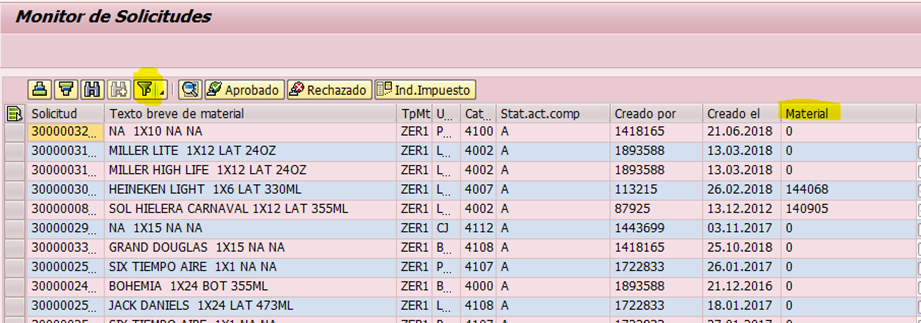

# PALOMEO DE PRODUCTO TERMINADO
[back](bom.md)

Descripción SOP:	Palomeo en Producto Terminado
Frecuencia del proceso:	Frecuente
Programas utilizados:	SAP
Fecha de revisión:	29/01/2025
Fecha de creación:	01/11/2019
Creado por:	Evelyn Paulín	
Revisado por:	Ronaldo Chavez

## 1. Propósito
- El propósito de este documento es presentar todos los pasos para realizar el Palomeo.

## 2. Alcance
- Al activar este atributo intervienes como área principal y final del proceso en donde activaras el sku a utilizar, con ello dicho producto podrá estar visible y activo para su planeación y producción.

## 3. Responsabilidades
- El Analista de MDM es el responsable de efectuar el primer palomeo un vez quede habilitada la lista y receta del sku, así mismo también ejecutara el ultimo palomeo una vez que los atributos del sku estén correctos y que el resto de las áreas hayan concluido cada uno de sus proceso

## 4. Descripción del proceso
### 4.1 Ejecutar palomeo
- Para Ejecutar en palomeo existen diversos escenarios.
- Tanto en productos ZER1 y ZER2 el primer palomeo se lleva acaba una vez que ya se tiene habilitada la lista de material y receta
- En Productos Multicategoria, Promocionales etc. se lleva a cabo de forma inmediata en cuanto llega la solicitud.
- En este caso, me enfocare en un ejemplo en donde estamos creando un nuevo sku Nacional En base al seguimiento ya se generó la lista y receta, ya tenía mi primero palomeo con el que inicie el proceso y adicional el resto de las áreas que Intervienen también ya terminaron sus procesos, este regresa a Dato Maestro para cerrar el ciclo del palomeo.

### 4.2 Tratamiento de solicitudes
- Entrar a la transacción ZMATERIALES, te arrojara la siguiente imagen.
  - Seleccionar el campo Monitor de Solicitudes
  - Y en el bloque Parámetros de Entrada, seleccionaremos y capturaremos lo siguiente
  - Tipo de Material agregaremos ZER1 o ZER2 según sea el caso de sku a tratar.
    En este ejemplo son varios y todos son Nacionales = ZER1	
    Seleccionar la Opción Modificar. Quedando de la siguiente forma.

- Dar clic en ejecutar. 
- Te arrojara la siguiente imagen en donde agregaremos Seleccionaremos la columna Material y agregaremos filtro. 

- A continuación podrás copiar los sku´s que deseas palomear..
- Quedaría de la siguiente forma y le damos ejecutar.

- Te dejara habilitada la siguiente imagen en donde daremos clic en la palomita verde. 
- Te regresara a la planta inicial, ahora con la flecha derecha te desplazaras de columnas, llegando así a la que deseas palomear.
  - En este caso será la columna Calidad para poder realizar el sku ya debe contar con el palomeo de Datos Maestros y costos de lo contrario no se puede realizar el de Calidad.

- Debes dar clic en cada cuadro en blanco correspondiente a la columna, en este caso son 7 ya que son diferentes sku´s nuevos que quiero habilitar y como se muestra en la imagen anterior ya cada área completo su proceso.

- Al dar clic en el recuadro en blanco te arrojara la siguiente imagen, daremos clic en concluir tarea.

- Una vez marcados con la palomita todos los skus en la columna correspondiente daremos clic en la opción guardar.
- Te arrojara el siguiente mensaje en donde daremos clic en la palomita verde.
- Te regresara a la pantalla inicial, en donde ya está finalizado el proceso.

