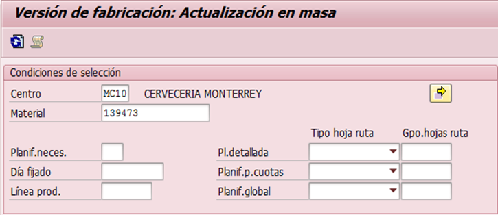
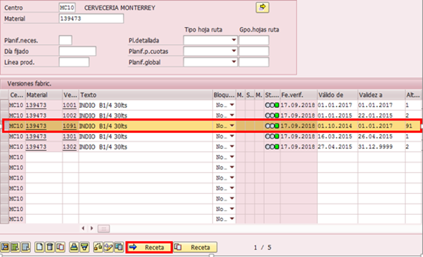
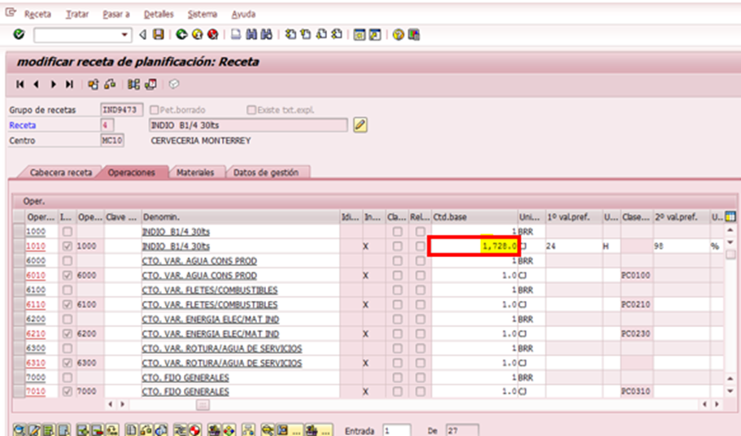
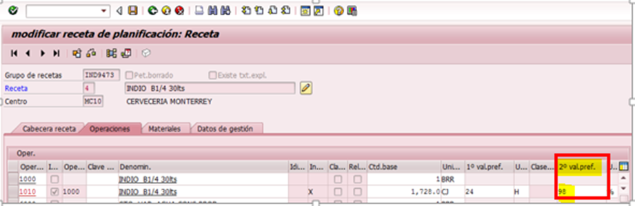

# MODIFICACIÓN DE RECETA
[back](bom.md)

Descripción SOP:	Modificación de receta 
Frecuencia del proceso:	Frecuente
Programas utilizados:	SAP
Fecha de revisión:	25/07/2024
Fecha de creación:	01/01/2019
Creado por:	Evelyn Paulín	
Revisado por:	Yahir Orona

## 1. Propósito
- El propósito de este documento es presentar todos los pasos necesarios para la modificación de una receta de producto terminado.

## 2. Alcance
- La correcta Planeación, Programación y Producción del producto Terminado en la Planta Correspondiente.

## 3. Responsabilidades
- El Analista de MDM es el responsable de modificar las recetas solicitadas por el equipo de Control de Producción alineados al vobo de Ingeniería.

## 4. Descripción del proceso
- Modificación de Receta de Producto Terminado

### 4.1 Solicitud
- El ajuste de las recetas son solicitadas por el equipo de Control de Producción en base a la capacidad y eficiencia de cada línea en cada planta.
    Existen 2 tipos de Ajuste Velocidad = Cantidad Base en  la cual antes de ejecutar el cambio debemos percatarnos que dicho ajuste ya fue aprobado por el equipo de Ingeniería y el segundo el cambio de Eficiencia

### 4.2 Tratamiento de solicitudes
- Entrar a la transacción C223 – Actualización versiones de fabricación
- Capturar los siguientes datos.
  - **Centro;** agregar la planta productora.
    Ejemplo MC10
  - **Material;** agregar el código de producto nuevo.
    Ejemplo 139473

- Seleccionar la versión de fabricación que debe sufrir dicho cambio y dar clic en el botón de receta.

- En la columna Cantidad Base podrás ajustar el dato por el cual te está indicando la planta (ctl de producción) y dar enter.
  - **OJO DEBE TRAER VOBO DE INGENIERÍA**

- Guardamos
- Si el cambio corresponde a eficiencia, debes realizar el movimiento en la columna 2° val pref. Cambiando el porcentaje tal cual lo señala el solicitante.

- Enter y guardamos

