# REPLICAR LISTA DE MATERIAL
[back](bom.md)

Descripción SOP:	Replicar lista de material 
Frecuencia del proceso:	Frecuente
Programas utilizados:	SAP
Fecha de revisión:	25/07/2024
Fecha de creación:	01/02/2019
Creado por:	Evelyn Paulín	
Revisado por:	Yahir Orona

## 1. Propósito
- El propósito de este documento es presentar todos los pasos necesarios para replicar una lista de material de producto terminado ya se de una misma planta o diferente.

## 2. Alcance
- Replicar de forma correcta y en base a un requerimiento la lista de Material de un producto terminado para su futura producción.

## 3. Responsabilidades
- El Analista de MDM es el responsable de replicar la listas de material que cumpla con los estándares y lineamientos tales como el Sku de Producto Terminado, la Planta Productora, la Línea todo ello bajo una previa solicitud por la Planta, El equipo de Empacotecnia, Materiales o Datos Maestros.

## 4. Descripción del proceso
- Replicar Lista de Material para Producto Terminado.

### 4.1 Solicitud
- Para replicar una lista de material se debe tener una previa solicitud por las siguientes áreas
  - Empacotecnia
  - Materiales
  - Coordinadores de Ctl de Producción y Materiales de cada planta.
  - Datos Maestros

### 4.2 Tratamiento de solicitudes
- Entrar a la transacción CS01 – Crear lista de materiales
- Capturar los datos señalados.
  - **Material** = sku producto terminado
  - **Centro** = Agregar la Planta Productora (MC00, MC02, MC04, MC06, MC08, MC10 y MC48)
  - **Utilización** = siempre debe llevar el “1”
  - **Alternativa** = número de alternativa que vas a generar, en este caso creare una alternativa de prueba “91”
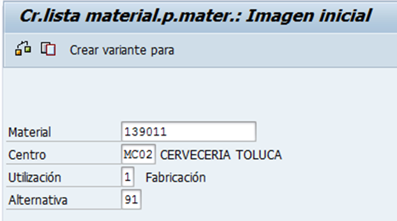
- Dar clic en el botón copiar.
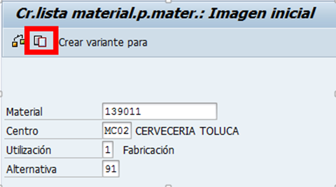
- Te arrojara el siguiente mensaje. Posteriormente dar enter.
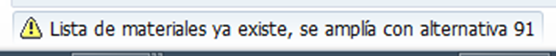
- Se habilitara el siguiente recuadro “Copiar Modelo” en donde escribiremos el número de alternativa del cual deseamos copiarnos.
  - Siguiendo el ejemplo tomare de base al alternativa 1 de los datos antes capturados (Sku – Centro – Alternativa)
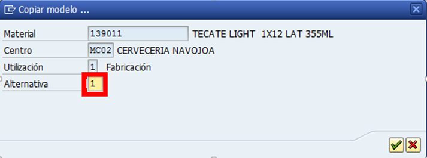
- Dar clic en la palomita verde.
- Posteriormente te arrojara la LM que has copiado y ahora daremos clic en el botón marcar todo.
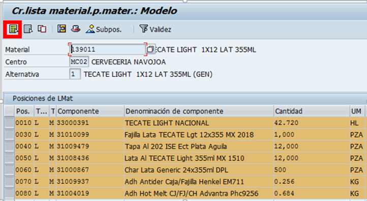
- Una vez marcado todo dar clic en el botón “Tomar” 
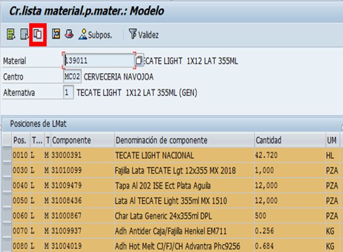
- Dar doble clic dentro de la fila que ya tienes marcada. Debe mostrarlo de la siguiente forma en donde notaras que ya aparece con el número de alternativa que especificaste al inicio.
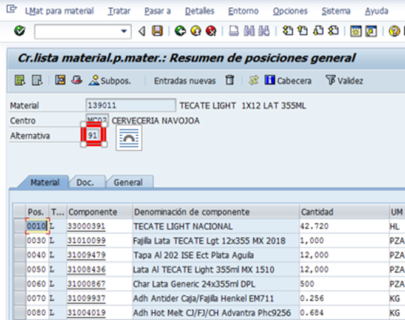
- Dar clic en el botón de cabecera 
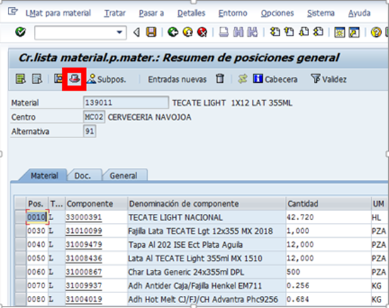
- Seleccionaremos la descripción que indica el material y la copiaremos en los recuadros de  Texto LMat y TextAlt.
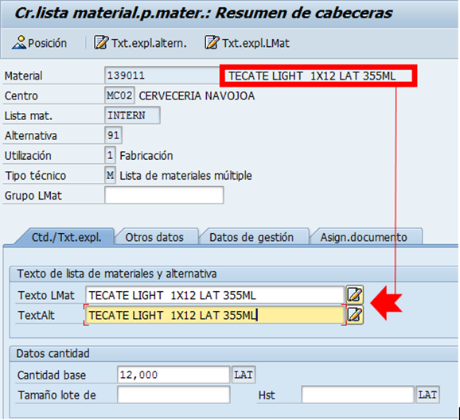
- Una vez capturado lo anterior dar clic en el botón posición.
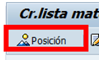
- Nuevamente dar clic en el botón Marcar todo y seleccionar grabar.
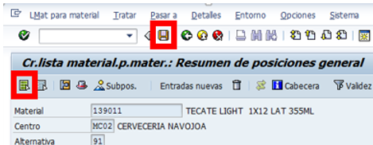
- Fin

