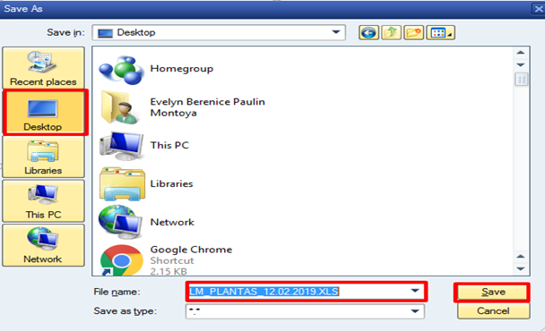

# EXTRACCIÓN DE LISTA DE MATERIAL
[back](bom.md)

Descripción SOP:	Reporte de Lista de Material
Frecuencia del proceso:	Diario
Programas utilizados:	SAP
Fecha de revisión:	25/07/2024
Fecha de creación:	01/02/2019
Creado por:	Evelyn Paulín	
Revisado por:	Yahir Orona

## 1. Propósito
- El propósito de este documento es presentar todos los pasos necesarios para extraer una listas de material de cada producto – planta según sea el requerimiento.

## 2. Alcance
- La extracción de lista de Material nos apoya en el concentrado total de materiales a utilizar para cada planta en base a la línea en donde se estima producirlo y también sirve como referencia para la creación y desarrollo de nuevos sku´s, o para la definición de nuevos cambios en base las nuevas iniciativas.

## 3. Responsabilidades
- El Analista de MDM es el responsable de compartir las listas de material que cumpla con los lineamientos ejemplo que dicha lista este vigente.

## 4. Descripción del proceso
- Extracción Lista de Material.

### 4.1 Solicitud
- Dicho requerimiento va por solicitud la cual puede ser extendida por Empacotecnia, Materiales, NPI´s, Logistica etc.

### 4.2 Tratamiento de solicitudes
- Entrar a la transacción ZMN_ADMINISTRA_DMPP – Administración de DM PP.
- Te aparecerá la siguiente imagen en donde deberán estar seleccionadas las opciones Lista de Materiales y Exportar Lista Materiales PP. Quedando de la siguiente forma, 

- Dar clic en ejecutar.
- Capturaremos el número de producto terminado que deseamos visualizar.
- En la fila centro, agregaremos en número de planta.
- En utilización debemos dejar el número “1” y clic en ejecutar.
- Te arrojara la siguiente pantalla en donde daremos clic en el botón   tal como se muestra en la siguiente imagen

- Te habilitara la siguiente imagen en donde capturaras la ruta en donde deseas guardar el archivo, en este caso seleccionare escritorio y le daremos algún nombre, por ultimo dar clic en Save

- Te aparecerá el siguiente recuadro en donde solo daremos clic en Transferir.
- Te arrojara el siguiente mensaje de seguridad en donde daremos clic en opción Permitir.
- Nuevamente te aparecerá el siguiente mensaje en donde hay que dar clic en la opción Permitir.
- Por ultimo te arrojara el siguiente mensaje, en donde ya fueron transmitidos los datos  
- Abrir la extracción realizada buscándola en la ruta y  con el nombre que señalaste

- Proceder en eliminar las siguientes columnas C, E, F, I, M y de la O hasta la U.
- Ante ello únicamente quedaran las siguientes columnas.

- Guardar  los cambios y compartir el arvhivo al solicitante.

