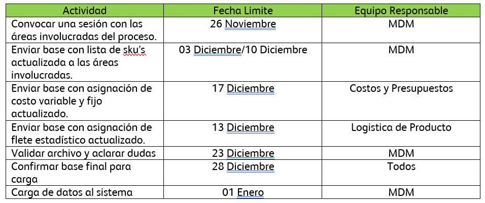

# ACTUALIZZACIÓN ANUAL DE COSTO DE TRANSFERENCIAS
[back](bom.md)

Descripción SOP:	Actualización Anual del Costo de Transferencia
Frecuencia del proceso:	Anual
Programas utilizados:	SAP
Fecha de revisión:	14/08/2024
Fecha de creación:	14/08/2024
Creado por:	Yahir Orona	
Revisado por:	Yahir Orona

## 1. Propósito
- Actualizar la base de datos cargada en la transacción ZAF_CECOSTRANS de manera masiva el 1° de Enero de cada año

## 2. Alcance
- Costo variable y costo fijo de cada SKU y el flete estadístico para los centros con dichos SKU’s habilitados

## 3. Responsabilidades
- El Analista MDM BOM es el responsable de validar que se realice de manera eficiente el cambio de los costos de manera anual.

## 4. Descripción del proceso
### 4.1 Preparación

1. Programar junta para la actualización de costos de transferencia
  - MDM debe programar una sesión con el personal involucrado, son encargados de definir hora y lugar para llevarla a cabo. 
  - Durante la junta se llevarán acuerdos de fechas y la manera en que se va a trabajar sobre el archivo que se va a cargar al sistema.

  - Áreas involucradas:
    - MDM Datos Maestros
      - Coordinación MDM
      - Analista MDM BOM
  - Logística de Producto
    - Erickson Manuel Sánchez Rodríguez
  - Costos y Presupuestos
    - Heriberto Fernandez Garcia 
    - Jose Roberto Delgado Uribe

2. ¿Como obtener la base actualizada de costos de transferencia?
   - En SAP ECC ingresamos a la transacción ZAF_CECOS_TRANS.
   - Colocamos el último día del año en curso para que nos arroje todas las combinaciones autorizadas, seleccionamos la opción “Consulta” y damos clic en ejecutar.
   - Esa base que arroja el sistema se envía a los equipos de logística de producto y de costos y presupuestos, para que realicen la validación completa y nos den su input sobre cuales registros seguirán para el año siguiente y cuales se descartarán.

3. Actualización y envió de archivos
*En este paso, los equipos involucrados en el proceso deben enviar los siguientes archivos al equipo de MDM:*
   - Costos y Presupuestos envía el listado de todos los materiales que se encuentran en sistema con el costo variable y fijo actualizado.
   - Logística de Producto envía la confirmación de los registros autorizados para el siguiente año con el costo del flete estadístico actualizado.

4. Validación de la base y aclaración de las dudas
   Una vez que el equipo de MDM recibe ambos archivos, se realizan las siguientes validaciones:
   - Asegurar que no existan registros duplicados.
   - Validar que el Costo Variable y Fijo sea el mismo en el SKU para todos los centros en los que se encuentra habilitado

5. Confirmación de base final para carga de sistema
    En este paso, los equipos involucrados en el proceso deben reunirse para dar una última validación al archivo base y asegurar que no se estén omitiendo registros o que algún dato este incorrecto.
    - Costos y Presupuestos da la autorización para el costo variable y fijo actualizado.
    - Logística de Producto da la autorización para el costo del flete estadístico actualizado.

6. Carga de la base actualizada del costo de transferencia
   - Una vez que tengamos el archivo final y que ambos equipos involucrados en el proceso den su visto bueno, se carga el archivo a la transacción ZAF_CECOSTRANS, posteriormente se debe consultar y enviar para que se actualice la información en sistema.

### 4.2 Tratamiento de solicitudes
Actualización anual del costo estándar envase
- Proceso de actualizar el costo estándar envase cargado en la transacción MM60 y la condición YXRV de la tx VK12 de manera masiva a principios del mes de enero de cada año. En este proceso se ven afectados principalmente el costo estándar por millar en la transacción MM60 y el precio estándar envase por caja en la condición YXRV de la tx VK12 para todos los envases indicados por el área de Costos y Presupuestos. Se debe asegurar por parte del equipo de costos y presupuestos que a las áreas impactadas se les notifique del cambio antes de realizar este ajuste.
- Entrar a la transacción SE16N
- Capturar la tabla MARA
- Desmarcar todas las opciones con el botón de desmarcar

- Habilitar las opciones:
  - Material
  - PB Niv Mandante
  - Tipo Material – ZEE1
  - Descripcion
- Descargar la tabla a un archivo Excel

- Pedir precio estándar por correo a Melissa Gonzalez Ochoa por:
  - Caja – Transaccion VK13
  - Millar – Transaccion MM60
- Indicar el precio estándar en Excel

- Entrar en la transacción SE16N
- Capturar la tabla MARC
- Habilitar las opciones de Centro y Material
- Descargar archivo Excel

- Realizar un VLOOKUP para traer precios a los centros

- Indicar la sociedad de cada uno de los centros
- Cargar los precios en la transacción MR21

- Solicitar al equipo de Revenue la condición YXRV

- Juntar los dos archivos de la organización de ventas CCM2 y 0083

- Entrar a la transacción VK13 (Clase Condición YXRV)
- Cargar la información en la transacción por sociedad (CCM2 y 0083)

