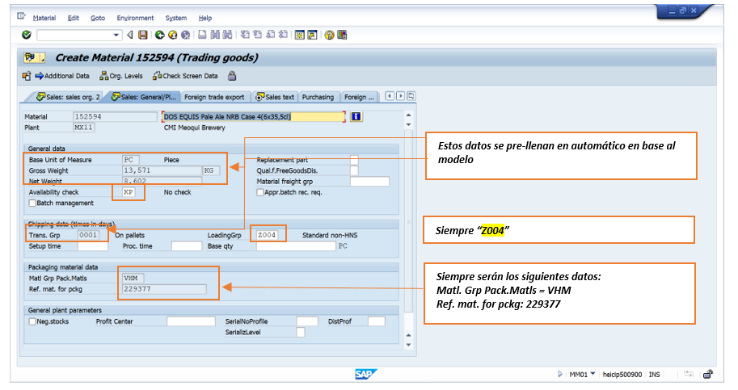

# ALTA PT EXPORTACION
[back](global.md)

SOP descripción:	Alta de SKU Exportación
Frecuencia del Proceso:	Por demanda
Sistema Usado:	SAP	
Revisión:	
Fecha de creación:	febrero 2024
Número de páginas:	
Creado por:	Nallely Becerra 
Revisado por: Ronaldo Chavez

## 1. Propósito
- El propósito de este documento es presentar todos los pasos a seguir para creación de un producto terminado de exportación con el fin de que pueda ser utilizado para su venta y distribución a nivel internacional que son gestionados por el Jefe de Estándares Logística Exportación (Roberto Carlos Rodriguez Amaya)

## 2. Alcance
- Todas las cervecerías que producen PT de exportación.

## 3. Responsabilidades
- El Analista de MDM es el responsable de validar que la solicitud sea realizada por medio de la herramienta HeiFlow, así como de la ejecución en tiempo y forma de lo que comprenden sus actividades y el seguimiento con el equipo de Master Data global.

## 4. Descripción del proceso
- Existen 2 escenarios para la creación de un nuevo SKU Exportación.
  - La operación requiere que haya un cambio en el patrón de amarre del SKU. 
Cuando ya existe un SKU con un patrón de amarre definido, pero se tiene la necesidad de estibarlo de forma diferente (Cajas x Tarima), es indispensable crear un nuevo SKU con el nuevo patrón de amarre, ya que si se modifica en el SKU existente impacta fuertemente en descuadre de inventarios.
  - Existe una iniciativa de la compañía en donde la necesidad es crear un SKU totalmente nuevo.

En los dos escenarios hay que asegurar la correcta ejecución de la creación del SKU en ZMATERIALES, el llenado del formato para la solicitud de creación del SKU en HeiXS, así como los procesos posteriores a la creación del SKU en HeiXS: Extensión del SKU a planta, Creación de BOM, Special Pack, y ligue en Tablas de Equivalencias.

### 4.1 Creación de solicitud
- Las solicitudes de Alta de Producto Terminado Exportación son elaboradas por parte del área de Logística Estándares Exportación, por medio de la herramienta de Heiflow en la sección de MDM > Datos Maestros > Materiales > Nueva Solicitud > Tipo de Servicio: Producto Terminado Exportación > Subtipo de Servicio: Alta.

El ticket deberá contener lo siguiente:
- Formato de Solicitud Alta de SKU
Este deberá contar los siguientes datos:
1.	Nombre del Producto
2.	Unidades por Caja
3.	Código UPC (Código de Barras)
4.	Cajas por Cama
5.	Camas por Tarima
6.	Cajas por Tarima
7.	Largo, alto, ancho de Caja (En centímetros)
8.	Largo, alto, ancho de Tarima (En centímetros)
9.	Plantas Productoras 
10.	Plantas Suministro
11.	MRP Área
12.	Calculo de Galones

- SKU Base (Si no se indica SKU Base, Analista MDM debe de buscar uno similar tomando en cuenta, Tipo de Material, Marca, Unidades por Empaque, Unidad de Medida Base, Volumen)
- **Nota1:** En el caso de que no exista un SKU base de referencia en el universo de materiales, es indispensable que el formato cuente con todos los datos sin excepción.

### 4.2 Visualizar solicitudes
- Solicitud dentro de Heiflow

### 4.3 Tratamiento de solicitudes
#### 4.3.1 Obtención de SKU
- Ingresar a la TX MM03 en la barra de comandos.
- En número de material, presionar en el teclado “F4”, se despliega el recuadro de búsqueda. 

- Tomando en cuenta la descripción del nuevo SKU que queremos dar de alta, buscaremos un SKU tomando en cuenta tipo de material, marca, unidades por empaque, unidad de medida base, y volumen.
- En este caso mi SKU tendrá por nombre:

En el que identifico los datos clave:

**Tipo de Material: ZER2 (PT Exportación)
Marca: Dos Equis Pale Ale
Unidades por Empaque: 4x6
Unidad de Medida Base: Botella
Volumen: 12 OZ**

- Posteriormente, ingresamos en el recuadro de búsqueda, los dos primeros datos clave: “Tipo de Material” y “Marca”

- Nos arrojara los resultados encontrados y posteriormente compararemos cual es el más similar al SKU que queremos dar de alta. En este caso, vemos que el 203348 es el más parecido, ya que tiene las mismas unidades por empaque (4x6), misma unidad de medida base (BOT), y mismo volumen (12oz).

#### 4.3.2 Captura de datos para creación de SKU en ZMATERIALES
- Ingresar a transacción ZMATERIALES
- Seleccionar la opción “Solicitud de Creación de Producto Terminado” 
- Indicar el tipo de material a dar de alta y los datos del SKU Base con el que creamos el nuevo SKU.

- Dar click en Ejecutar o F8 y se despliega la solicitud de alta con los datos pre-llenados que el sistema tomó de nuestro SKU Base.

- Iremos validando los datos y modicando de acuerdo a los atributos del nuevo SKU.

- Este es un ejemplo de como quedaria nuestra solicitud:

- Por ultimo daremos un enter a la solicitud y click en guardar  
Nos arrojara el número de solicitud.

#### 4.3.3 Generación del ticket para complemento de solicitud de PT
- Una vez que tenemos el número de solicitud creado en la ZMATERIALES, generaremos un ticket en la herramienta Heiflow para que el SKU pueda ser completado por el Analista MDM Materiales, y pueda ser creado el codigo de SKU. 

- Una vez generado el ticket, hay que esperar a que sea atentido por el Analista MDM Materiales.
**Nota2:**  El SLA para este sub-proceso es de 2 días habiles.
- Una vez que se haya procesado el ticket, llegara un correo de confirmación del portal de Heiflow, donde nos confirman el SKU creado:

#### 4.3.4 Llenado de formato para solicitud por HeiXS
- Una vez que tenemos creado nuestro SKU para ECC Ágil, procederemos con el armado del formato para solicitar la creación del SKU en el sistema HeiXS. 
La liga para descargar le formato es la siguiente:
[Liga de descarga](http://heiport.heiway.net/irj/portal/?NavigationTarget=TBN://wpc.link/2cae53b9-fdc3-11e3-cb0c-00003667cb71)
- Al entrar a heiport, buscaremos la opción de “Beverages” y daremos click, al hacerlo se desplegara la opción para guardar el formato: 

- Una vez descargado el formato, iremos llenando todos los campos, es importante tomar en cuenta que algunos campos se seleccionan desde una lista desplegable y otros son de texto libre. 
- Cada que llenemos un campo, la celda cambia a color verde.

- El empaque secundario lo determinaremos de la lista de materiales del SKU Base de ECC Ágil. Para ello seguiremos los siguientes paso:

- En ECC Ágil Productivo, iremos a la transacción CS03. 
- Ingresaremos los datos de SKU, centro productor (lo identificamos en el formato local de ECC), y utilización “1” y dar enter.

- El empaque secundario es el envase utilizado para agrupar varios paquetes que estan en contacto directo con el producto (empaque primario).
- En ese caso, vemos que la posición 0090 hace referencia a la caja en donde se agrupan los paquetes, es por eso que en el formato de global, asignamos “Box”, este a su vez también pudiera ser charola - “Tray”.

- **Nota3:** Como encontrar el SKU equivalente a nuestro SKU de ECC Ágil en HeiXS?
- El Gross Weight lo tomaremos del SKU Base de HeiXS, equivalente a SKU Base que utilizamos en ECC Ágil. Para ello, ingresaremos a HeiXS:
- En la selección de ambiente de SAP seleccionar la siguiente:

- Ingresar a la transacción MM03, nos posicionamos sobre el campo “Material” y damos clic en “F4”
- Se despliega el recuadro de busqueda. Seleccionaremos “A: Material by old material number”

- En el campo old material number, escribiremos el valor MX + SKU Base de ECC Ágil
Dar clic en  

- Nos arrojara el resultado y daremos dolbe clic sobre el primer campo

- De esta manera obtenemos la equivalencia en HeiXS de nuestro SKU Base de ECC Ágil.

#### 4.3.5 Envio de formato al equipo de Master Data Request
- Una vez que completamos el formato, el siguiente paso es hacer la solicitud al correo HBBV/HO/HGP Masterdata Request masterdatarequest@heineken.com y esperar a que este sea procesado. 
**Nota4:** El SLA del equipo de master data global, es de 2 días habíles.
- Ejemplo de solicitud:

**Nota5:** Es posible que la descripción de nuestro SKU en HeiXS sea diferente al que solicitamos. Esto es a que ellos lo acotan a los Data Standards.
- Una vez recibido el correo de confirmación donde nos informan el SKU de HeiXS creado en la organización “6300”, ya podemos proseguir con los siguientes procesos.

#### 4.3.6 Extensión de SKU a la organización de ventas "6362"
- Es necesario extender el SKU a la organización de ventas 6362 y habilitar las vistas correspondientes para que el SKU pueda ser usado en nuestra OpCo. Para ello seguiremos los sigueintes pasos:
- Ir a transaccion MM01 en HeiXS 

- Se despliega el recuadro para marcar las vistas a replicar, en el seleccionaremos las siguientes vistas:

- Ingresamos datos niveles de organización. Al desplegarse el recuadro, de lado izquierdo apareceran los campos para ingresar los datos del SKU modelo que seran copiados al nuevo SKU (lado derecho).

- Una vez ingresados los datos, nos mostrara las vistas que desdeamos crear, empezando por Sales Organization 1:

- En Sales Text hay que asegurarnos escribir la descripción del SKU. No debe haber espacios al inicio ni al final de la descripción del SKU. 
- En Purchase Order Text realizamos el mismo proceso. No debe haber espacios al inicio ni al final de la descripción del SKU. 

- Por ultimo, damos enter y guardar. Nos arrojara el recuadro para asegurarnos si queremos guardar, damos clic en “Yes” y nuestro SKU quedara extendido.

#### 4.3.7 Creación de Bill of Materials
- Ir a la transacción CS01. Ingresar nuestro SKU (heiXs confirmado por MasterDataRequest), Centro Productor y BOM Usage (5). Posteriormente en continuar  .
- Ingresar los datos en el primer registro. Linea 0010

- Una vez ingresado los datos en el registro 0010, daremos clic en el icono del sombrerito

#### 4.3.8 Actualización del Special Pack
- Para realizar el proceso de Special pack es necesario abrir el formato de relación speacial pack, por que de ahí tomaremos el dato que configuraremos en SAP.
- En el formato, lo primero que haremos sera filtrar o buscar el SKU modelo de HeiXS:

- Ingresamos a la transacción YV00_PACK_MDAT

#### 4.3.9 HeiXS Matching Table
En este proceso, ligaremos los dos SKU creados tanto en HeiXS-ECC Ágil
- Ir a la transacción YS00_CMMD}

- Se depliega la tabla de relaciónes para añadir el registro. Seleccionamos “New Entries”

- Ingresaremos la siguiente información:

#### 4.3.10
En este proceso, ligaremos los dos SKU creados tanto en ECC Ágil-HeiXS
**Nota6:** Aun no tenemos acceso a la transacción para ejecutar el movimiento. En la pantallas se usa de ejemplo un SKU pasado.
- En SAP ECC Ágil se ingresa a la transacción ZSDVT185

- Una vez concluida la creación del material procederemos a replicarlo en HeiXs a las plantas MX02, MX07 y las demás plantas distribuidoras que nos mencione el archivo. 
- Para esto en HeiXs abrimos la transacción MM01 y en el campo material colocaremos el material que replicaremos y en copy of material(HeiXs) pondremos el mismo número de material

- Presionamos la telca “Enter” 2 veces y nos apareceran las vistas para las cuales seleccionaremos las siguientes:

- En el lado izquierdo colocaremos la planta distribuidora a donde queremos replicar el material y en el lado derecho pondremos la planta productora.

- Procederemos en dar “enter” a todas las pantallas hasta que nos aparezca este mensaje y seleccionamos “Yes”

**Y así concluimos con la replica del material, debemos hacer lo mismo para los demás centros distribuidores**

#### 4.3.11 Enviar aviso al solicitante
- Una vez que se haya ejecutado los ajustes requeridos por el usuario, hay que ingresar a Heiflow para la confirmación del ticket. 

- De forma automática se envía un correo electrónico al solicitante donde avisa que dicha solicitud ha sido procesada ó rechazada.
A su vez podemos enviar correo al solicitante para confirmar los SKUs creados.
Ejemplo:

Fin

