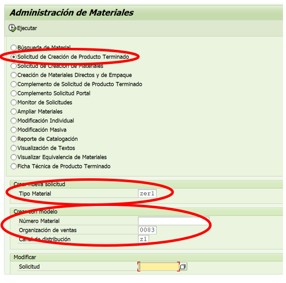
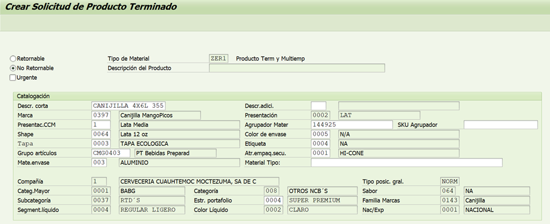
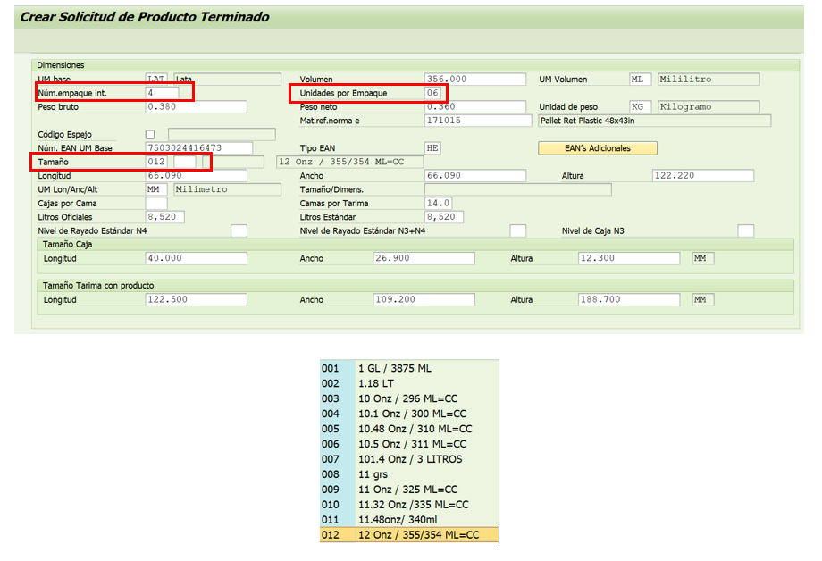
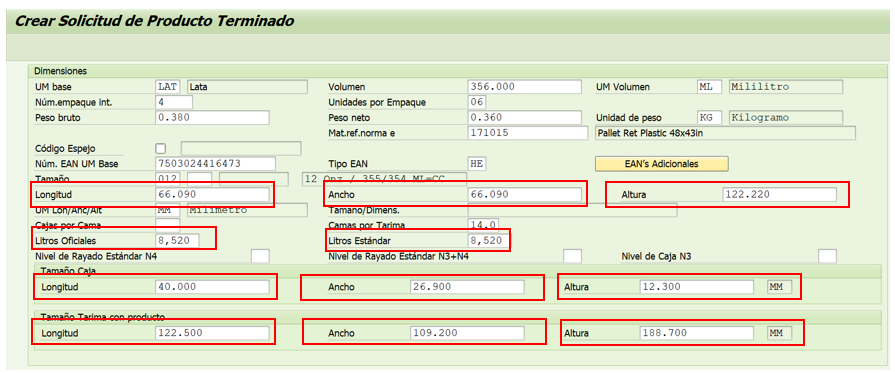
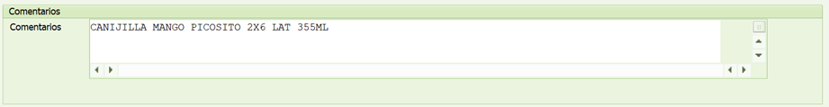
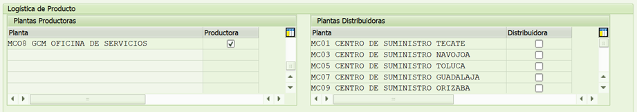
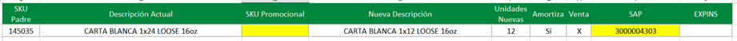
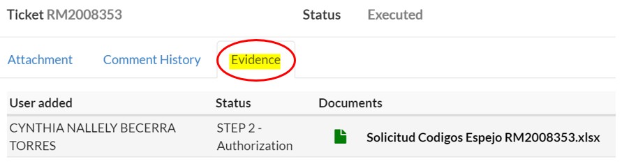
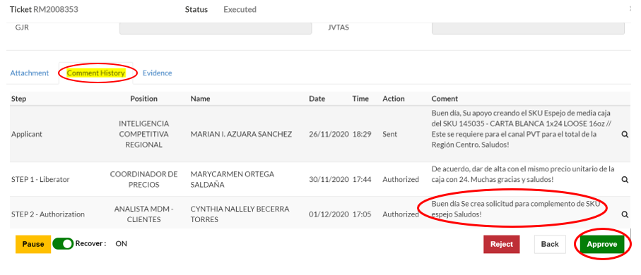

# ALTA PRODUCTO TERMINADO PROMOCIONAL
[back](global.md)

SOP descripción:	Alta de Producto Terminado Promocional
Frecuencia del Proceso:	Por solicitud.
Sistema Usado:	SAP
Revisión: 
Fecha de creación:	febrero 2024
Número de páginas:	
Creado por:	Nallely Becerra
Revisado por: Ronaldo Chávez

## 1. Propósito
- El propósito de este documento es presentar todos los pasos necesarios para realizar la correcta solicitud de alta de materiales promocionales.

## 2. Alcance
- Al crear la solicitud para el complemento, nos apoya de forma en que posteriormente se pueda proceder con el alta del SKU espejo.

## 3. Responsabilidades
- El Analista de MDM es el responsable de generar el alta y hacer las validaciones correspondientes cada que el usuario lo solicite.

## 4. Descripción del proceso
- Asegurar la correcta información a modificar en el alta.

### 4.1 Solicitud
- Dicho requerimiento puede ser solicitado por el coordinador de actividad promocional o bien jefes de Revenue regionales.

### 4.2 Tratamiento de solicitudes
- Al ingresar a la transacción ZMATERIALES será necesario indicar los siguientes puntos:
  - Seleccionar del menú la opción Solicitud de creación de Producto Terminado  
  - Seleccionar tipo de material, en este caso siempre es “ZER1”.
  - Son Datos de acuerdo al SKU modelo (es decir SKU Padre/ Producto Terminado
  - Numero de Material: es el número del SKU padre
  - Organización de Ventas: siempre parte de la 0083
  - Canal de Distribución: en este caso también siempre se indica “Z1”
  - Al terminar de llenar esta información solo se procede a Ejecutar  la solicitud.

- En la segunda pantalla de la transacción por default te da la información del SKU padre que se seleccionó. En lo que es la parte de “Catalogación” la información no se modifica”.

- En la parte de “Dimensiones” la información a modificar seria la siguiente:
  - **Numero de empaque interior:** En este caso el SKU padre es un 4X6 si se requiere media caja seria 2, es decir es el total de empaque por cada caja.
  - **Unidades por empaque:** Contemplando mismo ejemplo de 4X6 en cada empaque vienen 6 unidades por lo que si es media caja serian las mismas.
  - **Tamaño:** depende lo que nos indique el SKU padre si son 355 ml, 16 oz, litros, etc.

- Una vez realizada la parte de dimensiones validamos los siguientes aspectos:
  - Longitud, Ancho y Altura: Las 3 deben estar igual como la información inicial.
  - Litros Oficiales y Estándar: ambos deben ser proporcionales depende del SKU promocional a crear

- Posteriormente en la parte de comentarios se debe capturar la descripción del SKU promocional a dar de alta.

- En la parte de logística, solo habría que indicar la planta de Oficina de Servicios.

- Al terminar de llenar toda la información solo se selecciona “guardar” y a su vez arroja el numero de la solicitud que se creó.
- Ya con el número de solicitud se agrega en el archivo “Solicitud Código Espejo”.

- Se procede a cargar en el portal de Revenue Management el documento en el apartado de “Evidence”.

- Y por último se realiza la confirmación y aprobación de solicitud en el portal de RM.
  - Seleccionamos apartado “Comment History”
  - Se ingresa la confirmación del complemento.
  - Seleccionamos el botón “Approve”.

