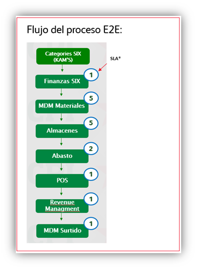
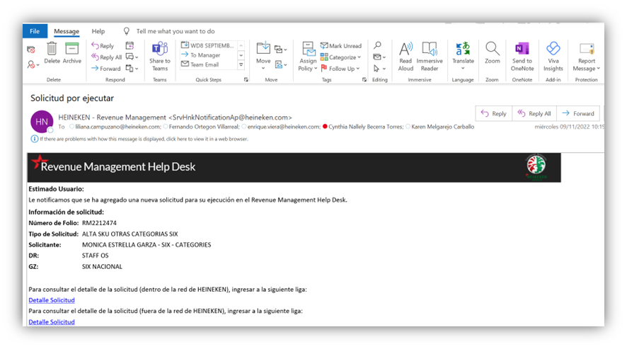
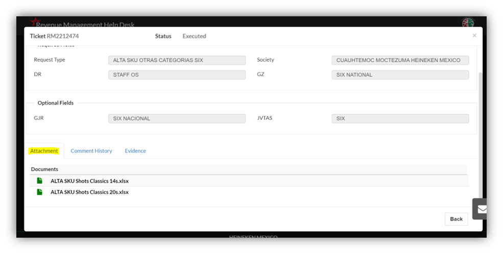
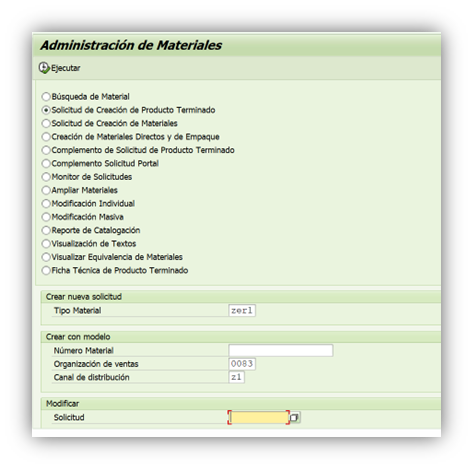
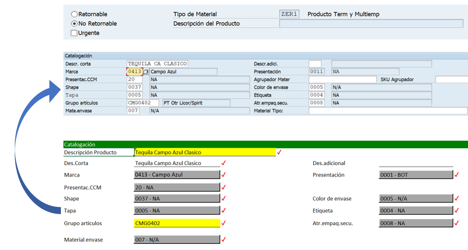
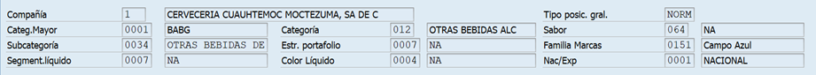
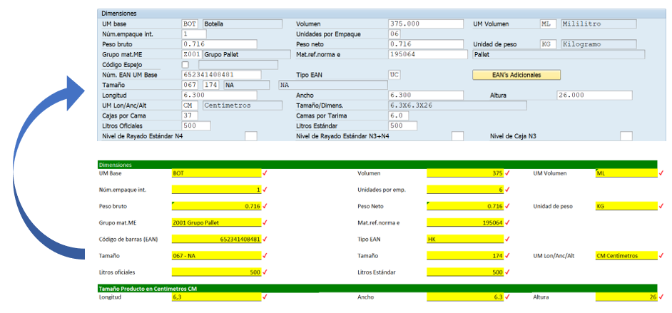
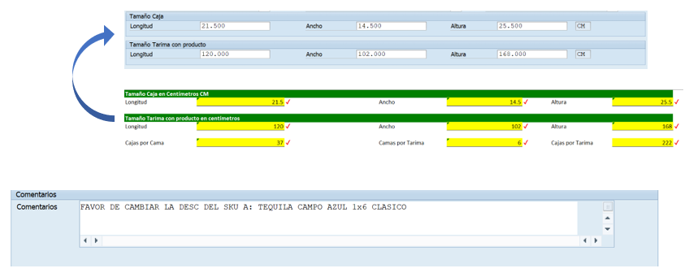
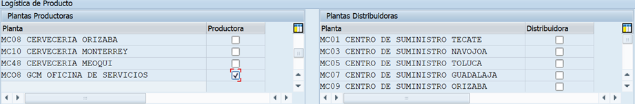
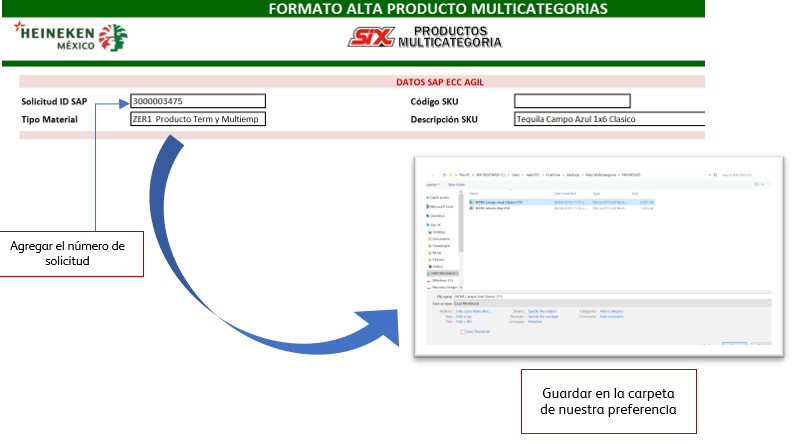

# ALTA DE SKU MULTICATEGORÍA
[back](global.md)

SOP descripción:	Alta de Producto Terminado Promocional
Frecuencia del Proceso:	Por solicitud.
Sistema Usado:	SAP
Revisión: 
Fecha de creación:	febrero 2024
Número de páginas:	
Creado por:	Nallely Becerra
Revisado por: Ronaldo Chavez

## 1. Propósito
- El propósito de este documento es presentar todos los pasos necesarios para realizar la correcta solicitud de alta de SKU’s Multicategorías.

## 2. Alcance
- Al crear la solicitud para el complemento, nos apoya de forma en que posteriormente se pueda proceder con el alta del SKU.

## 3. Responsabilidades
- El Analista de MDM es el responsable de generar el alta y hacer las validaciones correspondientes cada que el usuario lo solicite.

## 4. Descripción del proceso
- Asegurar la correcta información a modificar en el alta.

### 4.1 Solicitud
- Dicho requerimiento es solicitado por los KAM’S Categories SIX.

- Por medio de Outlook llegará una notificación de una nueva solicitud a liberar

- Al abrir la solicitud, visualizamos los comentarios de los roles aprobadores y los archivos adjuntos que utilizaremos para el alta.

- Es importante validar que la pestaña “Solicitud de Alta” cuente con todos los datos completos, ya de ahí tomaremos la información para dar de alta nuestro SKU. 

### 4.2 Tratamiento de solicitudes
- En el buscador seleccionar la transacción ZMATERIALES. 
- Al ingresar a la transacción será necesario indicar los siguientes puntos:
  - Seleccionar del menú la opción Solicitud de creación de Producto Terminado
  - Seleccionar tipo de material, en este caso siempre es “ZER1”.
  - Son Datos de acuerdo al SKU modelo (es decir SKU Padre/ Producto Terminado
  - Organización de Ventas: siempre parte de la 0083
  - Canal de Distribución: en este caso también siempre se indica “Z1”
  - Al terminar de llenar esta información solo se procede a Ejecutar  la solicitud.
  - 

- Se procede a llenar los campos con la información “solicitud del alta”.
  - Para Multicategoría siempre es “No Retornable”
  - Hay campos que son de Texto libre, otros se deberán seleccionar del Match Code, en caso de requerirlo .

- La segunda parte de catalogación, se pre-llena en automático.

- En la parte de “Dimensiones” la información a modificar seria la siguiente:
  - Las unidades por empaque hay que seleccionarlas desde el match code, ya que varían las denominaciones.
  - La unidad de peso, siempre ira representada en “KG” y así mismo los pesos hay que convertirlos a su equivalencia en kg.
  - Los datos de patrón de amarre, vienen especificados en la parte de *Tamaño Tarima con producto en centímetros” del formato.
  - El primer renglón de “dimensiones”, corresponde al tamaño del producto en cm.

- Una vez realizada la parte de dimensiones validamos los siguientes aspectos:
  - Siempre irán representados en “CM”
  - Es importante escribir la descripción completa del SKU en la parte de comentarios, ya que, al inicio de la solicitud, se pre-llena una en automático, que es incorrecta.

- En la logística del producto, Siempre se debe de marcar el centro “MCO8” 

- Cómo el último paso daremos clic en “guardar” y nos arrojara el número de solicitud.
- Agregar el núm. de solicitud al formato.

- **PENDIENTE PROCESO ACTUALIZADO**

