# AMPLIACIÓN DE CLIENTES VIRTUALES
[back](global.md)

SOP descripción:	Ampliación de Clientes Virtuales 
Frecuencia del Proceso:	Cuando se requiera.
Sistema Usado:	SAP
Revisión:	No aplica. 
Fecha de creación:	febrero 2024
Número de páginas:	
Creado por:	Nallely Becerra
Revisado por: Ronaldo Chavez

## 1. Propósito
- El propósito de este documento es presentar todos los pasos necesarios para la ampliación de franquicias, mayoristas y clientes virtuales en la APO.

## 2. Alcance
- Ampliar clientes virtuales.

## 3. Responsabilidades
- El Analista de MDM es el responsable de ampliar y hacer las validaciones correspondientes cada que se lo solicite el correo genérico. 

### 4. Descripción del proceso
- Asegurar la correcta ampliación de los clientes en APO.

### 4.1 Solicitud
- Las solicitudes son requeridas por el correo USUARIO DE SISTEMA PARA PROCESOS BA, en el cual en el mensaje automático se deberá indicar el producto y su ubicación en la cual no existe, en caso de que no aparezca la ubicación se deberá ignorar el correo. 
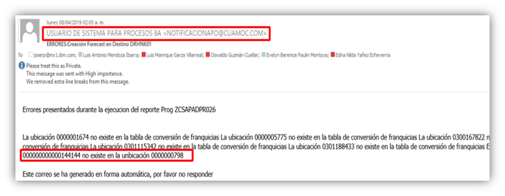

### 4.2 Tratamiento de solicitudes
- En el buscador seleccionar la transacción SQ01. 
- Ingresar a la transacción, se deberá realizar las siguientes acciones:
  - Dar clic en la parte de arriba a la palabra entorno.
  - Se desplegará una lista y se deberá seleccionar: ámbitos funcionales. 
  - Seleccionar campo de: área estándar (especifico mandante)
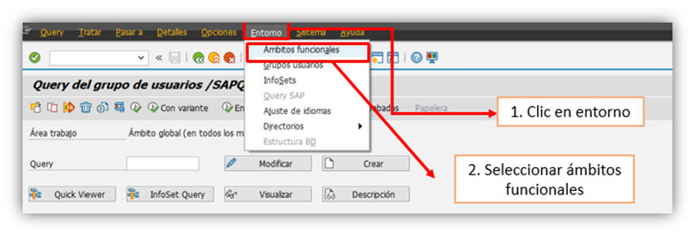
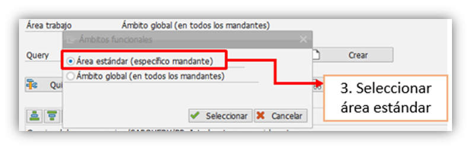
- Una vez seleccionados los parámetros, se deberá desplegar la siguiente lista en la cual se deberá dar clic en la opción de: Lista_MAT_UBI2.
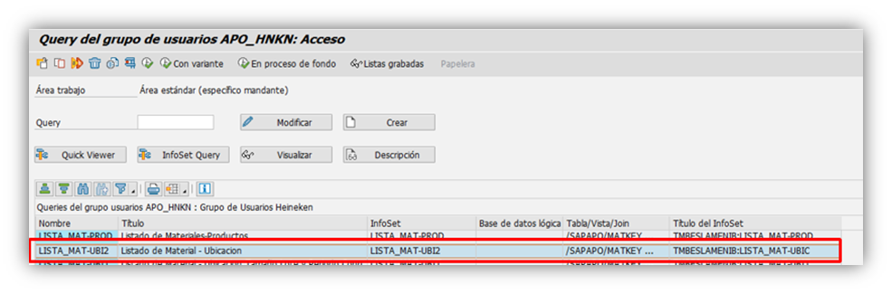
- Una vez ingresando a la transacción se deberá indicar el SKU que arrojo el mensaje por correo en este caso era el 144144
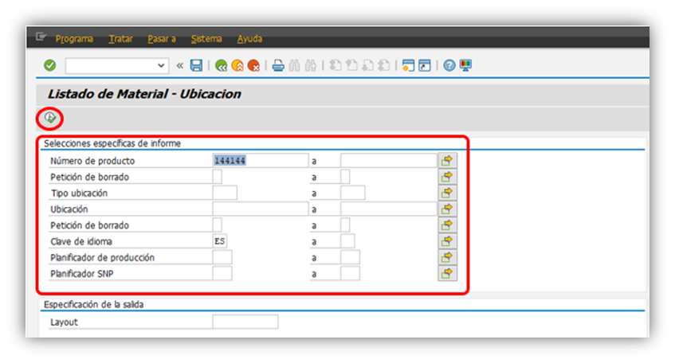
- Se abrirá una pantalla en el cual te mostrará todas las ubicaciones en la cual si se encuentra este producto. Una manera de identificar cual ubicación podemos tomar de ejemplo es la siguiente:
  - La cantidad de caracteres que tenga la ubicación, por ejemplo, en el correo que llego de manera automática mencionaba que la ubicación que deben encontrar es la 0000000798 por lo cual debemos considerar uno que también sea de 3 dígitos, en este caso podemos tomar el 0000000802.
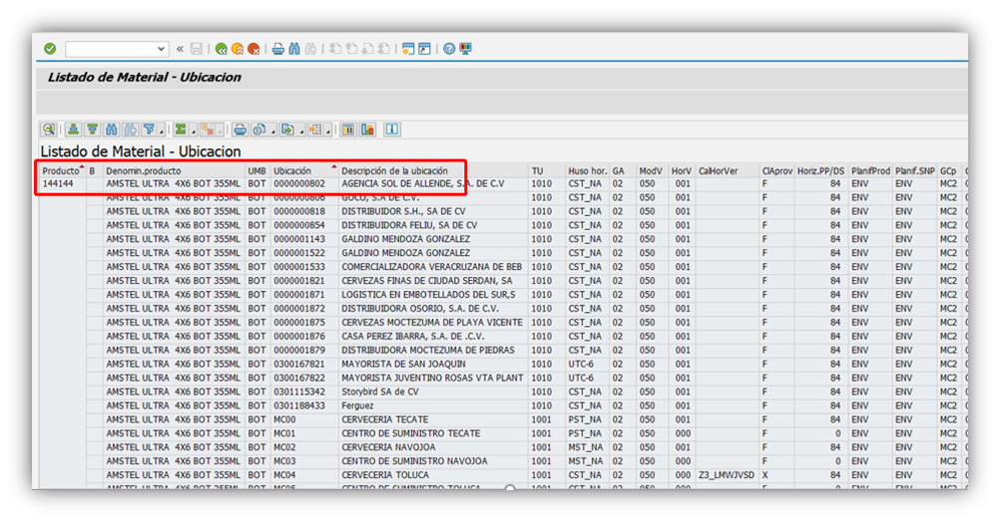
- Una vez identificada la ubicación que tomaremos como referencia nos iremos a la transacción: ZCSAP_ADP
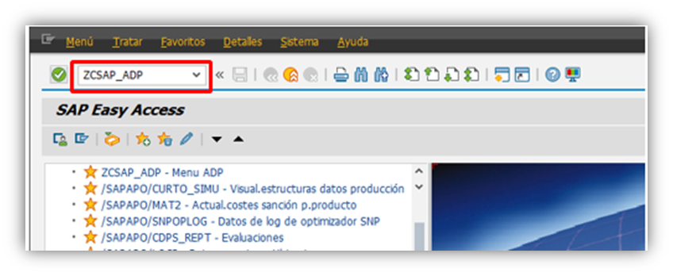
- Seleccionar la opción de programa de producción
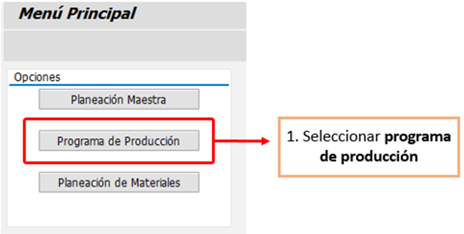
- Dar clic en actualización de campos para productos en la versión activa.
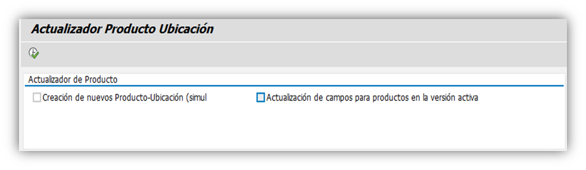
- Se desplegará las opciones, y seleccionaremos el campo de: crear nuevos productos en centros virtuales / clientes C/Referencia.
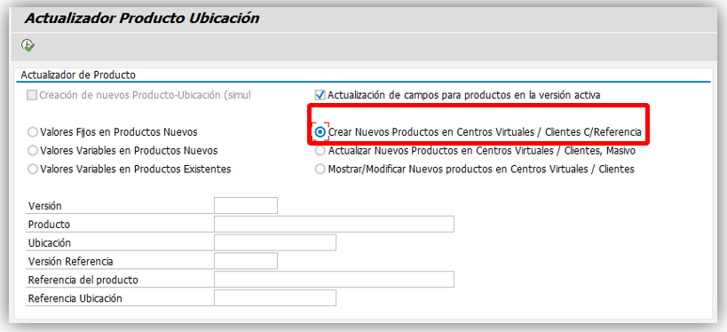
- **Es importante que una vez dado clic en esta opción se habiliten los campos de versión, producto, ubicación, versión referencia, referencia del producto y referencia ubicación.**  
 
- Se deberán completar los campos de la siguiente manera:
  - En la versión y versión de referencia siempre se deberá colocar 000.
  - En producto y producto referencia siempre se colocará el mismo número de SKU, este lo tomaremos del correo genérico que nos llegó.
  - En ubicación colocaremos la que nos pide el correo genérico en el cual queremos ampliar el producto franquicia / virtual.
  - En ubicación de referencia, colocaremos el que consideramos que era similar de la transacción SQ01.
  - Dar clic en ejecutar.
  - Seleccionar el cuadro de aceptar una vez que se ejecuta para que se realicé el ajuste.
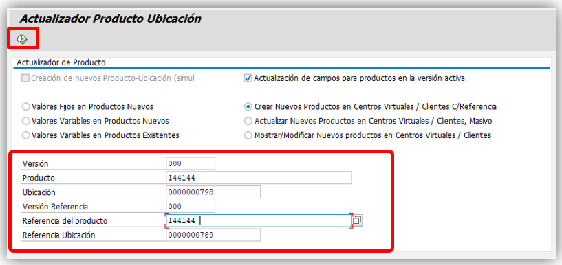
- Para confirmar que la ampliación del producto se realizó correctamente a la ubicación, tomaremos la información del correo donde se indicaba que el SKU es el 144144 con su ubicación en la 0000000798 y regresaremos a la transacción SQ01 y validaremos que este se encuentre ahí. 
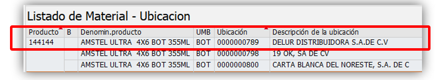
 
**Fin del proceso**

