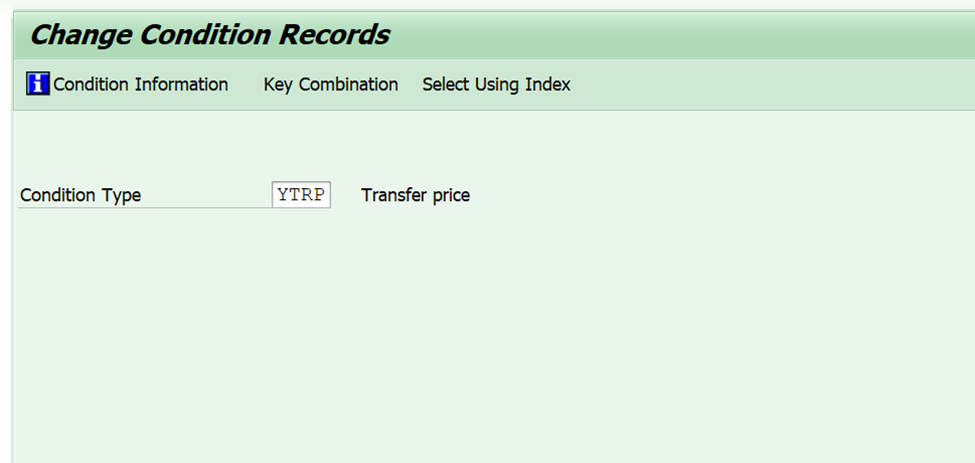
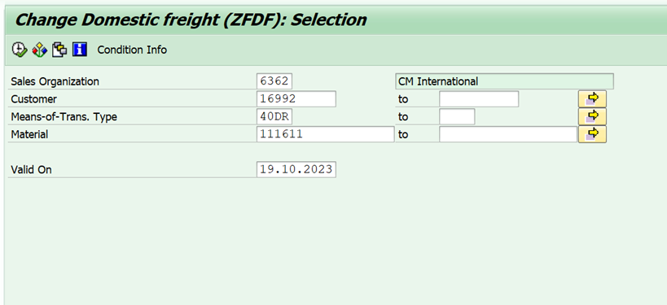

# CONDICIONES DE PRECIO EXPORTACION CARGA UNITARIOS A SAP MILLER E YBCP
[back](global.md)

Descripción del SOP: Carga de unitarios a SAP 	
Frecuencia del Proceso: pos solicitud 
Sistemas utilizados: SAP Heixs
Revisión: 	
Fecha de Creación:   febrero 2024	 
Número de Páginas:	
Creado por: Nallely Becerra	 
Revisado por: Ronaldo Chavez

## 1. Propósito
- Carga de unitarios a SAP de las condiciones de precio para Miller YTRP, ZFDF, ZFHH, ZFIF e YBCP

## 2. Alcance
- Carga de unitarios a SAP de las condiciones de precio para Miller YTRP, ZFDF, ZFHH, ZFIF e YBCP por solicitud tiempo de respuesta 2 días para solicitudes nuevas y carga única anual con condiciones del AP para el año siguiente la carga debe realizarse antes del 15 de diciembre, 

## 3. Responsabilidades
- Carga de unitarios a SAP de las condiciones de precio para Miller YTRP, ZFDF, ZFHH, ZFIF e YBCP por solicitud tiempo de respuesta 2 días para solicitudes nuevas y carga única anual con condiciones del AP para el año siguiente la carga debe realizarse antes del 15 de diciembre, notificada a finanzas antes para actualización de lista de precios

- La solicitud de carga de unitarios es por parte del equipo de operaciones, la solicitud de carga anual, expins solicitara el layout de carga de unitarios de AP a finanzas iniciando diciembre,

- Validación previa a la carga de la combinación ruta – SKU si existe en la conciliación previa reportar a Roberto Carlos el porqué de la modificación,

## 4. Descripción del proceso
- Para Miller
- La carga del costo logístico es por ruta en la transacción VK12 para las condiciones YTRP, ZFDF, ZFHH, ZFIF

*Miller Se carga por ruta*
- **YTRP**
  - Se ingresa en la transacción VK12 y se carga la condición YTRP.

  - Al ingresar te solicitará el company code y el material y damos F8.

  - Una vez dentro ingresarás los datos de material, Amount, Unit y Valid from y Valid to y presionamos Ctrl+S para guardar los cambios.

- **ZFDF**
  - Se ingresa en la transacción VK12 y se carga la condición ZFDF.

  - Al ingresar te solicitan los datos que se muestra en la siguiente pantalla y se llenan de acuerdo a lo que te solicitan una vez llenos presionamos F8.

  - Una vez dentro se ingresa el Customer, Mns, Material, Amount, Unit, Valid to y Valid from. Al terminar presionamos Ctrl+S para guardar los cambios.

- **ZFHH**
  - Se ingresa en la transacción VK12 y se carga la condición ZFHH.
  - Al ingresar te solicitan los datos que te muestran en la siguiente pantalla

  - Una vez dentro te solicitarán los datos de Customer, Mns, Material, Amount, Unit y Valid from/Valid to al terminar con el llenado de los datos guardamos con las teclas de Ctrl +S.

- **ZFIF**
  - Se ingresa en la transacción Vk12 en la condición ZFIF:
  - Al ingresar seleccionamos la opción Customer/Mns/Material

  - Una vez dentro ingresamos los datos que nos solicitan a cargar y presionamos F8.

  - Al dar F8 nos muestra la siguiente pantalla y nos solicita llenar Customer, Mns, Material, Amount, Unit y Valid to/ Valid from y guardamos en Ctrl+S.

- **YBCP**  
  - Se ingresa en la transacción VK12 en la condición YBCP y damos enter.
  - Al ingresar seleccionamos la opción Plant/Material.
  - Una vez dentro ingresamos los datos solicitados (Planta y Material) y damos F8.

  - En cuanto ingresamos nos arrojará la siguiente pantalla y llenamos los datos de Material, Amount, Unit y Valid from/Valid to.

 
**Fin del proceso**
