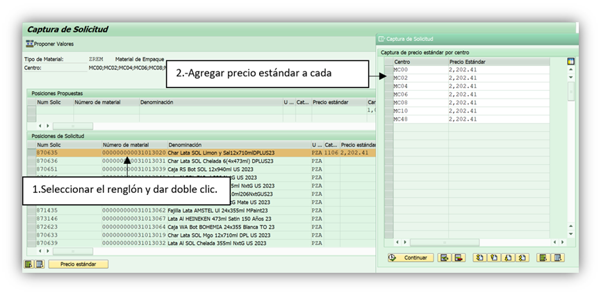

# COMPLEMENTOS DE MATERIALES DE EMPAQUE - COSTOS
[back](global.md)

SOP descripción:	Alta de Materiales Costo Estándar
Frecuencia del Proceso:	Por demanda y en promedio una vez a la semana
Sistema Usado:	SAP
Revisión:	
Fecha de creación:	febrero 2024
Número de páginas:	
Creado por:	Nallely Becerra
Revisado por: Ronaldo Chavez

## 1. Propósito
- El propósito de este documento es proporcionar la información base para las solicitudes de nuevos materiales de empaque y de elaboración, con el fin de que se configuren los datos maestros locales requeridos que permitan cumplir con la revisión de estándares en costos mensuales.

## 2. Alcance
- El proceso se realiza para todos los materiales con el tipo de material ZREM (Material de Empaque) que son utilizados por el equipo de Empacotecnia.

## 3. Responsabilidades
- El Analista de MDM es el responsable de determinar que categoría de valoración, grupo de origen y precio estándar deben llevar los nuevos materiales, de acuerdo al formato establecido para el cálculo de dichos datos, con el fin de realizar la captura de los datos en el sistema una vez que el personal de Costos & Presupuestos haya dado su visto bueno.

## 4. Descripción del proceso

### 4.1 Preparación del archivo
- Entrar a la liga de Empacotécnia y  abrir el archivo **2.Solicitud de Códigos SAP**  para saber las solicitudes que se tienen pendientes. 

- Abrir el formato de Alta de materiales de la semana pasada y renombrarlo con la semana en que se esté ejecutando el proceso. Ej. (Materiales ZREM_Semana()).
- Abrir el archivo VISTA MATER ZREM del mes.

- Del archivo **2.Solicitud de Códigos SAP**, se tomarán los datos correspondientes, sólo dando clic en el botón “Copy” en nuestro Formato Materiales ZREM y automáticamente se copian los materiales con los datos faltantes. 

- Se agrega el universo de materiales ZREM al archivo de Materiales ZREM_Semana(#) para que puedan tomar las fórmulas.

- A continuación, dependiendo de los materiales si sustituyen o no agregaremos en el apartado que se encuentra en blanco los precios actualizados de cada uno de los materiales:

- Para agregar los precios de cada material cuando este no sustituye se debe asignar un código que se encuentre en el Archivo VISTA MATER y para esto se toma la descripción en español y se busca en el archivo una descripción parecida que pertenezca al centro y al mercado que venía en la lista de materiales a dar de alta, solo se tiene que asegurar que se trate de un mismo tipo de SKU, la marca puede ser diferente.
- Considerar los siguientes puntos al buscar un SKU similar:
***Si se trata de un SKU de lata o botella, lo primero que debemos considerar es el volumen del producto:***
  - 190ml – Cuartito
  - 355ml _Media 12 Oz
  - 473ml _16 Oz
  - 710ml _24 Oz
  - 940ml _Entera (1L) Caguama
  - 1.18ml_Caguamon	

- Considerar el mercado al que será dirigido el producto, por ejemplo, MX o US.
- Considerar si es un producto retornable o no retornable.

- Posteriormente se asignará el material similar que buscó en la vista mater como material similar. 

- Sin embargo, cuando los materiales “Sustituyen” al agregar los SKUS en la pestaña “Descripción de materiales” veremos cómo en la pestaña ZREM_Semana se calculan los datos automáticamente debido a las fórmulas de nuestro formato.

- Por último, cuando se tenga el formato completo, dar guardar al archivo Excel. 

### 4.2 Solicitud de VoBo
- Una vez que se haya procesado el formato Alta de materiales, se envía un correo a Melissa Gzz Ochoa (Planning & Information Sc) para solicitar revisión y visto bueno de la información contenida en el formato.
  - Ejemplo:
    
- Una vez que tengamos su autorización, procederemos con la captura de los datos en SAP. 

### 4.3 Complemento de solicitud portal
- Al hacerlo se desplegará la siguiente pantalla en donde será necesario capturar la transacción ZMATERIALES 
- Seleccionar la opción Complemento de Solicitud Portal e indicar los globals IDs, tipo de material y centros.

- Ejecutamos
- Agregar precio estándar al material, en todos los centros.

- Guardamos

### 4.4 Ampliación de materiales
- Entramos a la transacción MMSC, nos arrojará la siguiente imagen.
- En el campo de material agregamos el SKU que deseamos a tratar.
- En el almacén, el número al cual deseamos ampliar dicho material. En este caso ampliamos todos los materiales al almacén 2006(Bodega Roca) al centro MC08(Orizaba). Y para las Hermetapas, Tapas, Plástico e Hincone sería para el almacén 1076 (Materiales) y centro MC08(Orizaba).

- Damos enter y nos arrojará los almacenes en donde esta ampliado y así mismo campos en blanco en donde podremos agregar el que deseamos ampliar.
- Agregar el número de almacén, dar enter y clic en guardar.

- Nos arrojará un mensaje de “función ejecutada”.

### 4.5 Sujeto lote
- Si el material es Barril, Botella, Hermetapa, Lata y Tapa se procede a realizar el sujeto lote.
- Entramos a la transacción MM02.
- Tomamos el material de acuerdo con el material que se solicita, lo colocamos en el espacio de Material y damos enter.
- Nos despliega las vistas de la transacción y seleccionaremos “Clasificación” y le damos clic a la palomita verde  .

- Nos desplegará la categoría de clase y seleccionaremos “Lote 022”.

- Una vez dentro en el apartado de “Clase” agregamos la palabra Materiales damos enter, guardar   y listo.

### 4.6 Confirmar de procesado
- Ir al archivo 2.Solicitud Códigos SAP en la columna de Costos, agregar “OK” a los materiales que hayamos procesado.
- Enviar correo de confirmación al usuario que solicitó dar de alta los materiales. Se puede confirmar desde el mismo correo que envía Vicente Munguía para la confirmación del complemento SAP, o un correo aparte. Ejemplo:

 
**Fin del proceso**

