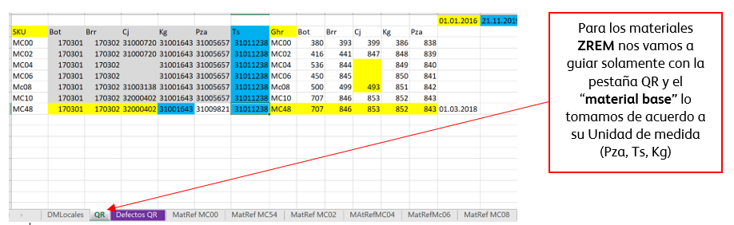
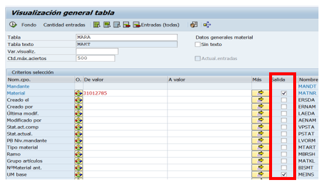
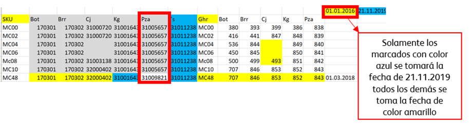
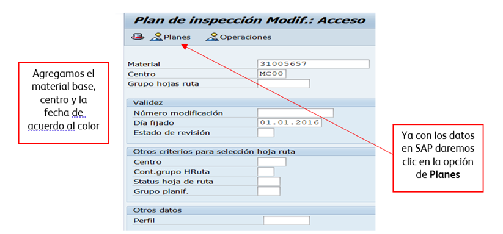
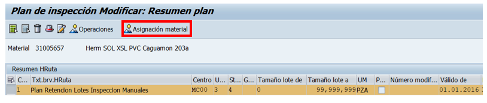
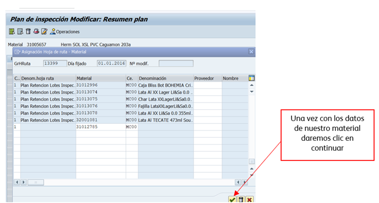

# ALTA MATERIALES ZCON
[back](global.md)

SOP descripción:	Plan de retención
Frecuencia del Proceso:	Diaria
Sistema Usado:	SAP
Revisión:	
Fecha de creación:	febrero 2024
Número de páginas:	
Creado por:	Nallely Becerra
Revisado por: Ronaldo Chavez

## 1. Propósito
- El propósito de este documento es asegurar un material ZER1 Producto Terminado Nacional y Multiempaque, ZER2 Producto Terminado Exportación/Importación y ZREM Material de Empacotecnia se configuren los datos maestros locales requeridos que permitan generar ordenes de producción con los parámetros necesarios para que Calidad registre los resultados de sus muestreos.

## 2. Alcance
- Plan de retencion de los tipos de material: ZER1, ZER2 y ZREM CM HEINEKEN

## 3. Responsabilidades
- El Analista de MDM es el responsable de validar que la solicitud sea realizada, así como de la ejecución en tiempo 

## 4. Descripción del proceso
- Asegurar la correcta carga de las operaciones de calidad.  

### 4.1 Plan de retención
- Se recibe un correo por parte de NPI´s, Technology o cualquier persona que necesite utilizar el SKU donde solicitan el plan de retención de SKU´s, a los cuales hay que validar que cuente con plan de retención en todas las plantas. 
- En los casos donde sean SKU nuevos siempre hay que realizar la carga de la receta, clase de inspección y plan de retención (cuando ya existe un SKU y solo se genera una versión nueva de producción solamente aplica la carga de receta)

### 4.2 Solicitud
- Podemos recibir la solicitud cuando nos confirman que un sku ya esta activo y sigue la carga de Calidad o nos pueden solicitar directamente la carga del plan de retención. 

### 4.3 Proceso de la solicitud
- Como primer paso hay que validar que tipo de material es el que validaremos y cargaremos el plan de retención, en el ejemplo de arriba podemos ver que es ZREM Material Empacotecnia. 
- Para poder realizar las retenciones de los materiales nos vamos a apoyar con el excel Materiales- validaciones Calidad el cual se encuentra en Sharepoint.
- **NOTA:** En el caso de materiales ZER1 y ZER2 tenemos que guiarnos con los “materiales base” de las pestañas del excel de las plantas (MC00, MC02, ect.) de acuerdo a su unidad de Medida (Botella, lata o barril).

- Para revisar la unidad de medida de los materiales entramos a la tx SE16N tabla MARA agregando el # de material y seleccionamos de la parte de Salida el material y UM base y damos clic en ejecutar.

- El sistema arrojara la información de su unidad de medida la cual necesitamos para tomar el material base del Excel mencionado
- En este caso por ser material con la unidad de medida PZA vamos a tomar esos materiales base para entrar a SAP a la transacción QP02

- Entramos a la transacción y agregamos los datos de nuestro material base de acuerdo con cada planta 

- Ya que entramos en el material base seleccionamos la opción de Asignación material 

- Al momento de entrar se abrirá una ventana nueva donde agregaremos el material al cual se le desea agregar el Plan de retención, agregamos # de material la planta y contador de grupo el cual siempre es 1 o 3 en planta MC48.

- Guardamos
- Al final de guardar el paso en SAP nos aparecerá el mensaje donde te confirma que ya se grabo el plan de Inspeccion.
- **NOTA:** Este paso se debe realizar con las 7 plantas tomando el material base de cada una de ellas de acuerdo con el excel.

### 4.4 Confirmar solicitud
- Una vez que se ha cargado el Plan de retención de los materiales en las 7 plantas se responde el correo mencionando que se han validado las operaciones de calidad y que los materiales ya cuentan con las retenciones.

**Fin del proceso**

