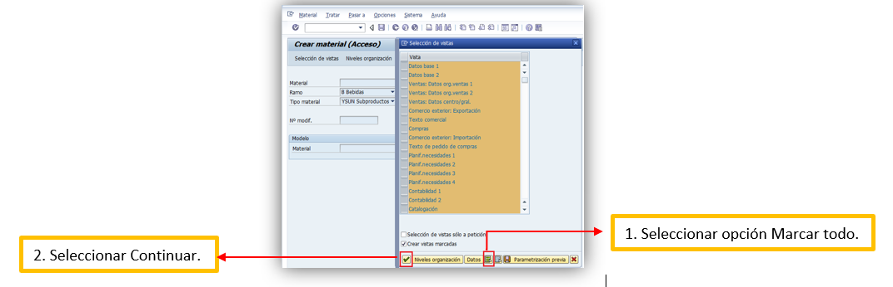

# ALTA Y ACTUALIZACION DE PRECIOS SUBRPODUCTOS
[back](global.md)

SOP descripción:	Materiales Subproductos
Frecuencia del Proceso:	Diaria
Sistema Usado: SAP
Revisión:	
Fecha de creación: Febrero 2024
Número de páginas:	
Creado por:	Nallely Becerra
Revisado por: Ronaldo Chávez

## 1. Propósito
- El propósito de este documento es presentar todos los pasos necesarios para la creación de solicitudes de Alta de Materiales Subproductos (YSUN) y actualización de precios de estos materiales.

## 2. Alcance
- Creación de los diferentes tipos de Materiales Subproductos (YSUN) de CM HEINEKEN. 
- Actualización de precios de materiales subproductos. 

## 3. Responsabilidades
- El Analista de MDM es el responsable de validar que la solicitud sea realizada por medio de la herramienta de Ticketing Tool, que ésta contenga el archivo en Excel que se muestra en la sección de anexos, así como de la ejecución en tiempo y forma del alta del material subproducto o la Actualización de precios del material.

## 4. Descripción del proceso de ALTA de material YSUB
- Asegurar el alta correcta de las solicitudes de Materiales Subproductos.  

### 4.1 Solicitud
- Las solicitudes de Alta son elaboradas por personal de Abastecimientos por medio de la herramienta de Heiflow. 
- Una vez que selecciones la solicitud debes de abrir el archivo de Excel anexo en la misma y validar lo siguiente:
  - **Descripción del Material:** Texto de hasta 40 caracteres que designa más detalladamente el material. No debe de ser solo una palabra. [Mayúsculas y Minúsculas]
  - **Centro:** Debe de capturar con una “X” el o los centros donde se utilizará el material.
  - **Unidad medida base:** Debe de indicarse una unidad de medida base en que se gestionará el stock del material.
  - **Unidad de medida de venta:** Debe de indicarse una unidad de medida en la que se venderá el material.
  - **Grupo de imputación para material:** Debe de indicarse  un grupo de imputación ya que al traspasar una factura a contabilidad, el sistema utiliza este indicador para determinar las cuentas de ingresos y reducción de ingresos en las cuales se han de asentar los valores correspondientes.
  - **CeBe:** Debe de indicarse uno por Planta [Centro].

*En caso de que alguno de los campos venga en blanco o no cumpla con alguna de las especificaciones antes mencionadas, la solicitud deberá de ser rechazada por medio de la herramienta, indicando los motivos de rechazo. Si la solicitud procede es necesario acceder a SAP ECC para la ejecución del alta.* 

### 4.2 Tratamiento de solicitudes
- Ingresar en el cuadro de búsqueda la transacción MM01
- Seleccionamos en Ramo “B Bebidas”, en Tipo de material “YSUN Subproductos” y damos click en Selección de vistas. 

- Después de dar click en Selección de Vistas se desplegarán todas las vistas, seleccionamos la opción Marcar todo, debemos verificar que se encuentre activado el flag Crear vistas marcadas y posteriormente damos click en Continuar [Paloma Verde].                    

- Capturamos el Centro, la Organización de ventas y el Canal de distribución indicados en el formato Excel, y posteriormente damos click en Continuar [Paloma Verde].

- Empezamos capturando en la pestaña Datos base 1 los valores referentes a Texto breve de material, Unidad de medida base, Grupo artículos, Sector, Status material para todos los centros, Valido de [Fecha de alta], Grupo de tipos de posición general y Grupo autorizaciones indicados en el archivo Excel adjunto. 

- En la pestaña Ventas: Org. Ventas 1 capturamos los valores de: Unidad de medida de venta, Tipo de impuesto IVA y Tipo de Impuesto IEPS los cuales varían de acuerdo al material subproducto a dar de alta. 

- En la pestaña Ventas: Org. Ventas 2 capturamos los valores referentes a los campos Grupo de tipos de posición general, Grupo de imputación del material y el Grupo de tipos de posición del maestro de material indicados en el archivo Excel adjunto. 

- Finalmente en las pestañas Ventas: Gral/Centro y Planif. Necesidades 1 capturamos los valores referentes a Grupo de verificación para verificación de disponibilidad, Grupo de transporte, Grupo de carga, el o los Centros de Beneficio dependiendo de en qué plantas se va a realizar la creación, la Característica de planificación de necesidades y damos click en la opción Grabar. 

### 4.3 Enviar aviso al solicitante
- Una vez que se ha creado la solicitud, es necesario ingresar a Ticketing Tool, indicar en la sección de comentarios el número de material de subproductos creado y dar clic en el botón de finalizar. Si esta es rechazada, será necesario indicar los motivos de rechazo de esta. 

## 5 Descripción del proceso actualización de precios materiales YSUB
### 5.1 Solicitud
- El ticket llega a la plataforma de Heiflow de la siguiente manera:

- Solo se pide el formato de actualización de precios que es este:

### 5.2 Tratamiento de solicitud
- Se entra a sap en la transacción VK12 cuando no se solicita el iva retenido solo se coloca la condición YMPB eso se menciona en el formato.
- Cuando se llegue a pedir el Iva Retenido se coloca la condición YMRI
- Al ingresar aparecerá este recuadro en donde se selecciona **Org.Ventas/Centro/Cliente/Material** en amarillo cuando es YMPB

- Se da en ejecutar F8 para entrar y empezar a capturar la información señalada en amarillo en base a lo que se solicite en el archivo 

- Ya capturada la información se guarda y se cierra el ticket
 
**Fin del proceso**

