# ASIGNACIÓN DE DATOS DE CALIDAD
[back](global.md)

SOP descripción:	Recetas
Frecuencia del Proceso:	Diaria
Sistema Usado:	SAP
Revisión:	
Fecha de creación:	Marzo 2018
Número de páginas:	
Creado por:	Edgar Belmares
Revisado por:	
Firmado por (HGSS Centre):	
Firmado por (HE):

	

## 1. Propósito
- El propósito de este documento es asegurar que en cada alta o ampliación de un material ZER1 Producto Terminado Nacional y Multiempaque, ZER2 Producto Terminado Exportación/Importación, ZALB Producto Semiterminado se configuren los datos maestros locales requeridos que permitan generar ordenes de producción con los parámetros necesarios para que Calidad registre los resultados de sus muestreos.

## 2. Alcance
- Altas y ampliaciones de los tipos de material: ZER1, ZER2, ZALB de CM HEINEKEN.

## 3. Responsabilidades
- El Analista de MDM es el responsable de validar que la solicitud sea realizada por medio de la herramienta Ticketing Tool, así como de la ejecución en tiempo y forma de la asignación de receta. 

## 4. Descripción del proceso
- Asegurar la correcta carga de las solicitudes de Asignación de Receta para las operaciones de calidad.  

### 4.1 Solicitud
- Se recibe un correo por parte del Analista Datos Maestros Prod Y Mat, donde informa que se habilitaron materiales en una o más cervecerías, ya sean nuevos SKU´s o ampliaciones, a los cuales hay que validar que la receta de calidad que le replicó está correcta, es decir que las operaciones 8000 se encuentren cargadas correctamente. 

### 4.2 Tratamiento de solicitudes

#### 4.2.1 Asignación de recetas
- Dentro de SAP ECC se debe de acceder a la transacción C223, en donde lo primero que se hace es validar por cada Material – Centro, si cuenta con las operaciones de calidad completas. 
- Dentro de la transacción C223 es necesario indicar el Centro y Material, dar Enter y nos desplegará las versiones disponibles, después damos clic en el botón Receta ubicado en la parte inferior de la pantalla.
- 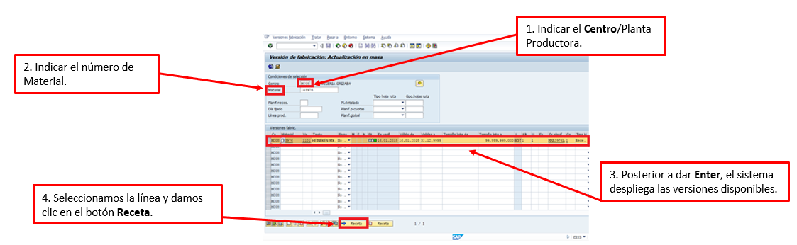
- Posterior a presionar el botón de Receta y damos clic en continuar (o palomita)
- Consecuentemente visualizaras la receta, con las operaciones de elaboración/producción [1000], de costos [6000 y 7000] y calidad. En nuestro caso debemos asegurar que cuente con las operaciones “8000” en adelante y validar una muestra al azar de ellas para corroborar que se encuentran configuradas de manera correcta, para eso: 
- 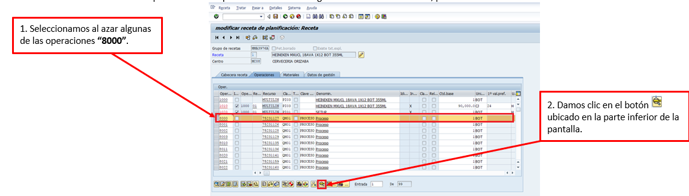
- Si la siguiente ventana se encuentra con todas las caracteristicas de inspección completas quiere decir que el proceso de copia que realizó el Analista Datos Maestros Prod. Y Mat., se realizó de manera correcta pero si por el contrario esta vacía, quiere decir que no copiaron de manera completa las operaciones de calidad por lo que tendremos que borrar las operaciones cargadas incompletas y volver a realizar la carga en forma completa.
- 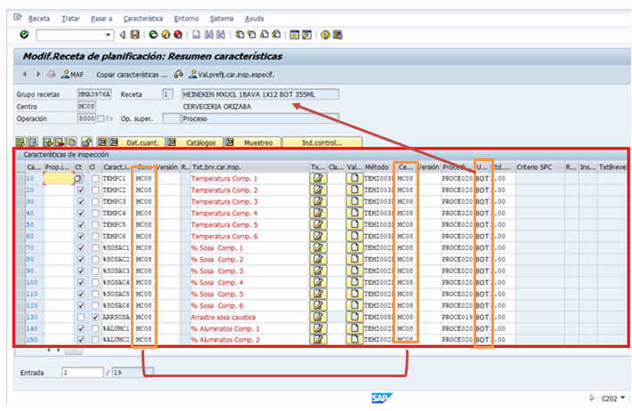
- **Nota**: Validar las columnas de “Centros” (dos columnas), y la unidad de medida base, esta debe de coincidir con la descirpcion del material. 

#### 4.2.2  Borrar recetas incompletas
- Ingresar a la transacción C202 Receta de planificación modificar: Acceso, indicar el Número de Material, Centro, seleccionar la Versión de fabricación habilitada para el material y por último dar Enter.
- 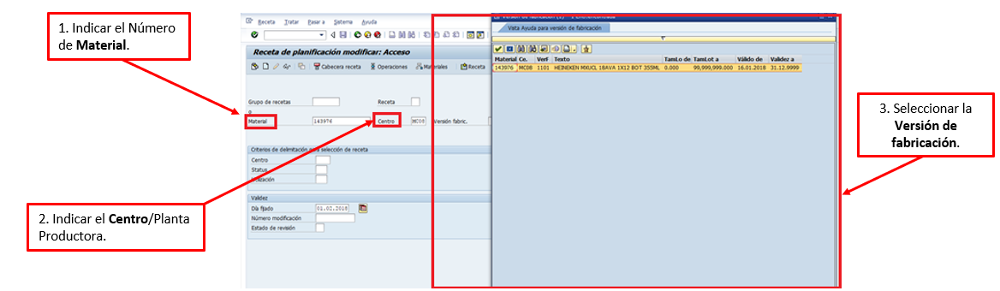
- Se deben seleccionar/marcar únicamente las operaciones de 8000 en adelante y dar clic en el botón Borrar Operación   que se encuentra ubicado en la parte inferior de la pantalla.
- 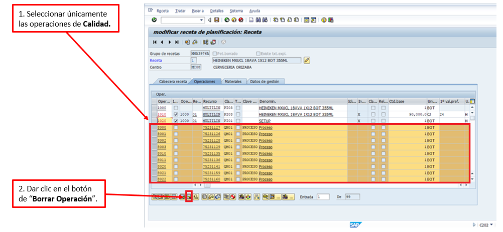

#### 4.2.3 Carga de una receta
- Para realizar la carga de la receta como primer paso debemos visualizar con que versión de fabricación cuenta el material al que se le hará la carga, para esto es necesario que te dirijas a la transacción C223 Versión de fabricación: Actualización en masa, e indiques el Centro, Número de Material y dar Enter.
- 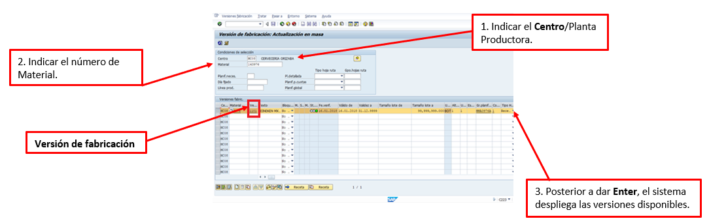
- **Importante considerar lo siguiente:** Si se va a cargar una receta, que se tome como modelo la misma planta y la misma línea.
- Después de conocer la Versión de fabricación nos vamos ahora a la transacción *ZMN_CARGA_QM* y en la sección Descarga Datos Maestros QM damos clic en el botón de **Operaciones QM en recetas**. 
- 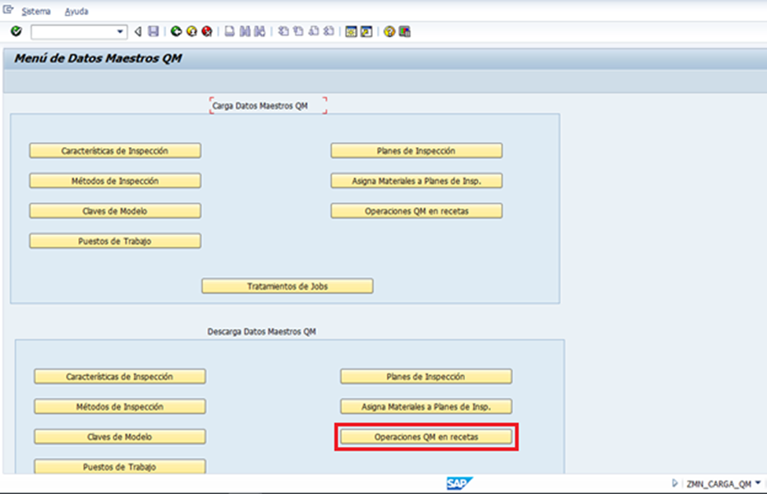
- Visualizarás una pantalla en donde indicarás los Parámetros de Selección. Debes indicar:
  - El Centro/Planta productora del material
  - En el campo de Material deberás dar clic en el matchcode y ahí puedes realizar un filtro de búsqueda de manera que SAP te arroje los materiales que también cuentan con la versión de fabricación del cual realizaremos dicha carga.
  - En Versión fabricación indicar la consultada en la transacción C223.

- **En la sección Update/Download no olvides marcar la opción Descarga e ingresar la dirección a donde deseas se exporte el archivo.**

- Una vez que se descargue el archivo en Excel deberás realizar el cambio de los valores indicados en las columnas Grupos de Receta, Material que contaba con las operaciones de calidad incompletas y se le realizará nuevamente la carga de manera correcta e Inicio de Vigencia **[Indicar siempre el Today/día en que se realizará la carga]**. La información [Grupos de Receta] la podrás visualizar en la transacción C223 en donde en un inicio consultaste la versión de fabricación. 
- 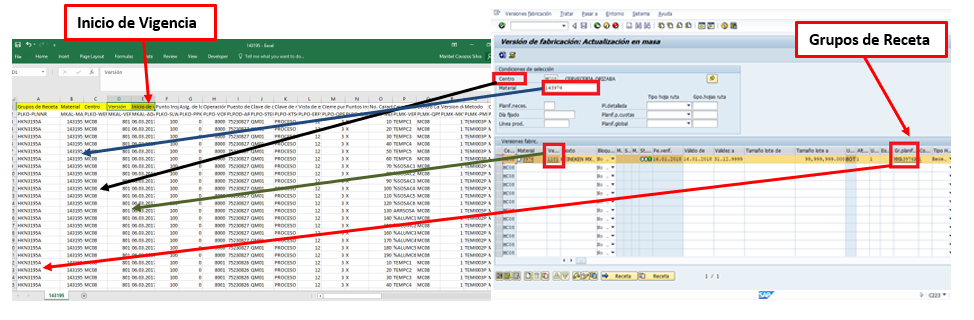
- Posterior a realizar dichos movimientos en el archivo en Excel, habrá que guardar dicho en formato Unicode Text e ir nuevamente a la transacción ZM_CARGA_QM y ahora en la sección Carga Datos Maestros QM damos clic en el botón de Operaciones QM en recetas. 
- 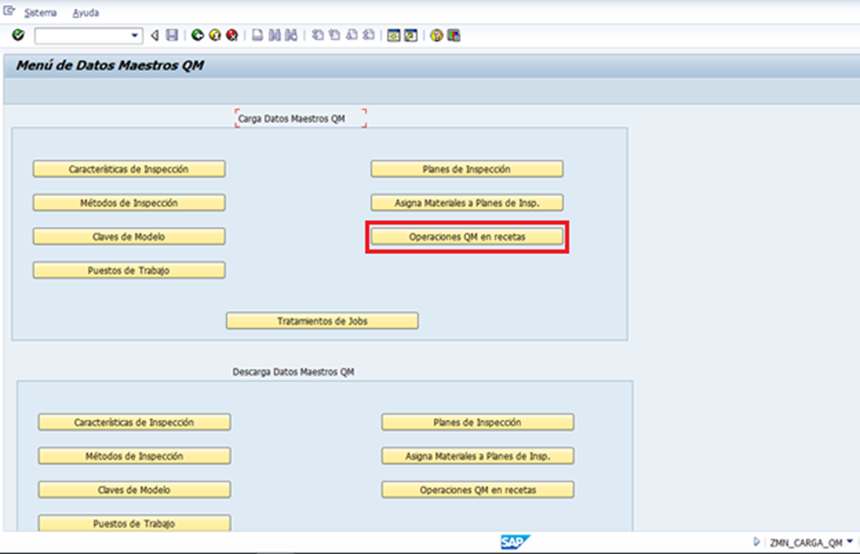
- En la siguiente pantalla tienes que llenar los Parámetros de Selección. Debes indicar:
  - El Centro/Planta productora del material.
  - En la Clase de inspección debes indicar siempre “03” [Aplica para las cargas de los materiales ZER1, ZER2 Y ZALB]

**En la sección Update/Download no olvides marcar la opción Carga, nunca utilizar Borrar Registros QM**

- 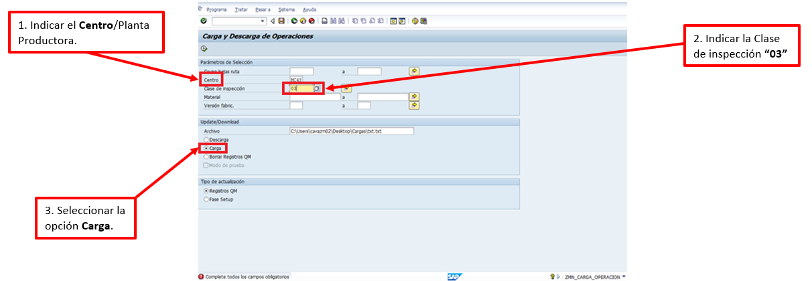
- 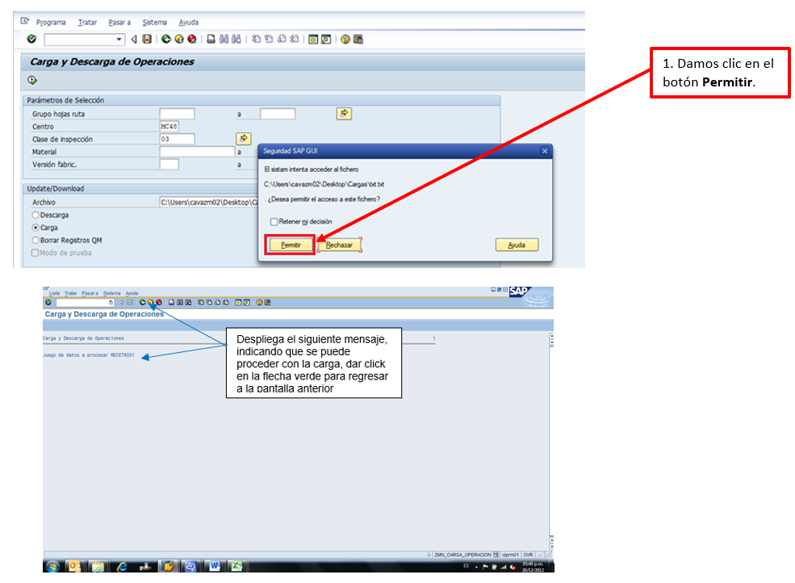
- 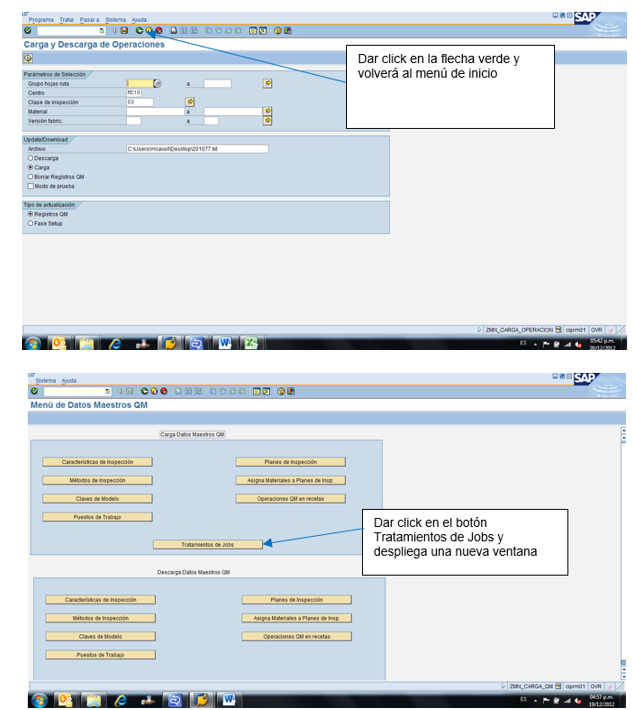
- 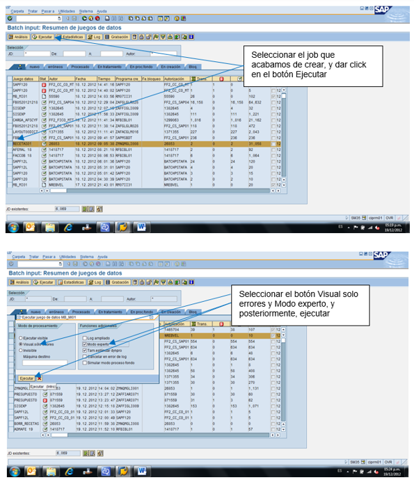

#### 4.2.4 Clase de inspección
- En los casos donde sean SKU nuevos siempre hay que realizar la carga de la receta, clase de inspección y plan de retención (cuando ya existe un SKU y solo se genera una version nueva de producción solamente aplica la carga de receta.
- Para realizar la clase de inspección entramos a la transacción MC02 en SAP ECC Ágil y agregamos el numero de SKU
- Damos enter y se nos van a desplegar las pestañas que contiene la transacción para lo cual vamos a selección la de Gestión de Calidad y damos clic en continuar
- Agregamos la planta a la cual le agregaremos la clase de inspección, recordando que este paso de debe realizar en las 7 plantas. (MC00, MC02, MC04, MC06, MC08, MC10, MC48)
- Damos clic en la pestaña de ParametrizInsp
- 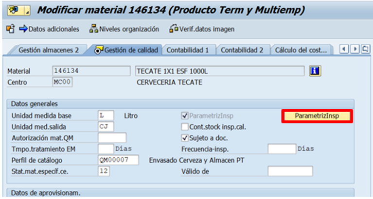
- Se nos desplegará esta pestaña en la cual nos aparecerá la clase de inspección que tiene el SKU, recordando que en materiales ZER1 (nacional) y ZER2 (exportación) deben tener las clases de inspección 03 y 08, en este ejemplo ya contiene el 03 por lo cual solo será necesario agregar el 08 dando clic en la parte de abajo que dice Clase de inspección
- 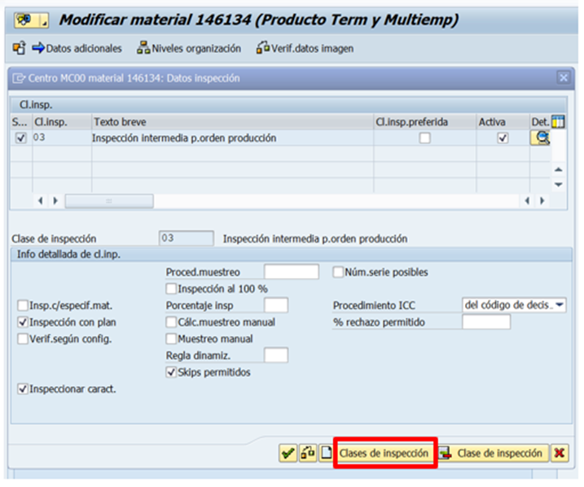
- Se habilitará la pantalla donde puedes escribir la clase de inspección que falta y en este caso agregaremos el 08 y daremos clic en los casos de la inspeccion 03 y 08 en la casilla de Activa y continuar
- 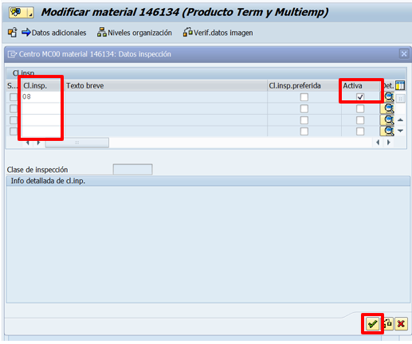
- Ya que se dio clic en continuar te regresa a la pantalla de Gestión de calidad en donde ya solamente daremos clic en Guardar

- **Nota:** Si quieres validar varios SKU´s y ver si falta la clase de inspección en alguna planta; entramos a la transacción SE16N en la tabla QMAT y nos posicionamos en Material damos clic en la fecha que viene la columna Mas y pegamos los sku´s que se ocupan validar y damos clic en ejecutar

- Una vez que demos clic en ejecutar se abrirá la pantalla donde nos mostrara los sku´s, plantas y la clase de inspección que tiene cada una. (La cuarta columna Insp.c/plan es la que tiene una X en cada planta que tenga la clase 03 o 08)

## Confirmar solicitud
- Una vez que se ha validado o asignado la receta y se agregado el dato de clase y plan en sku´s nuevos, se responde el correo mencionando que se han validado las operaciones de calidad.

