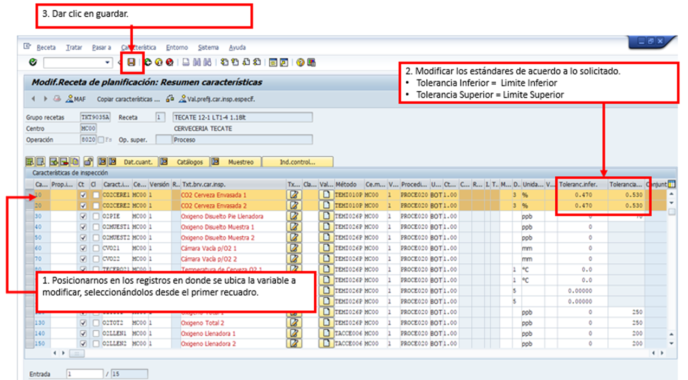

# ACTUALIZACIÓN DE ESTANDARES Y VARIABLES
[back](global.md)

SOP descripción:	Actualización de Estándares y Variables
Frecuencia del Proceso:	Esporádica
Sistema Usado:	SAP	
Revisión:	
Fecha de creación:	marzo 2025
Número de páginas:	
Creado por:	Nallely Becerra 
Revisado por:	
Firmado por (HGSS Centre):	
Firmado por (HE):

## 1. Propósito
- El propósito de este documento es presentar todos los pasos a seguir para la actualización en los estándares (límite inferior, superior y target) de las variables de las operaciones de calidad, en las cervecerías de HMEX que así lo soliciten.

## 2. Alcance
- Todas las cervecerías. 

## 3. Responsabilidades
- El Analista de MDM es el responsable de validar que la solicitud sea realizada esto por medio de correo electrónico o bien teams, así como de la ejecución en tiempo y forma de las actualizaciones en los estándares.

## 4. Descripción del proceso
- Asegurar la correcta ejecución de las solicitudes de actualización en los estándares de las variables que apliquen, ajuste de unidad de medida o adición-eliminación de variables, en las operaciones de calidad. 

### 4.1.1 Modificar variables
- Para comenzar con el ajuste es necesario, revisar el archivo: “Formato de Solicitud de Ajuste de Recetas”, entender el requerimiento, aclarar dudas en caso de que se presenten.
  - Ejemplo:
    - Se solicita actualizar el estándar de la variable CO2 Cerveza Envasada 1 y 2 de las recetas de botella y lata de todas las cervecerías.

- Ingresar a la TX C202 
- Ingresar los datos solicitados y dar clic en continuar.
- 
- Dar clic en Continuar y posteriormente dar “Enter”.  Se desplegará la lista de operaciones:
- 
- 
- Se deplegará la pantalla con el detalle de las variables, en la cual identificaremos la(s) variables a ajustar, en este caso “CO2 Cerveza Envasada 1 y 2”.
- 

- **Nota:** Si en la receta identificamos que existe la variable solicitada en otros puestos de trabajo, se debera dar clic en   Back, y repetir el proceso hasta que se hayan modificado el estandar en todos los puestos de trabajo en los que existe la variable y finalmente dar clic en grabar   .

- **Nota 1:** Es posible ajustar los estándares [Tolerancias] o la UM (si es que existe en el catálogo), de lo contrario no se puede modificar UM. En dicho caso se solicitaría el alta en la 1111, pero desde 2009 a la fecha solo 1 vez hubo la necesidad de agregar alguna.

### 4.1.2 Procedimiento
- Para comenzar con el ajuste es necesario, revisar el archivo: “Formato de Solicitud de Ajuste de Recetas”, entender el requerimiento con la variable que se desea eliminar y aclarar dudas en caso de que se presenten.
- Abrir el archivo Excel con los materiales a tratar y proceder con la ejecución en sistema.
- Ingresar a la TX C202 e ingresar los datos solicitados.
- 
- Dar clic en Continuar y posteriormente dar “Enter”.  Se desplegará la lista de operaciones
- 
- 
- Se deplegará la pantalla con el detalle de las variables, en la cual identificaremos la(s) variables a eliminar.
- 
- **Nota:** Si en la receta identificamos que existe la variable solicitada en otros puestos de trabajo, se debera dar clic en Back, y repetir el proceso hasta que se haya eliminado en todos los puestos de trabajo en los que existe la variable y finalmente dar clic en grabar.

### 4.1.3 Agregar variables
- Para comenzar con el ajuste es necesario, revisar el archivo: “Formato de Solicitud de Ajuste de Recetas”, entender el requerimiento con la variable que se desea agregar y aclarar dudas en caso de que se presenten.
- Abrir el archivo Excel con los materiales a tratar y proceder con la ejecución en sistema.

- **Nota:** Previamente se habilitó la variable(s) en el sistema, se puede validar en la TX QS24, pero es responsabilidad de Calidad OS el dar de alta la variable para solo agregarla en las recetas.

- Ingresar a la TX C202 e ingresar los datos solicitados.

- Dar clic en Continuar    y posteriormente dar “Enter”.  Se desplegará la lista de operaciones:
- 
- 
- Se deplegará la pantalla con el detalle de las variables, en la cual se agregaran los siguientes datos: 
- 
- 

- **FIN**

