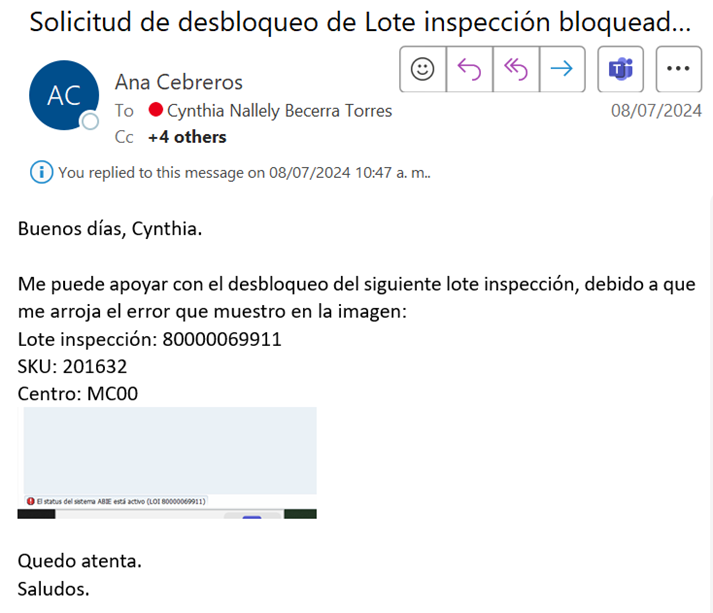
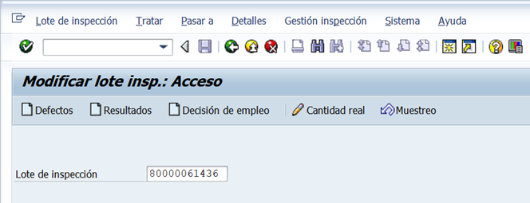
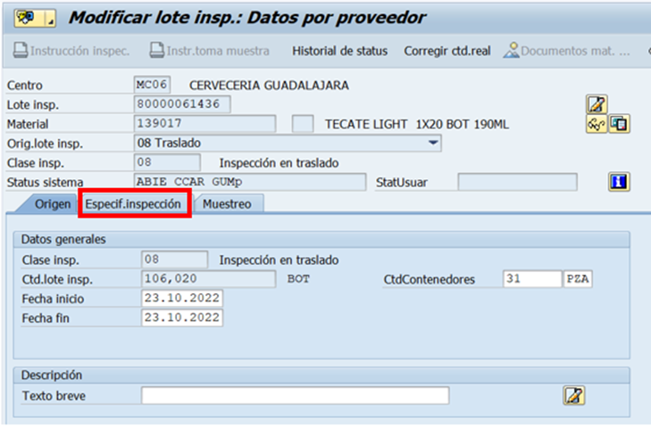
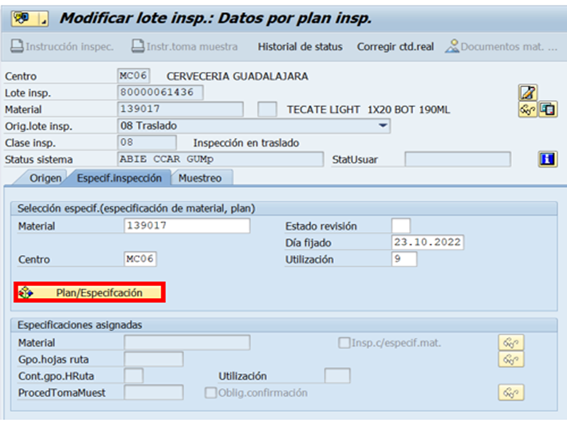
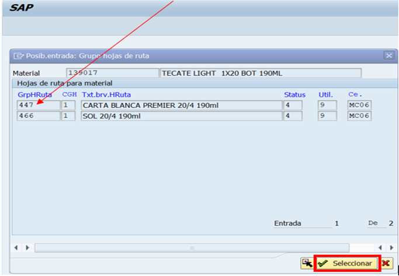
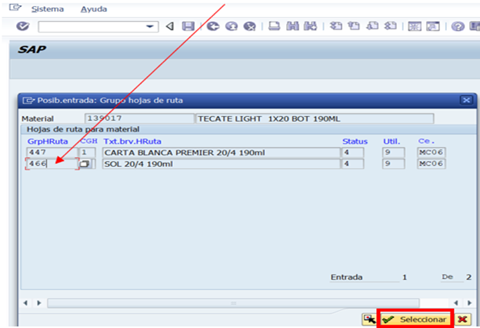
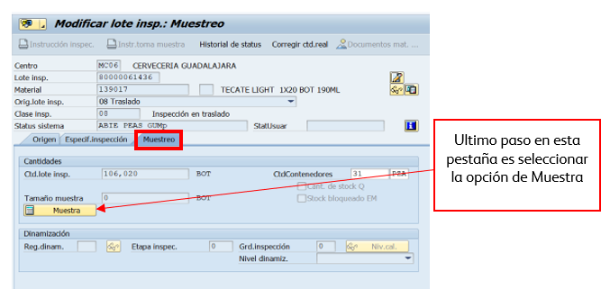
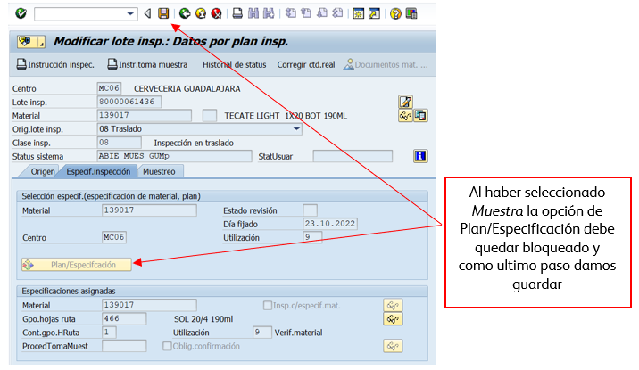

# ASIGNACIÓN DE LOTE DE INSPECCIÓN
[back](global.md)

SOP descripción:	Lotes
Frecuencia del Proceso:	Diaria
Sistema Usado:	SAP
Revisión:	
Fecha de creación:	marzo 2025
Número de páginas:	
Creado por:	Nallely Becerra
Revisado por:	
Firmado por (HGSS Centre):	
Firmado por (HE):

## 1. Propósito
- El propósito de este documento es asegurar que en material ZER1 Producto Terminado Nacional y Multiempaque, ZER2 Producto Terminado Exportación/Importación, se configuren los datos maestros locales requeridos que permitan generar ordenes de producción con los parámetros necesarios para que Calidad registre los resultados de sus muestreos.

## 2. Alcance
- Clase de inspección de los tipos de material: ZER1 y ZER2 CM HEINEKEN.

## 3. Responsabilidades
- El Analista de MDM es el responsable de validar que la solicitud sea realizada, así como de la ejecución en tiempo y forma.

## 4. Descripción del proceso
- Asegurar la que los materiales ZER1 y ZER2 cuenten con el plan de retención y actualizar los lotes de Inspeccion.  

### 4.1 Solicitud
- Se recibe un correo por parte del equipo de Quality Labs donde solicitan apoyo para poder asignar el motivo de retención a los lotes que están generando en SAP y les marca un error al momento de generar una orden.
- 

### 4.2 Tratamiento de solicitudes
- Entraremos a la transaccion QA02 en donde agregaremos en la parte de Lote de Inspeccion el # de lote que nos compartieron via correo electronico
- 
- Se abrirá esta pantalla en donde seleccionaremos la pestaña de Especif.Inspección
- 
- Una vez que seleccionamos la pestaña, se abrira esta hoja en donde daremos clic en Plan/Especificacion 
- 
- Empezamos poniendo el cursor en el primer dato GrpHRuta, en este caso 447 y daremos clic en Seleccionar
- 
- Una vez que demos clic en Seleccionar nos arrojará el mensaje de que a la hoja de ruta que seleccionamos ha sido asignada al lote de inspección
- Nos volvemos a posicionar en la hoja de ruta faltante 466 y haremos el mismo procedimiento de dar clic en seleccionar
- 
- Nos volverá arrojar el mensaje de que a a la hoja de ruta seleccionada ha sido asignado en el lote de Inspección.
- Ya que terminamos de seleccionar las hojas de ruta, daremos clic en la pestaña de Muestreo
- 
- 

### 4.3 Confirmar solicitud
- Una vez que haya guardado la información procedemos a confirmarle al solicitante que el lote de inspección ya cuenta con los datos de calidad.

