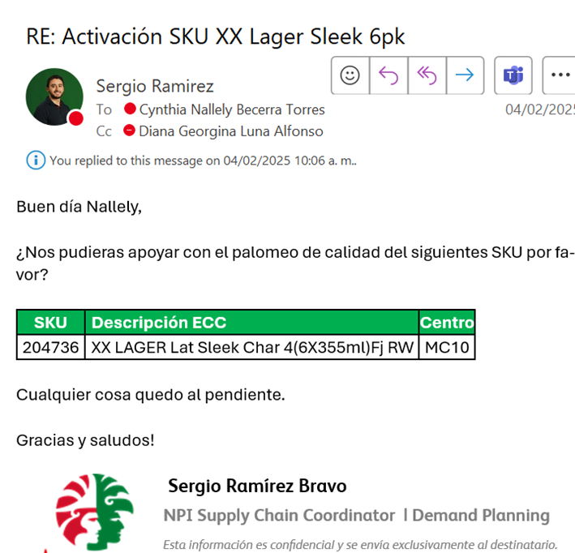
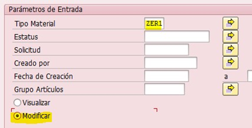
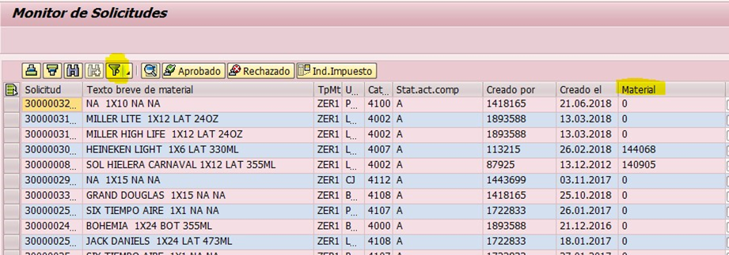
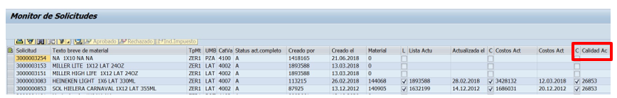
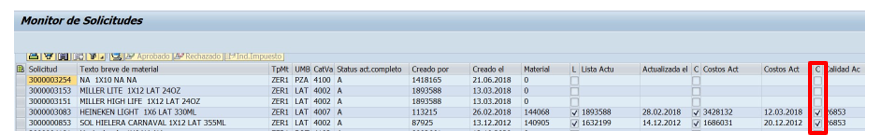
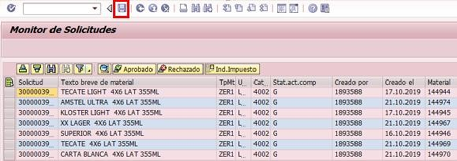
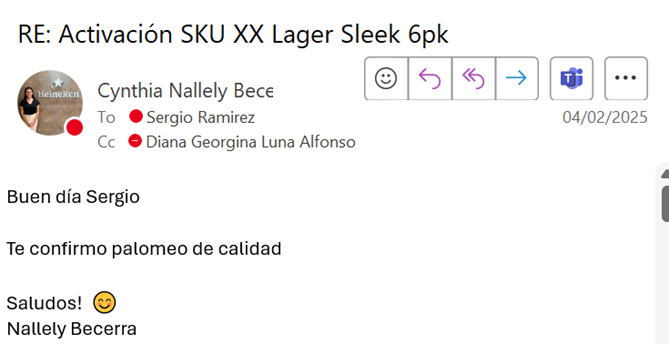

# PALOMEO DE PRODUCTO TERMINADO
[back](global.md)

SOP descripción: 	Palomeo en Producto Terminado  
Frecuencia del Proceso: 	Frecuente 
Sistema Usado: 	SAP 
Revisión: 	 
Fecha de creación: 	Marzo 2025
Número de páginas: 	 
Creado por: 	Nallely Becerra 
Revisado por: 
Nivel de Servicio:                                             1-2 días hábiles 	 
Firmado por (HGSS Centre): 

## 1. Propósito
- El propósito de este documento es presentar todos los pasos para realizar el Palomeo. 

## 2. Alcance
- Al activar este atributo intervienes como área principal y final del proceso en donde activaras el sku a utilizar, con ello dicho producto podrá estar visible y activo para su planeación y producción. 

## 3. Responsabilidades
- El Analista de MDM es el responsable de efectuar el primer palomeo un vez quede habilitada la lista y receta del sku, así mismo también ejecutara el ultimo palomeo una vez que los atributos del sku estén correctos y que el resto de las áreas hayan concluido cada uno de sus procesos

## 4. Descripción del proceso
- Palomeo de producto terminado.

### 4.1 Solicitud
- En Productos Multicategoria, Promocionales etc. se lleva a cabo de forma inmediata en cuanto llega la solicitud. 
 
- En este caso, me enfocare en un ejemplo en donde estamos creando un nuevo sku Nacional En base al seguimiento ya se generó la lista y receta, ya tenía mi primero palomeo con el que inicie el proceso y adicional el resto de las áreas que Intervienen también ya terminaron sus proceso, este regresa a Dato Maestro para cerrar el ciclo del palomeo. 

- 

### 4.2 Tratamiento de solicitudes
- Entrar a la transacción ZMATERIALES, te arrojara la siguiente imagen. 
- Seleccionar el campo Monitor de Solicitudes 
- Y en el bloque Parámetros de Entrada, seleccionaremos y capturaremos lo siguiente 
  - Tipo de Material agregaremos ZER1 o ZER2 según sea el caso de sku a tratar. 
  **En este ejemplo son varios y todos son Nacionales = ZER1**  
  - Seleccionar la Opción Modificar. Quedando de la siguiente forma. 
- 
- Te arrojara la siguiente imagen en donde agregaremos Seleccionaremos la columna Material y agregaremos filtro.  
- 
- Te habilitara la siguiente imagen en donde daremos clic en la opción para agregar multiples valores
- A continuación podrás copiar los sku´s que deseas palomear.
- Te dejara habilitada la siguiente imagen en donde daremos clic en la palomita verde.  
- Te regresara a la planta inicial, ahora con la flecha derecha te desplazaras de columnas, llegando así a la que deseas palomear. 
En este caso será la columna Calidad para poder realizar el sku ya debe contar con el palomeo de Datos Maestros y costos de lo contrario no se puede realizar el de Calidad. 
- 
- Debes dar clic en cada cuadro en blanco correspondiente a la columna y como se muestra en la imagen anterior ya cada área completo su proceso. 
- 
- Al dar clic en el recuadro en blanco te arrojara la siguiente imagen, daremos clic en concluir tarea. 
- Una vez marcados con la   todos los skus en la columna correspondiente daremos clic en la opción guardar. 
- 
- Te arrojara una pantalla diciendo: "Error: No se genero solicitud para envio de job"
- Te regresara a la pantalla inicial, en donde ya esta finalizado el proceso.

### 4.3 Confirmacion de solicitud
- Notificar a  las áreas la ejecución del palomeo, de haber sido el último palomeo el o los sku´s ya estarán con estatus activo. 
- 

