# CREACIÓN COMPLEMENTO DE PROVEEDORES
[back](global.md)

SOP descripción:	Creación Complemento Proveedore
Frecuencia del Proceso:	Por solicitud.
Sistema Usado:	SAP
Revisión: 
Fecha de creación:	Enero 2025
Número de páginas:	
Creado por:	Nallely Becerra
Revisado por:	
Firmado por (HGSS Centre):	
Firmado por (HE):

## 1. Propósito
- El propósito de este documento es presentar todos los pasos necesarios para realizar el correcto complemento para proveedores.

## 2. Alcance
- Al crear el complemento para el proveedor, nos apoya de forma en que posteriormente se pueda proceder con el alta correspondiente.

## 3. Responsabilidades
- El Analista de MDM es el responsable de generar el complemento y hacer las validaciones y modificaciónes correspondientes cada que el usuario lo solicite.

## 4. Descripción del proceso
- Asegurar la correcta información a modificar.

### 4.1 Solicitud
- Se nos notifica por medio de correo la solicitud para crear el complemento por medio de SAP en donde nos notifica el ticket de Heiflow, número de ID y nombre del proveedor:
- 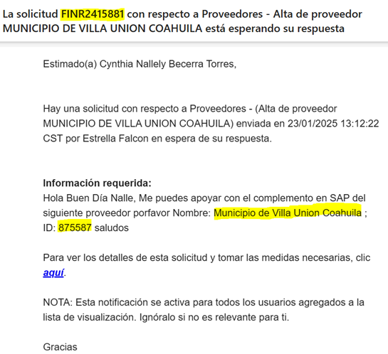
- Con el número de ticket entrar a Heiflow para validar la solicitud y reunir los datos que se ocupan para el complemento:
- 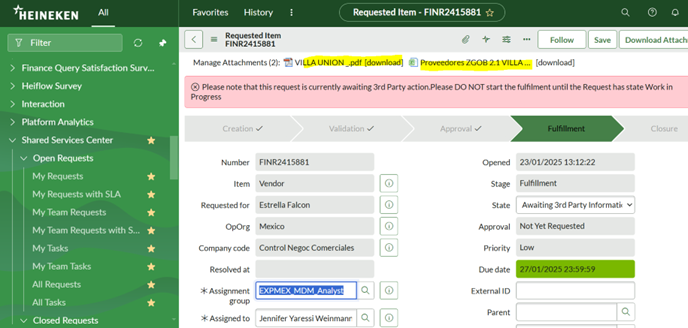
- Descargamos los documentos; Estado De Cuenta y Excel que se anexan en el ticket que nos ayudarán para realizar el complemento en SAP:

### 4.2 Tratamiento de solicitudes
- Entramos a la zproveedores > Complemento solicitud portal
- Agregamos los datos que nos comparten en el excel descargado 
*Núm.Solcitud = Global ID
- 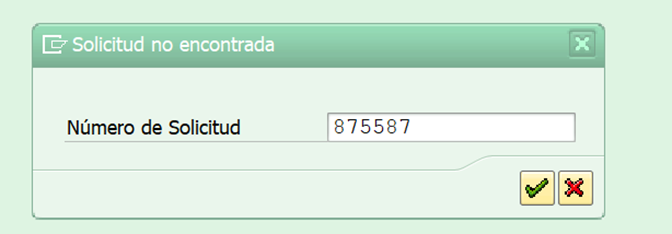
- 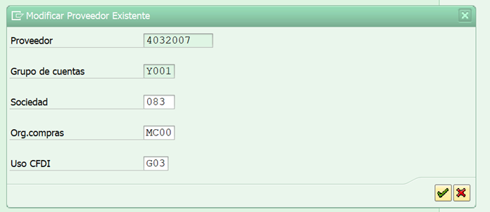
- Dentro de los Datos Generales en la parte de Banco:
    *Se capturan los datos de Banco correspondientes*

- 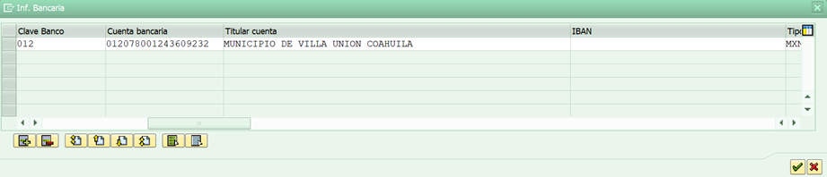
- Se agrega en el botón “Browse” el documento Estado de Cuenta y al final se oprime “Adjuntar Archivos” para que el doc. Se adjunte en sistema SAP
- 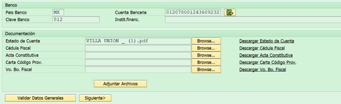
- **Nota: Se comparte informacion en caso de que el proveedor sea extranjero:**
- 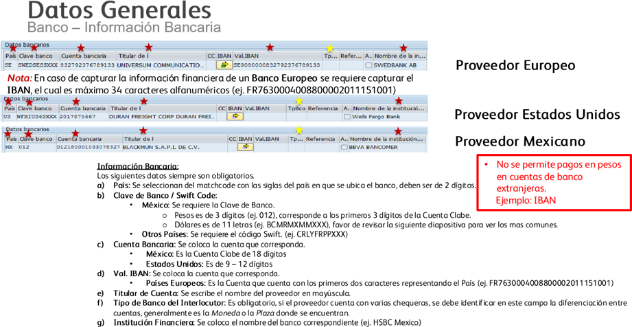
- Para el apartado de datos de sociedad se llenan los campos en blanco, la información se llena en base al excel del complemento.
- 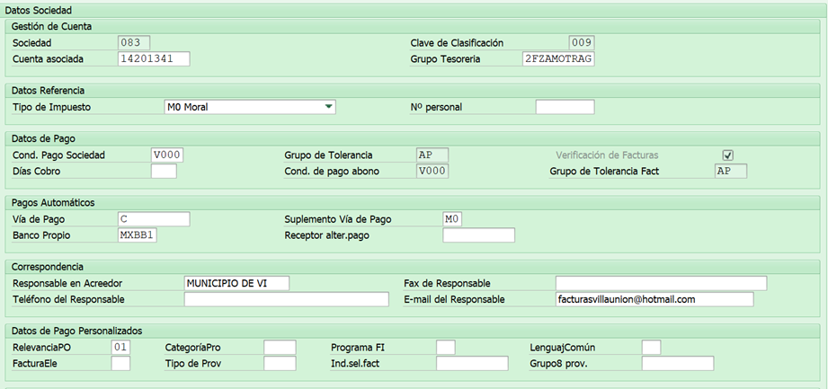
- En el campo de Información sobre Retención se llena en base al excel si el documento no te indica llenar el apartado se queda en blanco.
- 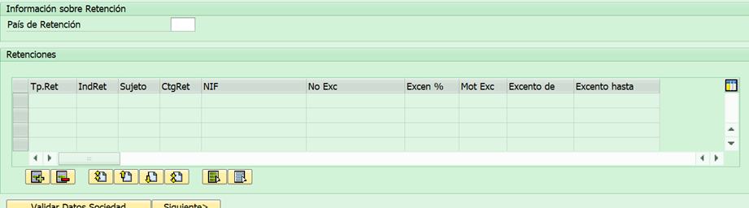
- **Si en dado caso se ocupa retención se sigue las reglas de la siguiente imagen:**
- 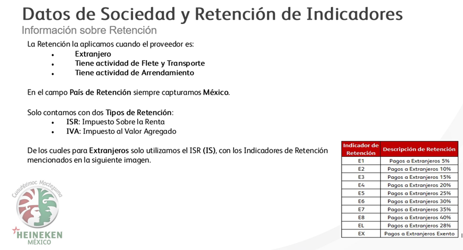
- En Datos de Compras de igual manera se llena en base a lo que el excel te indica. *Clave de Control Confirm siempre seleccionar Z002.
- 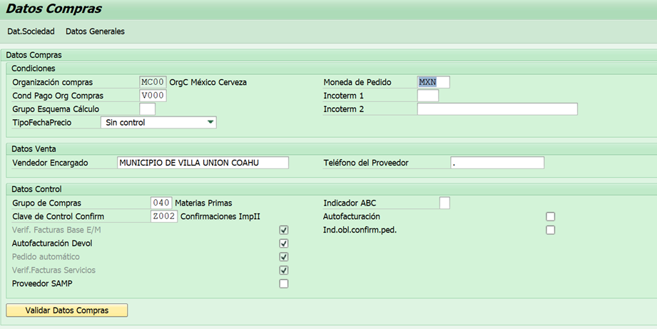
- Guardamos o bien Ctrl+S y nos arroja el núm de solicitud.