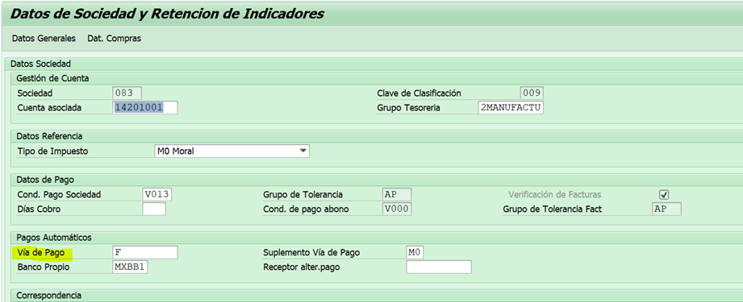

# SOLICITUDES DE PROVEEDORES MODIFICACION
[back](global.Md)

SOP descripción:	Solicitudes de Proveedores Modificación
Frecuencia del Proceso:	Por solicitud.
Sistema Usado:	SAP
Revisión: 	Enero 2025
Fecha de creación:	
Número de páginas:	
Creado por:	Nallely Becerra
Revisado por:	
Firmado por (HGSS Centre):	
Firmado por (HE):

## 1. Propósito
- El propósito de este documento es presentar todos los pasos necesarios para realizar la correcta modificación de proveedores

## 2. Alcance
- Al crear la solicitud para el usuario, nos apoya de forma en que posteriormente se pueda proceder con las modificaciones solicitadas.

## 3. Responsabilidades
- El Analista de MDM es el responsable de generar el movimiento y hacer las validaciones correspondientes cada que el usuario lo solicite.

## 4. Descripción del proceso
- Asegurar la correcta información a modificar.

### 4.1 Solicitud
- Dicho requerimiento es solicitado por Abasto.

### 4.2 Tratamiento de solicitudes
- Para las solicitudes de proveedores nos llegan por medio de Heiflow nos pueden indicar el núm. de proveedor por medio del Excel adjunto o bien por medio de la descripción de este. Tenemos diferentes tickets y los movimientos son los siguientes:
- CFDI
- Cambio de cuenta
- Cuenta bancaria EUR o USD
- Condición de pago 
- Cambio vía de pago
- Actualización de correo
- Eliminar retenciones
- Activar retenciones
- Generar las replicas para las solicitudes anteriores.

#### 4.2.1 CFDI
- 
- Entramos a la transacción zproveedores > Modificación de proveedor > F8
- 
- En el apartado de Datos Generales buscamos el campo Uso CFDI y agregamos el dato solicitado en el ticket y guardamos.
- Nos arroja un numero de solicitud en este caso sería el siguiente:
263572
- Una vez completado nos llegará un correo notificación por parte de Jenni y procedemos con la replica para el resto de las sociedades.

#### 4.2.2 Cambio de cuenta bancaria
- 
- Entramos a la transacción zproveedores > Modificación de proveedores > Agregamos el num de proveedor y sociedad
- Del Estado de cuenta que se anexó en el ticket tomamos los datos bancarios para anexarlos en el apartado de Banco y comparamos y validamos contra EDC y SAP nombre, agregar campos de banco y anexar el EDC en documentación y guardamos.
- 
- Nos arroja un numero de solicitud en este caso sería el siguiente:
264539
- Una vez completado nos llegará un correo notificación por parte de Jenni y procedemos con la replica para el resto de las sociedades.

#### 4.2.3 Cuenta bancaria EUR o USD
- 
- Entramos a la transacción zproveedores > Modificación de proveedores > Agregamos el num de proveedor y sociedad.
- Una vez dentro de la solicitud nos vamos al apartado de Bancos y es el mismo proceso que una Cambio cuenta bancaria MXN(núm 7) solo tomar en cuenta los siguientes datos:
- 

#### 4.2.4 Condición de pago
- 
- Entramos a la transacción zproveedores > Modificación de proveedores > Agregamos el num de proveedor, sociedad y organización de compras.
- 
- Comenzamos a capturar los datos solicitados en el campo de Datos de Pago
  - Cond. Pago Sociedad 
  - Días de Cobro
- 
- Luego nos movemos al campo de Datos de Compras y registramo > Guardamos
  - Cond Pago Org Compras
- 
- Nos arroja un numero de solicitud en este caso sería el siguiente:
264352
- Una vez completado nos llegará un correo notificación por parte de Jenni y procedemos con la replica para el resto de las sociedades.

#### 4.2.5 Cambio vía de pago
- 
- Transacción zproveedores > Modificación de proveedor , Se agregan los datos núm de proveedor y sociedad
- Nos dirigimos al apartado de datos de sociedad > Pagos automáticos > Anexamos el cambio a F(Factoraje) y guardamos.
- Recordando que para este cambio no se puede realizar el cambio FACTORAJE cuando las condiciones de pago son 0 días PERO si tiene condición de pago mas de 0 días (como el ejemplo) se puede realizar el cambio.
- 
- Nos arroja un numero de solicitud en este caso sería el siguiente:
263628
- Una vez completado nos llegará un correo notificación por parte de Jenni y procedemos con la replica para el resto de las sociedades.

#### 4.2.6 Actualización de correo.
- 
- Entramos a la transacción zproveedores > Modificación de proveedores > Agregamos el num de proveedor y sociedad.
- Nos ubicamos en la vista Datos de Sociedad > Correspondencia > E-mail del responsable.
- En este último se agrega el correo que se solicita en el ticket y guardamos.
- 
- Nos arroja un numero de solicitud en este caso sería el siguiente:
263063
- Una vez completado nos llegará un correo notificación por parte de Jenni y procedemos con la réplica para el resto de las sociedades.

#### 4.2.7 Eliminar retenciones
- 
- Transacción zproveedores > Modificación de proveedor , Se agregan los datos núm de proveedor y sociedad
- Una vez en sistema nos dirigimos a la vista Datos de Sociedad y nos dirigimos al campo Información sobre retenciones eliminamos “MX” nos posicionamos en el campo Retenciones y seleccionamos toda la información que se encuentra en el apartado y oprimimos el botón de la parte inferior con una rayita en rojo y guardamos.
- 
- Nos arroja un numero de solicitud en este caso sería el siguiente:
262100
- Una vez completado nos llegará un correo notificación por parte de Jenni y procedemos con la réplica para el resto de las sociedades.

#### 4.2.8 Activar retenciones
- 
- Transacción zproveedores > Modificación de proveedor , Se agregan los datos núm de proveedor y sociedad
- Una vez en sistema nos dirigimos a la vista Datos de Sociedad y nos dirigimos al campo Información sobre retenciones agregamos “MX” nos posicionamos en el campo Retenciones y agregamos las retenciones que nos indican en el formato Excel y guardamos.
- 
- Nos arroja un numero de solicitud en este caso sería el siguiente:
261745
- Una vez completado nos llegará un correo notificación por parte de Jenni y procedemos con la réplica para el resto de las sociedades.

#### 4.2.9 Replicas de proveedores
- Una vez que se generan las solicitudes , al proveedor se hace una replica a todas las sociedades. 
- Se toma el Núm. de proveedor del ticket y Sociedad en la cual se generó la solicitud. Una vez concluidas las solicitudes estos datos se reflejan en el correo notificación.

  - Ejemplo de correo:
  - Núm. Proveedor: 6027381
  - Sociedad: 083

- 
- Replica de proveedor > F8 > Agregar Núm. Proveedor > Datos iniciales – Sociedad (se agregan los Núm. de sociedad faltantes 051, 055, 068, 169, 265 y 560) > Referencia- Sociedad (se agrega el Núm. de sociedad que se ocupó para generar la solicitud 083). Seleccionamos la palomita y replicamos.
- 

