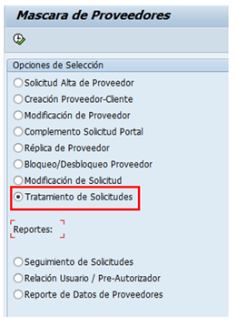
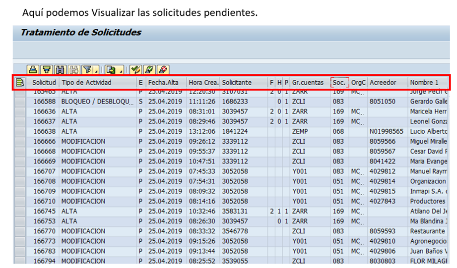
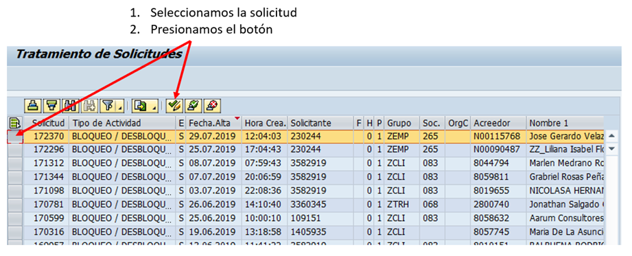
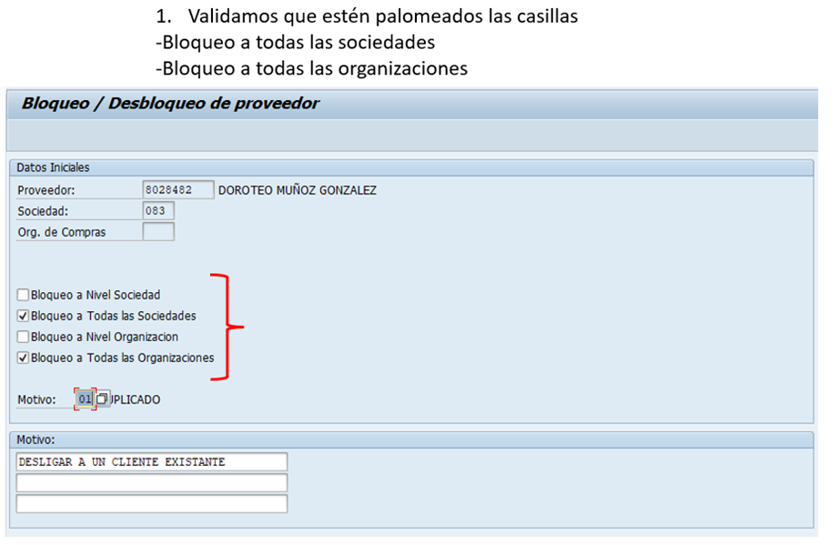
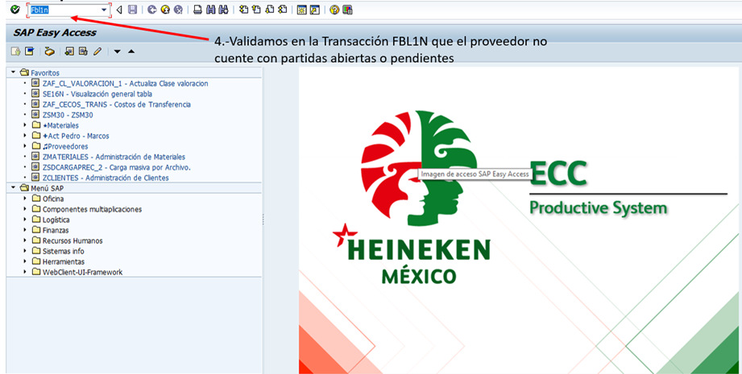
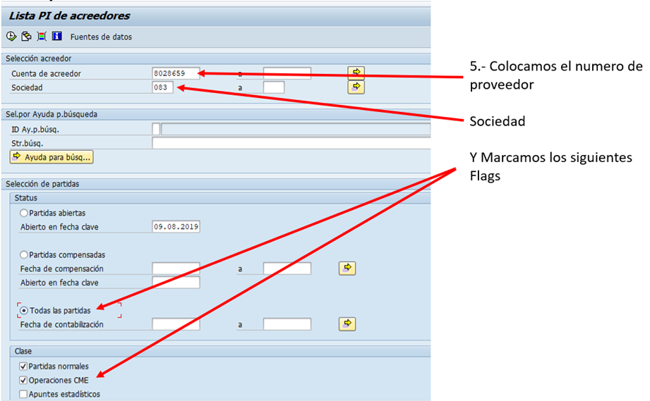
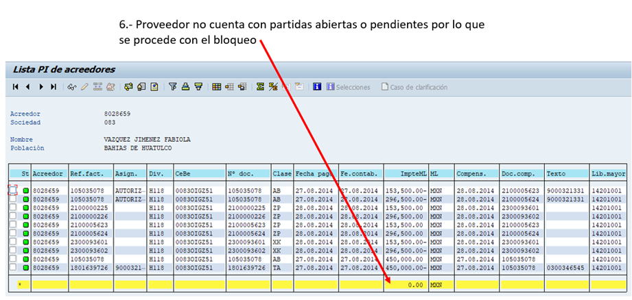
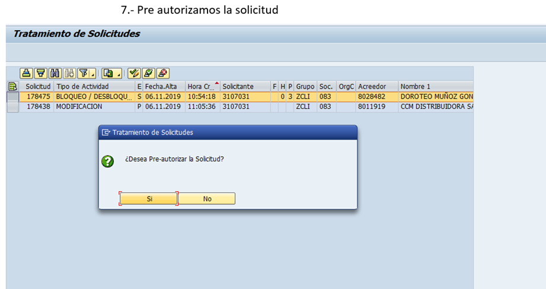
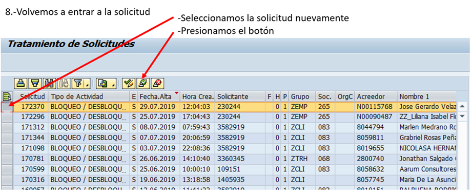

# BLOQUEO, BAJA Y REPLICA DE PROVEEDOR
[back](analyst.md)

Descripción SOP:	Bloqueo, baja y réplica de proveedor 
Frecuencia del proceso:	Diaria
Programas utilizados:	SAP
Fecha de revisión:	25/07/2024
Fecha de creación:	19/04/2023
Creado por:	Jennifer Weinmann	
Revisado por:	Yahir Orona

## 1. Propósito
- El propósito de este documento es presentar todos los pasos necesarios para el Bloqueo, Marcado para borrar y replica de proveedor.

## 2. Alcance
- Realizar el bloqueo de proveedor, marcador para borrar y la réplica del mismo.

## 3. Responsabilidades
- El Analista de MDM es el responsable de analizar las reglas para realizar el bloqueo, marcado para borrar y las réplicas de proveedores.

## 4. Descripción del proceso
### 4.1 Bloqueo de proveedor
- Entramos a SAP, capturamos la transacción ZPROVEEDORES en el buscador.
- Les aparecerá la siguiente imagen, de la cual tendrán que elegir la opción Tratamiento a Solicitudes

- Cuando los datos del Proveedor verificados en el sistema están correctos, en la transacción ZPROVEEDORES se da por autorizada la solicitud y los cambios quedan registrados.  
- Si los datos revisados no están correctos o si el Proveedor ya existe en el sistema SAP, se rechaza dicha solicitud en la transacción ZPROVEEDORES, en donde se le indica el motivo por el cuál fue rechazada 

### 4.2 Tratamiento de solicitudes
