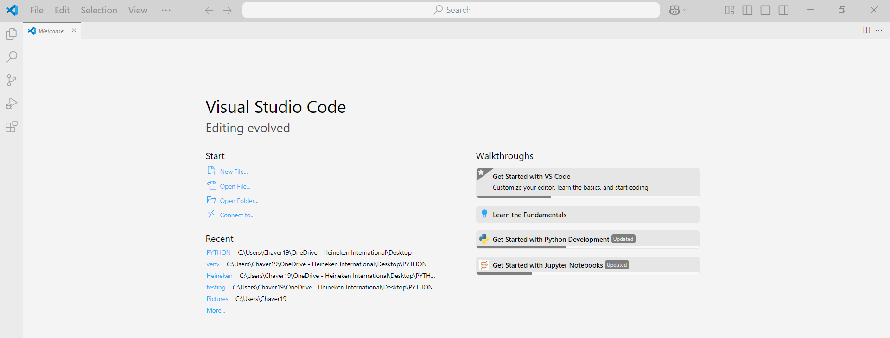

# TUTORIAL TRANSCRIBIR SOP

## 1. Descargamos Visual Studio Code
- Nos dirigimos a Microsoft Store y buscamos "Visual Studio Code"
- Nos debrá arrojar esta apliacción como opción y la descargamos
  

- Abrimos la app y tendremos una pantalla como esta:

- En la opción de extensiones de la parte izquierda

- Buscamos "Markdown"
- Seleccionamos el que dice "Markdown All in one" y lo instalamos.
- Despues seleccionamos la opción de folder.

- Damos click en file en la barra de herramientas de arriba y open folder.
- Seleccionamos un folder en el que queramos tener toda la info que bajemos. De preferencia que no tenga nada
- Ya una vez en el folder, tendremos en la parte izquierda el nombre del folder y todos los contenidos. No deberíamos tener nada de momento pero agregamos un file dando clik en la siguiente opcion.

nos dará una linea nueva para nombrar el archivo que queramos. Lo nombran con el código del SOP como en este ejemplo y al final agregan el tipo de archivo que es (.md)

- Una vez ya creado el archivo tomamos este ejemplo como formato del SOP

- Y solo es ir copiando y pegando de acuerdo al SOP.

## Tips
### Tip 1
Para poder ver el progreso o como se vería el SOP con los cambios que esten realizando. con el teclado ponemos el comando (CTRL + SHIFT + V) y te agregará una pestaña nueva con el nombre "Preview", como a continuación

Arrastramos esa nueva pestaña a la derecha de nuestra pantalla y nos pondra la pantalla dividida en el texto que estamos realizando y el preview, asi como a continuación

### Tip 2
- Poniendo palabras u oraciones entre asteriscos, cambia el estilo del texto
  - Ejemplos
<pre>*Hola*</pre>
es igual a cursiva: *Hola*

<pre>**Hola**</pre>
es igual a negritas: **Hola**

<pre>***Hola***</pre>
es igual a negritas cursiva: ***Hola***

